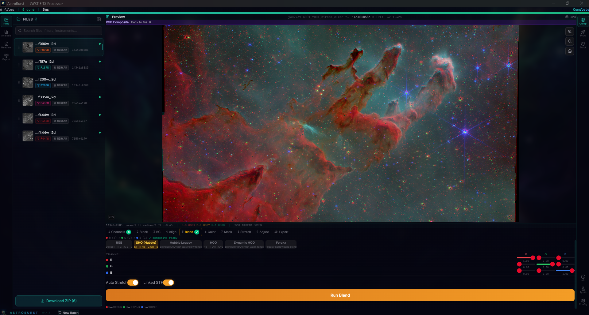
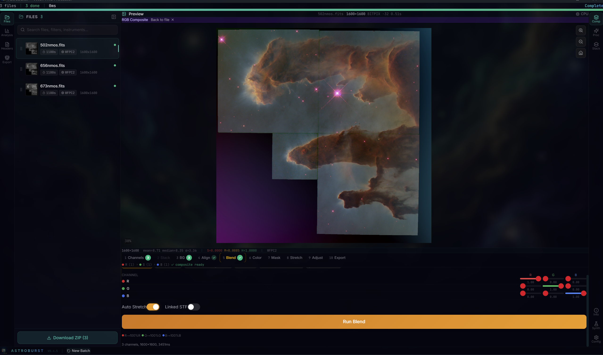
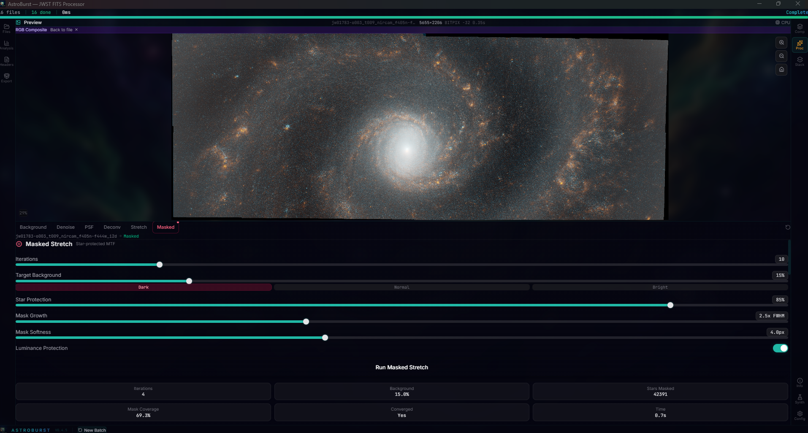
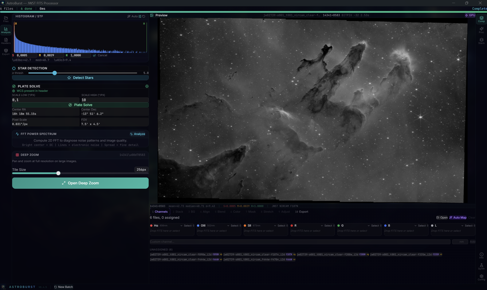
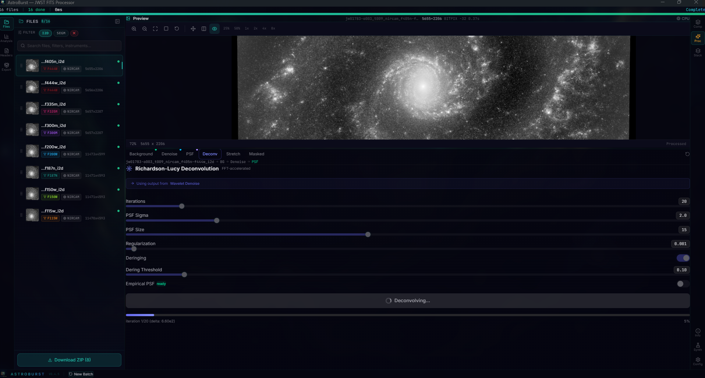
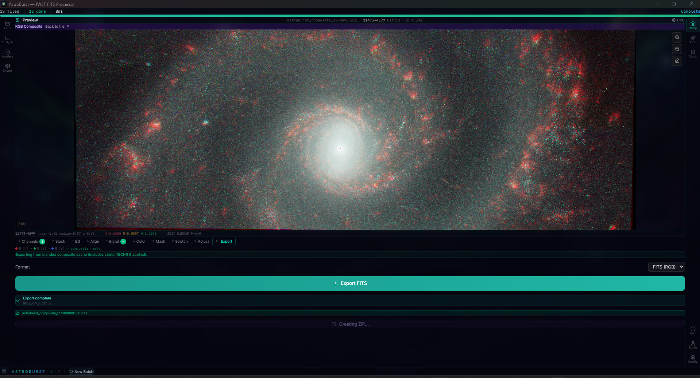
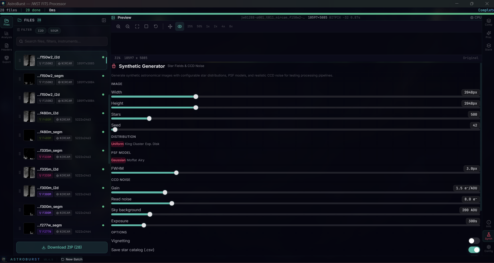

<p align="center">
  
</p>

<h1 align="center">AstroBurst</h1>

<p align="center">
  <strong>High-Performance Astronomical Image Processor</strong><br>
  <em>Rust + Tauri + WebGPU. Process JWST, Hubble, and Roman Space Telescope data at native speed.</em>
</p>

<p align="center">
  <a href="https://github.com/samuelkriegerbonini-dev/AstroBurst/releases"></a>
  <a href="https://github.com/samuelkriegerbonini-dev/AstroBurst/actions"></a>
  
  
  <a href="LICENSE"></a>
  
  <a href="https://ko-fi.com/astroburst"></a>
</p>

<p align="center">
  <a href="#installation">Install</a> &middot;
  <a href="#features">Features</a> &middot;
  <a href="#quick-start">Quick Start</a> &middot;
  <a href="#getting-data">Data</a> &middot;
  <a href="#usage">Usage</a> &middot;
  <a href="#architecture">Architecture</a> &middot;
  <a href="#roadmap">Roadmap</a> &middot;
  <a href="#contributing">Contributing</a>
</p>

---

AstroBurst is an open-source desktop app for processing astronomical images. Drop in your FITS or ASDF files, compose RGB from narrowband channels, stack with sigma clipping, and export. Everything runs locally on your machine with no cloud dependencies.

It's built on Rust for the heavy lifting, React for the interface, and WebGPU for real-time preview. The result is a tool that opens a 2 GB IFU datacube in 300 ms, processes 10 frames at 1.4 GB/s, and renders STF adjustments in 8 ms on GPU.

> **What's new in v0.4.5**: Non-destructive composite pipeline (ORIG/KEY dual cache, idempotent WB and SCNR), STF rendering consistency across GPU/CPU/Rust, spectral wavelength resolver for blend presets, wavelength unit conversion in spectroscopy, Windows output path fix, star overlay and detection fixes. See the [changelog](CHANGELOG.md).
>
> **v0.4.x highlights**: 10-step ComposeWizard pipeline, masked stretch with star protection, SPCC color calibration, star-based affine alignment, stability white balance, SCNR luminance redistribution, blend presets (SHO/HOO/Foraxx/Dynamic HOO/Hubble Legacy), live composite STF re-stretch, synthetic FITS generation, and a full numerical correctness audit. The frontend was refactored into 12 domain services with shared UI primitives.

## Screenshots

<p align="center">
  
</p>
<p align="center"><em>JWST Pillars of Creation (M16) composed from 6 NIRCam filters with SHO (Hubble) blend preset. ComposeWizard BlendStep showing preset buttons: RGB, SHO, Hubble Legacy, HOO, Dynamic HOO, Foraxx. 14340x8583 with auto stretch and linked STF. Spectral wavelength resolver maps presets to any bin configuration.</em></p>

<p align="center">
  
</p>
<p align="center"><em>HST Eagle Nebula (M16) RGB composite via 10-step ComposeWizard. Three WFPC2 narrowband files ([OIII] 502nm, H-alpha 656nm, [SII] 673nm) auto-mapped to R/G/B channels. BlendStep with per-channel weight matrix, auto stretch, and "composite ready" status. 1600x1600 float32.</em></p>

<p align="center">
  
</p>
<p align="center"><em>NGC 628 (M74) RGB composite with masked stretch. Processing tab showing star-protected MTF: 10 iterations, 15% target background, 85% star protection, 2.5x FWHM mask growth, 4.0px softness, luminance protection. Result: 42,391 stars masked, 69.3% coverage, converged in 4 iterations (0.7s).</em></p>

<p align="center">
  
</p>
<p align="center"><em>JWST Pillars of Creation single-channel analysis. 14341x8583 F187N at GPU render. Histogram with auto-STF, star detection (sigma 5.0), plate solve (RA 18h 18m 55.15s, Dec -13 51' 6.2", 0.031"/px, 7.5' x 4.5' FOV), FFT power spectrum, and deep zoom. ChannelStep below with 6 unassigned JWST files ready for mapping.</em></p>

<details>
<summary><strong>More screenshots</strong></summary>

<p align="center">
  
</p>
<p align="center"><em>JWST NGC 628 (M74) Richardson-Lucy deconvolution. 16 NIRCam files with I2D/SEGM filter chips. Processing chain: BG > Denoise > PSF. RL with 20 iterations, PSF sigma 2.0, Tikhonov regularization (0.001), deringing threshold 0.10. AdvancedImageViewer with zoom presets (25%-8x). Deconvolving in progress (iteration 1/20, delta 6.60e2).</em></p>

<p align="center">
  
</p>
<p align="center"><em>NGC 628 (M74) RGB composite export. 18 JWST NIRCam files. ExportStep (step 10) with FITS RGB format, export complete (618 MB, 617ms), file reveal button, and ZIP bundle creation in progress. ComposeWizard bar showing Channels and Blend completed.</em></p>

<p align="center">
  
</p>
<p align="center"><em>Synthetic FITS generator with 28 JWST NIRCam files loaded. Configurable star field: 2048x2048, 500 stars, uniform distribution, Gaussian PSF (3.0px FWHM). CCD noise model: gain 1.5 e-/ADU, read noise 8.0 e-, sky background 200 ADU, 300s exposure. Vignetting toggle and star catalog CSV export.</em></p>

### Stacking Panels

<p align="center">
  
  
  
</p>
<p align="center"><em>Left: Calibration mapper with science, bias, dark, and flat frame slots. Center: Sigma-clipped stacking with configurable low/high thresholds (3.0), max iterations (5), auto-align, and JWST file list. Right: Calibration pipeline with per-channel R/G/B file assignment, calibration frames (darks/flats/bias), sigma clipping, and normalize toggle.</em></p>

</details>

## Features

### ComposeWizard (10-Step Pipeline)
1. **Channels**: Auto-detect narrowband filters from headers, drag-and-drop assignment, JWST wavelength mapping, custom bins
2. **Stack**: Per-channel sigma-clipped stacking with configurable thresholds and auto-align
3. **Background**: Polynomial surface extraction with sigma-clipped grid sampling (subtract/divide)
4. **Align**: Phase correlation (sub-pixel) or star-based affine (rotation/scale), automatic fallback
5. **Blend**: Preset palettes (SHO, HOO, Foraxx, Dynamic HOO, Hubble Legacy, RGB) with spectral wavelength resolver for any bin configuration
6. **Calibrate**: Stability-based auto white balance or manual per-channel sliders, non-destructive (reads from immutable ORIG cache)
7. **Mask**: Star mask with growth/protection controls for masked stretch
8. **Stretch**: Per-channel STF, masked stretch with star protection, or arcsinh
9. **Color**: SCNR green removal (average/maximum neutral) with BT.709 luminance redistribution
10. **Export**: PNG (8/16-bit), FITS RGB, ZIP bundle with all channels + composite

### Core Pipeline
- **FITS + ASDF**: Memory-mapped I/O. MEF with auto SCI selection. First non-Python ASDF reader (zlib/bzip2/lz4, Roman Space Telescope gWCS). ZIP transparency. Multi-BITPIX export (16/float32/float64).
- **Non-destructive composite**: ORIG/KEY dual-layer cache. WB and SCNR reconstruct from immutable originals every time. Reset to blend with one click.
- **Dual alignment**: FFT phase correlation (sub-pixel, O(n log n)) as default, star-based affine (triangle asterism + RANSAC, 500 iterations) for rotation. Automatic fallback chain: affine > rigid > phase correlation > identity.
- **STF consistency**: GPU shader, CPU worker, and Rust backend produce pixel-identical output via symmetric denominator protection and unified padding threshold.
- **Calibration**: Bias, dark, flat correction with median-combined masters. Crop-to-intersection for mismatched dimensions.
- **Smart Pipeline**: Auto-detects 2D images vs 3D cubes per file and routes accordingly.

### Enhancement
- **Deconvolution**: Richardson-Lucy (FFT-based, Tikhonov regularization, deringing)
- **Background**: Polynomial surface fitting with sigma-clipped grid sampling
- **Wavelet**: A trous multi-scale denoise with per-scale thresholds (up to 8 scales)
- **Stretch**: Arcsinh stretch, masked stretch with star protection, per-channel STF
- **SPCC**: Spectrophotometric color calibration with optional Gaia DR3 TAP (vizier feature)

### Analysis
- 16K-bin histogram with auto-STF
- FFT power spectrum with Hann window
- Star detection (flux, median FWHM, SNR) with overlay circles
- Empirical PSF estimation with moment-based FWHM (eigenvalue decomposition, subpixel peak interpolation)
- Narrowband filter auto-detection (H-alpha, [OIII], [SII]) with multi-palette support (SHO, HOO, HOS, NaturalColor, Custom)
- Spectroscopy with automatic wavelength unit conversion (M, NM, ANGSTROM, HZ)
- Full header explorer with categorized keyword browser

### Synthetic Data
- Star field generation with configurable count and flux distribution
- PSF modeling (Gaussian, Moffat)
- Noise injection (Poisson, Gaussian, readout)
- Stack generation for testing calibration and alignment pipelines

### Rendering
- WebGPU compute shader for real-time STF preview (8 ms at 4K)
- Binary IPC with zero base64 overhead
- Deep zoom tile pyramid with percentile-based stretch
- Canvas 2D fallback

### Astrometry
- Plate solving via astrometry.net (auto-downsample for large images)
- WCS coordinate readout and pixel/world conversion

## Installation

### Download

| Platform | Download |
|----------|----------|
| **macOS** (Apple Silicon) | [`.dmg`](https://github.com/samuelkriegerbonini-dev/AstroBurst/releases/latest) |
| **macOS** (Intel) | [`.dmg`](https://github.com/samuelkriegerbonini-dev/AstroBurst/releases/latest) |
| **Linux** | [`.deb`](https://github.com/samuelkriegerbonini-dev/AstroBurst/releases/latest) / [`.AppImage`](https://github.com/samuelkriegerbonini-dev/AstroBurst/releases/latest) / [`.rpm`](https://github.com/samuelkriegerbonini-dev/AstroBurst/releases/latest) |
| **Windows** | [`.msi`](https://github.com/samuelkriegerbonini-dev/AstroBurst/releases/latest) / [`.exe`](https://github.com/samuelkriegerbonini-dev/AstroBurst/releases/latest) |

### One-liner

```bash
# macOS
curl -fsSL https://raw.githubusercontent.com/samuelkriegerbonini-dev/AstroBurst/main/scripts/install-macos.sh | bash

# Linux (Debian/Ubuntu)
curl -fsSL https://raw.githubusercontent.com/samuelkriegerbonini-dev/AstroBurst/main/scripts/install-linux.sh | bash
```

### Build from source

```bash
git clone https://github.com/samuelkriegerbonini-dev/AstroBurst.git
cd AstroBurst
cargo tauri dev
```

Requires Rust 1.75+, Node.js 18+, Tauri CLI v2.10. WebGPU needs Vulkan/Metal/DX12.

## Quick Start

1. **Drop files** into the window (`.fits`, `.fit`, `.asdf`, or `.zip`). They're processed automatically.
2. **Explore**: Click a file to see its preview, histogram, and headers. Tweak STF sliders or hit Auto STF.
3. **ComposeWizard**: Open the Compose tab and follow the 10 steps. Auto-Map detects filters, blend presets resolve by wavelength, WB and SCNR are non-destructive.
4. **Processing**: Background extraction, wavelet denoise, deconvolution, and stretch are available as standalone tools in the Processing tab.
5. **Export**: PNG (8/16-bit) or FITS with preserved WCS metadata. ZIP bundle for all channels + composite.

## Getting Data

AstroBurst works with publicly available data from NASA and ESA archives. No account required for most downloads.

### MAST (JWST, Hubble, Roman)

The [MAST Portal](https://mast.stsci.edu/search/ui/#/jwst) is the primary source for JWST and Hubble data. To find calibrated images ready for processing:

1. Go to **[MAST Search](https://mast.stsci.edu/search/ui/#/jwst)**
2. Search by target name (e.g., "M51", "Carina Nebula", "Cassiopeia A")
3. Filter by **Instrument**: NIRCam or MIRI
4. Filter by **Product Level**: Level 2b/2c (calibrated single exposures) or Level 3 (combined mosaics)
5. Download the `_cal.fits` or `_i2d.fits` files

**Quick links to popular targets:**

| Target | Filters | Link |
|--------|---------|------|
| Pillars of Creation | NIRCam F090W/F187N/F200W/F335M/F444W | [MAST](https://mast.stsci.edu/search/ui/#/jwst/results?resolve=true&target=M16) |
| Carina Nebula | NIRCam F090W/F200W/F444W | [MAST](https://mast.stsci.edu/search/ui/#/jwst/results?resolve=true&target=Carina%20Nebula) |
| Cassiopeia A | NIRCam F162M/F356W/F444W | [MAST](https://mast.stsci.edu/search/ui/#/jwst/results?resolve=true&target=Cassiopeia%20A) |
| M51 Whirlpool | NIRCam F115W/F200W/F335M/F444W | [MAST](https://mast.stsci.edu/search/ui/#/jwst/results?resolve=true&target=M51) |
| Jupiter | NIRCam F164N/F212N/F360M | [MAST](https://mast.stsci.edu/search/ui/#/jwst/results?resolve=true&target=Jupiter) |

For Roman Space Telescope simulated data (`.asdf` files), filter by instrument **WFI** on the MAST portal.

### ESA Hubble Archive

The [ESA Hubble Science Archive](https://hst.esac.esa.int/ehst/) provides an alternative interface for HST data. Useful for narrowband imaging (H-alpha, [OIII], [SII]) that works well with the automatic SHO palette detection.

### Sample Data

The repository includes three HST/WFPC2 narrowband FITS files in `tests/sample-data/` for quick testing: [OIII] 502nm, H-alpha 656nm, and [SII] 673nm of the Eagle Nebula (M16). Public domain (NASA/ESA).

## Usage

### JWST NIRCam

NIRCam has two detector resolutions: short-wave (~0.031"/px, ~14K) and long-wave (~0.063"/px, ~7K). When you compose RGB with mixed SW+LW filters, AstroBurst detects the mismatch and auto-resamples the smaller channels via bicubic interpolation. WCS headers are updated so astrometry stays valid.

**Recommended combinations:**

| Type | R | G | B |
|------|---|---|---|
| Full range (auto-resampled) | F444W | F200W | F115W |
| LW only (same resolution) | F444W | F335M | F300M |
| SW only (highest res) | F200W | F150W | F115W |

### Hubble Narrowband

HST narrowband filters are auto-detected from FITS headers. Six blend presets are available: SHO (Hubble Palette), HOO, Dynamic HOO, Foraxx, Hubble Legacy, and RGB. The spectral wavelength resolver maps presets to any bin configuration by sorting both preset weights and filled bins by wavelength. SHO maps [SII] 673nm to R, H-alpha 656nm to G, [OIII] 502nm to B. Custom bins with wavelength metadata (e.g., JWST filters) are resolved automatically.

### Roman Space Telescope (ASDF)

AstroBurst is the first non-Python tool with native ASDF support. Roman `.asdf` files are loaded transparently through the same pipeline as FITS, including zlib/bzip2/lz4 decompression and gWCS extraction.

### 3D Cubes

For IFU data (NAXIS3 > 1), click anywhere on the preview to extract the spectrum at that pixel. Wavelength calibration is read from WCS headers when available, with automatic unit conversion (meters, nanometers, Angstroms, Hz, etc.).

## Architecture

```
Frontend (React 19 + TypeScript 5.7 + Tailwind v4)
+-- 12 domain services (compose, fits, analysis, header, synth, ...)
+-- 8 shared UI primitives (Slider, Toggle, RunButton, ...)
+-- 8 split PreviewContexts for minimal re-renders
+-- 10-step ComposeWizard with useReducer state machine
+-- infrastructure/tauri/ IPC layer (safeInvoke, withPreview, getOutputDir)
+-- Lazy-loaded panels via React.lazy + Suspense
         |
         | Tauri Commands (47)
         v
Backend (Rust + Tauri v2.10)
+-- cmd/     47 command handlers across 12 modules
+-- core/    alignment (phase correlation + affine), analysis,
|            astrometry (WCS, plate solve, SPCC), compose (RGB, blend, SCNR),
|            cube, imaging (STF, deconv, wavelet, background, masked stretch,
|            star mask, PSF), metadata, stacking, synth
+-- domain/  orchestration (calibration, drizzle, cube, plate solve)
+-- infra/   FITS mmap, ASDF reader, ORIG/KEY dual cache, config, render, progress
+-- types/   shared types + 310 constants
+-- math/    NaN-safe median/MAD, sigma clipping, SIMD (Cephes-precision log)
```

**Design principles:**
- All pixel data stays in f32/f64. No integer quantization at any stage.
- Non-destructive composite: immutable ORIG cache, all WB/SCNR reconstruct from originals.
- Dual alignment: FFT phase correlation (sub-pixel) as default, star-based affine (triangle asterism + RANSAC) for rotation. Automatic fallback chain.
- White balance picks the channel with lowest noise (MAD/median) as reference, not always G.
- SCNR redistributes lost luminance to R/B via BT.709 weights instead of adding it back to G.
- STF rendering is pixel-identical across GPU (WGSL), CPU worker (JS), and Rust backend.
- Blend presets resolve by spectral wavelength, not positional index.
- Drizzle uses flat contiguous storage instead of per-pixel heap allocations.
- Sigma clipping uses median/MAD (Stetson 1987) on first iteration, mean/stddev on subsequent.
- NaN values sort to end everywhere: median, MAD, sigma clipping, auto-STF.
- Binary IPC for GPU pixels: 16-byte header + raw f32 array, zero JSON/base64.
- SIMD log uses Cephes degree-8 minimax polynomial with range reduction (< 1 ULP for f32).
- All JSON response keys use shared constants from `types/constants.rs`. Zero hardcoded string keys.
- Output paths resolve via `appDataDir()` on all platforms (no `./output` relative paths).

## Roadmap

| Version | What | Status |
|:--------|:-----|:-------|
| **v0.4** | ComposeWizard, non-destructive pipeline, masked stretch, SPCC, affine alignment, stability WB, SCNR redistribution, blend presets, STF consistency, numerical audit | **Released** |
| **v0.5** | FITS ERR/DQ/VAR propagation, MAST API, tone curves / levels | Next |
| **v0.6** | Star removal, Gaia DR3 photometric calibration, PixelMath | Planned |
| **v0.7** | Mosaic stitching, gradient-aware background, local normalization | Planned |
| **v1.0** | Full WebGPU pipeline, WASM plugins, Python scripting | Planned |

## Contributing

Contributions are welcome. See [CONTRIBUTING.md](CONTRIBUTING.md) for guidelines.

Some areas where help would be especially valuable:
- FITS ERR/DQ/VAR error propagation through the processing chain
- MAST API integration for direct JWST/HST data access
- Tone curves and levels for selective contrast/saturation
- Star removal algorithms
- Gaia DR3 cross-match for photometric calibration
- Mosaic stitching with WCS-aware reprojection
- WebGPU compute shaders for stacking and alignment
- Test data curation from public archives (MAST, ESA)

## Support

AstroBurst is free, open-source, with no subscriptions and no feature locks.

If it helps your work, consider supporting development:

<p align="center">
  <a href="https://ko-fi.com/astroburst">
    
  </a>
</p>

See [membership tiers](https://ko-fi.com/astroburst/tiers) for details.

## Supporters

<!-- SUPPORTERS:START -->
*Be the first to support!*
<!-- SUPPORTERS:END -->

## License

GPLv3. See [LICENSE](LICENSE).

---

<p align="center">
  <sub>Created by <a href="https://github.com/samuelkriegerbonini-dev">Samuel Krieger</a></sub>
</p>
