<p align="center">
  
</p>

<h1 align="center">AstroBurst</h1>

<p align="center">
  <strong>High-Performance Astronomical Image Processor</strong><br>
  <em>The first FITS + ASDF processor built on the Rust · Tauri · WebGPU stack</em>
</p>

<p align="center">
  <a href="https://github.com/samuelkriegerbonini-dev/AstroBurst/releases"></a>
  <a href="https://github.com/samuelkriegerbonini-dev/AstroBurst/actions"></a>
  
  
  <a href="LICENSE"></a>
  
  <a href="https://ko-fi.com/astroburst"></a>
</p>

<p align="center">
  <a href="#installation">Install</a> ·
  <a href="#features">Features</a> ·
  <a href="#quick-start">Quick Start</a> ·
  <a href="#usage">Usage</a> ·
  <a href="#architecture">Architecture</a> ·
  <a href="#roadmap">Roadmap</a> ·
  <a href="#contributing">Contributing</a> ·
  <a href="#support">Support</a>
</p>

---

AstroBurst is a native desktop application for processing astronomical FITS and ASDF images. It combines a high-performance Rust backend with a modern React frontend, delivering GPU-accelerated rendering with a fraction of the memory footprint of legacy tools -- targeting both professional astronomers and advanced astrophotographers.

**v0.3.0** brings Richardson-Lucy deconvolution (FFT-based), polynomial background extraction, wavelet denoise (a trous), full ASDF format support (the first non-Python implementation -- Roman Space Telescope ready), a smart pipeline that auto-detects 2D/3D data, dimension-tolerant stacking with crop-to-intersection, and an IntelliJ-style panel layout. See the [changelog](CHANGELOG.md) for details.

## Screenshots

<p align="center">
  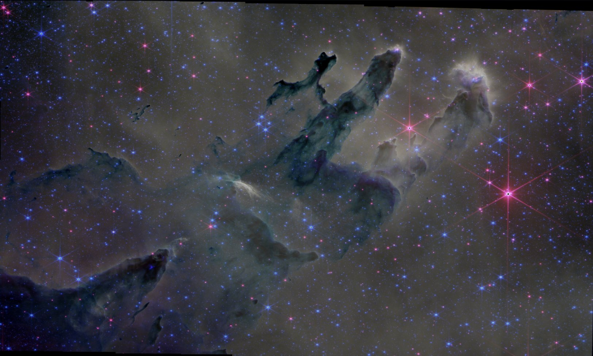
</p>
<p align="center"><em>JWST Pillars of Creation -- NIRCam F090W/F187N/F200W RGB composition with Manual white balance and SCNR green removal at 50% (Proposal 2739)</em></p>

<p align="center">
  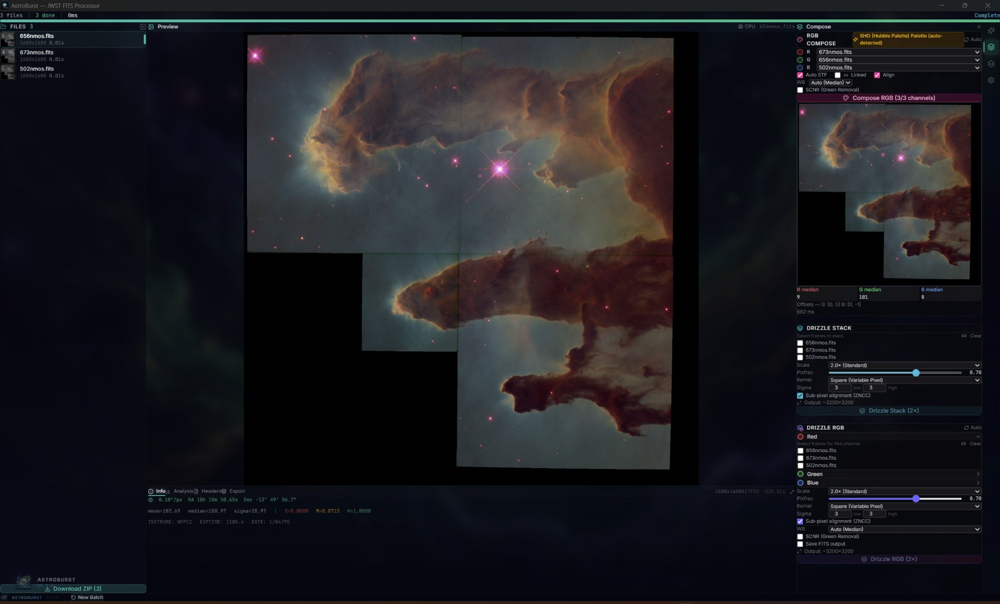
</p>
<p align="center"><em>Full interface layout -- Hubble WFPC2 narrowband SHO palette (auto-detected) with RGB Compose, Drizzle Stack, and Drizzle RGB panels. Info bar shows RA/Dec, pixel scale, and image statistics</em></p>

<p align="center">
  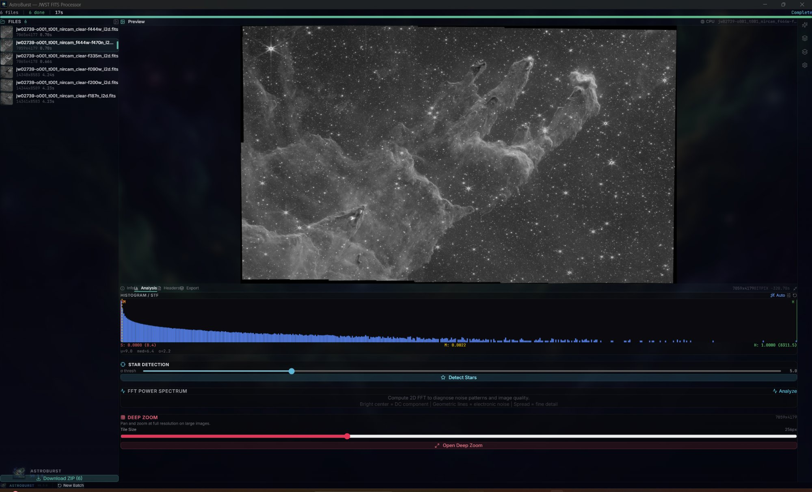
</p>
<p align="center"><em>6 JWST NIRCam filters loaded (F444W, F470N, F335M, F090W, F200W, F187N) -- Analysis tab with 16384-bin histogram, auto-STF, star detection threshold slider, FFT power spectrum, and Deep Zoom tile viewer</em></p>

<p align="center">
  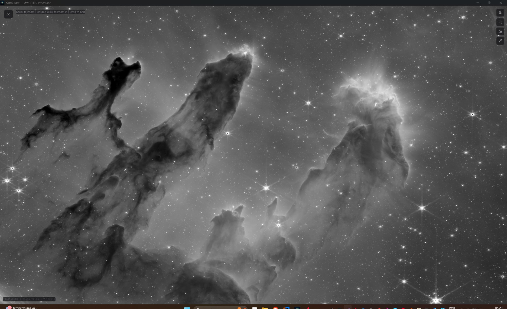
</p>
<p align="center"><em>Deep Zoom viewer -- Pillars of Creation at full 14542x8583 resolution with 256px tiles and 8-level pyramid. Scroll to zoom, double-click to zoom in, drag to pan</em></p>

<p align="center">
  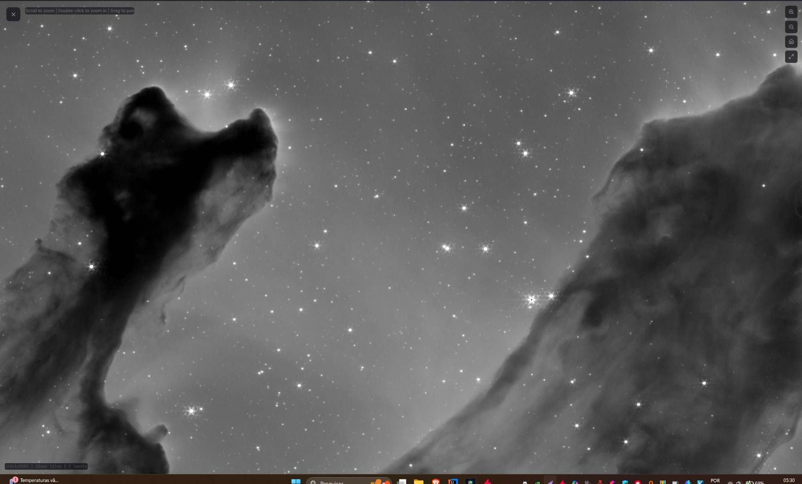
</p>
<p align="center"><em>Deep Zoom detail -- zoomed into individual pillar structure showing sub-arcsecond detail with diffraction spikes and embedded young stars</em></p>

<p align="center">
  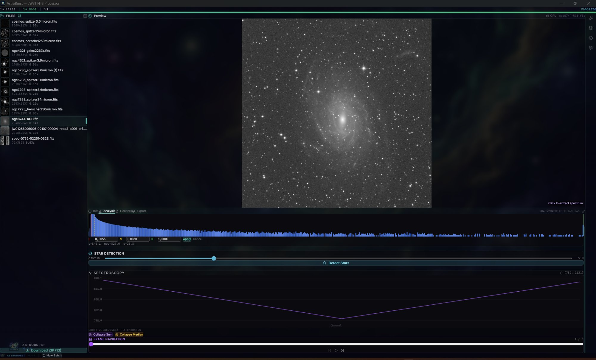
</p>
<p align="center"><em>13-file mixed dataset (Spitzer, Herschel, JWST, GALEX) -- NGC 6744 RGB cube with click-to-extract spectroscopy, Collapse Sum/Median modes, and frame navigation controls</em></p>

<p align="center">
  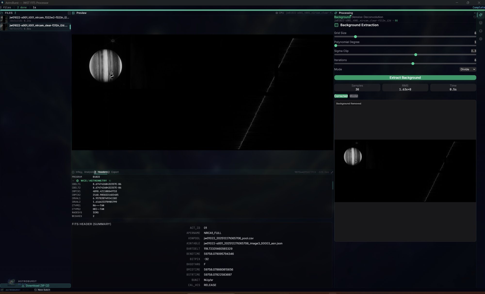
</p>
<p align="center"><em>JWST NIRCam data with Headers tab showing WCS/Astrometry section (CDELT, CRPIX, CRVAL, CTYPE RA---TAN/DEC--TAN) and full FITS header summary. Right panel: Background Extraction in Divide mode with polynomial fit</em></p>

<p align="center">
  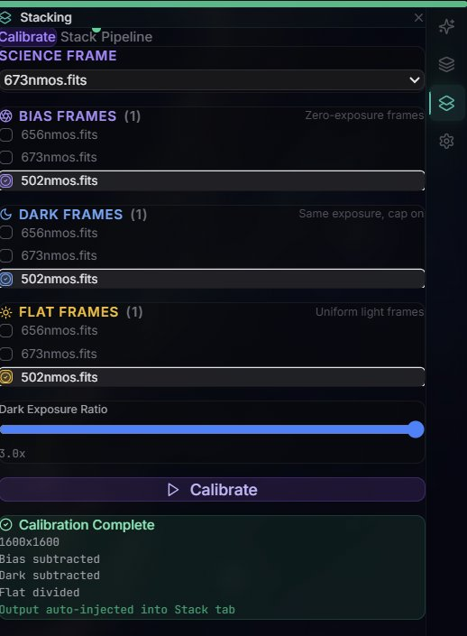
</p>
<p align="center"><em>Calibration pipeline -- science frame selection with separate Bias, Dark, and Flat frame assignment, configurable dark exposure ratio (3.0x), with auto-injection into the Stack tab after completion</em></p>

<p align="center">
  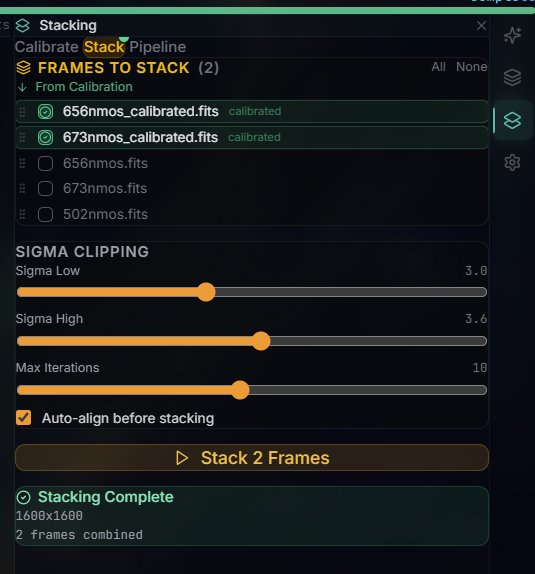
</p>
<p align="center"><em>Sigma-clipped stacking -- 2 calibrated frames combined with configurable sigma low/high thresholds (3.0/3.6), 10 max iterations, and auto-align before stacking. Output: 1600x1600</em></p>

<p align="center">
  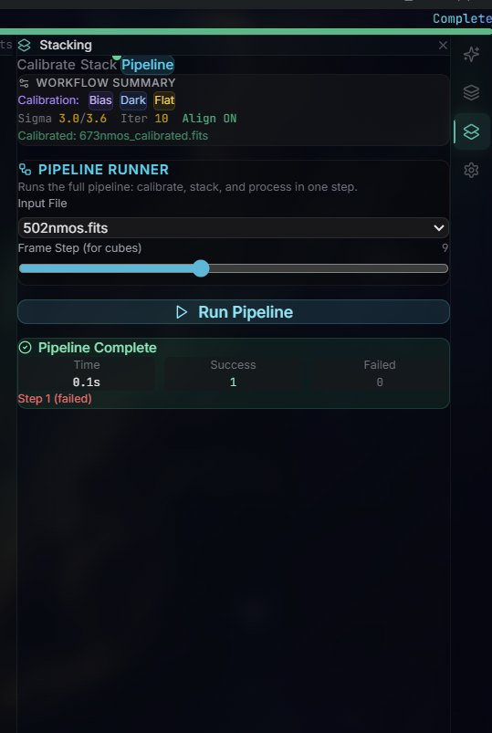
</p>
<p align="center"><em>Smart Pipeline Runner -- one-click calibrate + stack + process workflow with per-file input selection, cube frame step control, and completion status tracking (time, success/failed counts)</em></p>

<p align="center">
  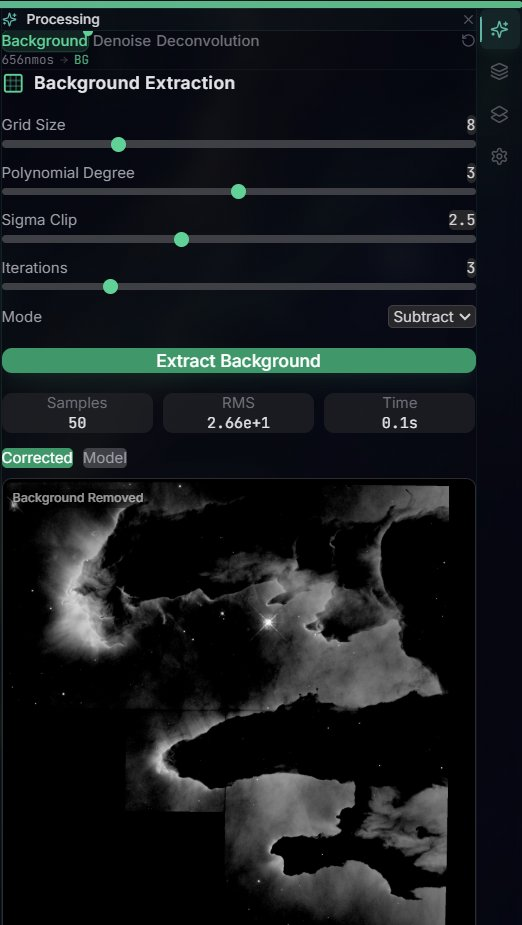
</p>
<p align="center"><em>Background Extraction -- polynomial surface fitting with configurable grid size (8), degree (3), sigma clip (2.5), and iterations (3). Subtract mode with Corrected/Model toggle and result metrics (50 samples, RMS 2.66e+1, 0.1s)</em></p>

<p align="center">
  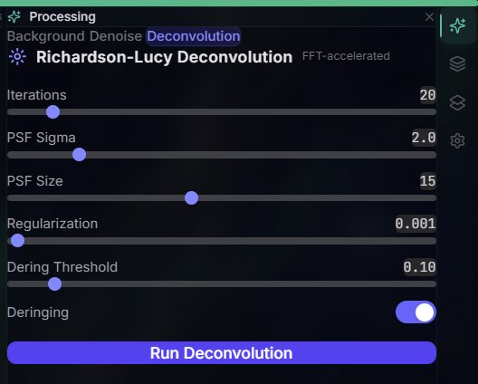
</p>
<p align="center"><em>Richardson-Lucy Deconvolution -- FFT-accelerated with configurable iterations (20), Gaussian PSF sigma/size (2.0/15), regularization (0.001), and deringing threshold (0.10)</em></p>

<p align="center">
  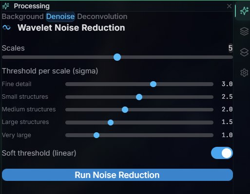
</p>
<p align="center"><em>Wavelet Noise Reduction -- a trous transform with 5 decomposition scales, per-scale sigma thresholds (fine detail 3.0 to very large 1.0), and soft/hard threshold toggle</em></p>

## Features

### Processing Pipeline
- **FITS I/O** -- Memory-mapped extraction with ZIP transparency and Multi-Extension FITS (MEF) support with automatic SCI extension selection
- **ASDF format** -- First non-Python ASDF implementation: parser with zlib/bzip2/lz4 decompression, Roman Space Telescope data model traversal, gWCS extraction, and transparent AsdfImage-to-Array2 bridge -- `.asdf` files are auto-dispatched alongside `.fits` in all commands
- **Smart pipeline** -- Unified pipeline runner that auto-detects 2D images vs 3D cubes and routes accordingly; processes FITS, ASDF, ZIP, and directories
- **Batch processing** -- Concurrent file processing (3 workers) with Rayon thread pool, ~118 MB/s sustained throughput
- **Bicubic resampling** -- Catmull-Rom interpolation with Rayon row-parallelism for mixing JWST NIRCam short-wave (~14K) and long-wave (~7K) data; auto-resample detects resolution groups and resamples to target dimensions with WCS header update
- **STF rendering** -- Screen Transfer Function with shadow/midtone/highlight controls, auto-STF from image statistics
- **Drizzle stacking** -- Sub-pixel reconstruction with Square, Gaussian, Lanczos3, and Turbo kernels, configurable scale (1-4x) and pixel fraction
- **RGB composition** -- Multi-channel combine with per-channel STF, auto white balance, pyramid alignment, dimension harmonization (5% tolerance crop), and SCNR green noise removal
- **Drizzle RGB** -- Combined drizzle + RGB with per-channel dimension harmonization and progress tracking
- **Calibration** -- Bias, dark, flat-field correction pipeline
- **Sigma-clipped stacking** -- Configurable sigma thresholds for outlier rejection with automatic crop-to-intersection for frames with differing dimensions
- **FITS export** -- Single-channel and RGB FITS writer with WCS/observation metadata preservation

### Image Enhancement
- **Richardson-Lucy deconvolution** -- FFT-based iterative deconvolution with Gaussian PSF, configurable iterations, regularization, and deringing threshold
- **Background extraction** -- Polynomial surface fitting (configurable grid size, degree, sigma clipping) with subtract and divide modes for gradient removal
- **Wavelet denoise** -- A trous wavelet transform with per-scale sigma thresholds, linear/nonlinear modes, and MAD noise estimation

### Analysis
- **Histogram** -- 16384-bin histogram with median, mean, sigma, MAD statistics and auto-STF derivation
- **FFT spectrum** -- 2D Fourier power spectrum with log-magnitude colormap for noise pattern identification
- **Star detection** -- PSF-based detection with flux, FWHM, and SNR measurements
- **Header Explorer** -- Categorized FITS header browser (Observation, Instrument, Image, WCS, Processing) with keyword search, value copy, and filter detection badge
- **Filter detection** -- Automatic narrowband filter identification (H-alpha, [OIII], [SII]) from FITS headers, keywords, wavelength values, and filenames with Hubble Palette (SHO) channel suggestion and confidence scoring

### Spectroscopy & Data Cubes
- 3D FITS cube support (NAXIS3 > 1) with eager and lazy processing modes
- Click-to-extract spectrum at any pixel coordinate
- Wavelength calibration from WCS headers
- Frame navigation and collapsed views (mean/median)

### Astrometry
- Plate solving via astrometry.net API
- WCS coordinate readout
- Pixel <-> world coordinate conversion

### Rendering
- **WebGPU** compute shader pipeline for real-time STF preview
- **Binary IPC** -- Zero-copy pixel transfer (no base64 encoding)
- **Deep zoom** -- Tile pyramid generation with percentile-based stretch for large images
- Canvas 2D fallback for systems without WebGPU

### Export
- Single-channel and RGB FITS export with WCS/metadata preservation
- Batch PNG export with ZIP packaging (STORE compression for speed)

## Installation

### Download (Recommended)

Download the latest release for your platform:

| Platform | Architecture | Download |
|----------|-------------|----------|
| **macOS** | Apple Silicon (M1+) | [`.dmg` (aarch64)](https://github.com/samuelkriegerbonini-dev/AstroBurst/releases/latest) |
| **macOS** | Intel | [`.dmg` (x86_64)](https://github.com/samuelkriegerbonini-dev/AstroBurst/releases/latest) |
| **Linux** | x86_64 | [`.deb`](https://github.com/samuelkriegerbonini-dev/AstroBurst/releases/latest) · [`.rpm`](https://github.com/samuelkriegerbonini-dev/AstroBurst/releases/latest) · [`.AppImage`](https://github.com/samuelkriegerbonini-dev/AstroBurst/releases/latest) |
| **Linux** | ARM64 | [`.deb`](https://github.com/samuelkriegerbonini-dev/AstroBurst/releases/latest) · [`.AppImage`](https://github.com/samuelkriegerbonini-dev/AstroBurst/releases/latest) |
| **Windows** | x86_64 | [`.msi`](https://github.com/samuelkriegerbonini-dev/AstroBurst/releases/latest) · [`.exe`](https://github.com/samuelkriegerbonini-dev/AstroBurst/releases/latest) |

### One-Line Install

**macOS:**
```bash
curl -fsSL https://raw.githubusercontent.com/samuelkriegerbonini-dev/AstroBurst/main/scripts/install-macos.sh | bash
```

**Linux (Debian/Ubuntu):**
```bash
curl -fsSL https://raw.githubusercontent.com/samuelkriegerbonini-dev/AstroBurst/main/scripts/install-linux.sh | bash
```

### Build from Source

```bash
git clone https://github.com/samuelkriegerbonini-dev/AstroBurst.git
cd AstroBurst
cargo tauri dev
```

**Requirements:** Rust 1.75+, Node.js 18+, Tauri CLI v2. WebGPU requires a compatible GPU driver (Vulkan/Metal/DX12).

## Quick Start

1. **Open files** -- Drag and drop `.fits` / `.fit` / `.asdf` files or use the file picker. ZIP-compressed FITS are extracted transparently.
2. **Process** -- Files are automatically processed: mmap read --> asinh normalize --> statistics --> PNG render. Progress is shown per-file.
3. **Auto-resample** -- Enable the "Auto-resample" checkbox before processing to automatically match dimensions when mixing short-wave and long-wave NIRCam data.
4. **Explore** -- Select a processed file to see the preview, histogram, and header data. Adjust STF sliders or click "Auto STF".
5. **GPU mode** -- Toggle the CPU/GPU button for real-time WebGPU rendering with instant STF feedback.
6. **RGB Compose** -- Assign channels manually or use "Auto" to detect filters from filenames/headers. At least 2 channels required.
7. **Drizzle** -- Select multiple frames of the same target for sub-pixel reconstruction. Drizzle RGB combines stacking + composition.
8. **Export** -- Download PNG previews or export processed FITS with preserved metadata.

## Usage

### Processing JWST Data

JWST NIRCam files from MAST typically come as Multi-Extension FITS with SCI, ERR, and DQ extensions. AstroBurst automatically selects the SCI extension and merges the primary header for complete metadata.

### Processing Roman Space Telescope Data

AstroBurst is the first non-Python tool with native ASDF support. Roman Space Telescope simulated data (`.asdf` files) are loaded transparently -- the ASDF parser handles zlib/bzip2/lz4 block decompression, Roman data model traversal, and gWCS extraction. ASDF files work in all commands (preview, stacking, RGB compose, pipeline) with zero configuration.

### NIRCam Resolution Mixing

NIRCam data comes in two detector resolutions:
- **Short-wave (SW):** F090W, F150W, F187N, F200W -- ~14340x8583 px
- **Long-wave (LW):** F335M, F444W, F470N -- ~7065x4178 px

When composing RGB with mixed SW + LW filters, enable **Auto-resample** before processing. AstroBurst detects the two resolution groups (threshold: 1.5x area ratio), resamples the larger group to the smaller using bicubic Catmull-Rom interpolation, and updates WCS headers (CRPIX, CD matrix / CDELT) so astrometry remains valid. Original files are preserved -- resampled versions are saved as `{name}_resampled.fits`.

For RGB composition of NIRCam short-wave data:
- **B:** F090W (0.9μm)
- **G:** F150W (1.5μm)
- **R:** F200W (2.0μm)

For Drizzle RGB, assign the two detector modules (NRCA + NRCB) per channel.

### Processing Hubble Data

HST narrowband filters are automatically detected from FITS headers:
- **H-alpha (656nm)** --> G channel (SHO palette)
- **[OIII] (502nm)** --> B channel
- **[SII] (673nm)** --> R channel

The Header Explorer shows the detected filter with confidence level (High/Medium/Low based on keyword source) and an "Assign" button for direct channel mapping.

### Spectroscopy

For 3D FITS cubes (IFU data), click anywhere on the preview image to extract the spectrum at that pixel coordinate. Wavelength calibration is read from WCS headers when available.

## Architecture

```
+--------------------------------------------------+
|                     Frontend                      |
|           React + TypeScript + Tailwind           |
|                                                   |
|  Layout: IntelliJ-style panels                    |
|    Center: persistent preview                     |
|    Bottom: Info | Analysis | Headers | Export      |
|    Right:  Processing | Compose | Stacking | Config|
|                                                   |
|  Context: 6 split PreviewContexts                 |
|  Hooks: useBackend . useFileQueue . useTimer      |
|                      |                            |
|              useBackend.ts (IPC)                   |
+----------------------+----------------------------+
                       | Tauri Commands (42)
+----------------------+----------------------------+
|                      Backend                      |
|                 Rust + Tauri v2                    |
|                                                   |
|  I/O:      mmap FITS parser, MEF scanner,         |
|            ASDF parser (zlib/bzip2/lz4),          |
|            FITS writer (mono + RGB)               |
|  Imaging:  deconvolution (RL), background,        |
|            wavelet denoise, stf, resample, scnr   |
|  Compose:  rgb, drizzle_rgb                       |
|  Stack:    sigma-clip, drizzle, align, calibrate  |
|  Analysis: stars, histogram, fft                  |
|  Meta:     header_discovery, filter detection     |
|  Astro:    plate_solve, wcs transforms            |
|  Cube:     eager + lazy, spectrum, frame nav      |
+--------------------------------------------------+
```

**Key design decisions:**
- All image data stays in f32/f64 -- no integer quantization at any stage
- Binary IPC for GPU pixel transfer -- zero base64 overhead
- Concurrent file processing with `requestAnimationFrame` yields -- UI stays responsive during batch operations
- Dimension harmonization with 5% tolerance -- channels with slight size differences are auto-cropped instead of rejected
- Crop-to-intersection stacking -- frames with different dimensions are cropped to their common overlap region
- Bicubic resampling for large dimension mismatches (>1.5x area ratio) -- preserves flux distribution and updates WCS
- Narrowband filter detection via regex matching on header keywords, wavelength values, and filename patterns
- ASDF auto-dispatch -- `.asdf` files are transparently routed through the same command layer as `.fits`

## Roadmap
| Version  | Features                                                  | Status            |
|:---------|:----------------------------------------------------------|:------------------|
| **v0.3** | Deconvolution, background extraction, wavelet denoise, ASDF format, smart pipeline | Released          |
| **v0.4** | Multi-extension FITS ERR/DQ/VAR propagation, MAST API integration, star removal | Next              |
| **v0.5** | Photometric color calibration (Gaia DR3), PixelMath expressions | Planned           |
| **v1.0** | Full GPU pipeline, plugin system (WASM), Python scripting | Planned           |

## Contributing

Contributions are welcome. See [CONTRIBUTING.md](CONTRIBUTING.md) for guidelines.

**Areas welcoming contributions:**
- Multi-extension FITS ERR/DQ/VAR error propagation
- MAST API integration for direct JWST/HST data download
- Star removal algorithms
- Photometric calibration (Gaia DR3 cross-match)
- WebGPU compute shader pipeline expansion
- Test data curation (public FITS from MAST, ESA archives)
- ASDF format testing with real Roman Space Telescope simulated data
- Documentation and processing tutorials
- Platform-specific packaging and testing

## Support

AstroBurst is free and open source -- no subscriptions, no feature locks.

If it saves you time or helps your astrophotography workflow, consider supporting development:

<p align="center">
  <a href="https://ko-fi.com/astroburst">
    
  </a>
</p>

Your support helps cover:
- Development time for new features (Gaia DR3 calibration, MAST integration, WASM plugins)


**Supporters get:**
See [membership tiers](https://ko-fi.com/astroburst/tiers) for details.

## Supporters

Thanks to everyone supporting AstroBurst development:

<!-- SUPPORTERS:START -->
*Be the first to support!*
<!-- SUPPORTERS:END -->

## License

GPLv3. See [LICENSE](LICENSE) for details.

---

<p align="center">
  <sub>Created by <a href="https://github.com/samuelkriegerbonini-dev">Samuel Krieger</a> · Built with Rust 🦀</sub>
</p>
