<p align="center">
  
</p>

<h1 align="center">AstroBurst</h1>

<p align="center">
  <strong>High-Performance Astronomical Image Processor</strong><br>
  <em>The first FITS + ASDF processor built on the Rust / Tauri / WebGPU stack</em>
</p>

<p align="center">
  <a href="https://github.com/samuelkriegerbonini-dev/AstroBurst/releases"></a>
  <a href="https://github.com/samuelkriegerbonini-dev/AstroBurst/actions"></a>
  
  
  <a href="LICENSE"></a>
  
  <a href="https://ko-fi.com/astroburst"></a>
</p>

<p align="center">
  <a href="#installation">Install</a> /
  <a href="#features">Features</a> /
  <a href="#quick-start">Quick Start</a> /
  <a href="#usage">Usage</a> /
  <a href="#architecture">Architecture</a> /
  <a href="#roadmap">Roadmap</a> /
  <a href="#contributing">Contributing</a> /
  <a href="#support">Support</a>
</p>

---

AstroBurst is a native desktop application for processing astronomical FITS and ASDF images. It combines a high-performance Rust backend with a modern React frontend, delivering GPU-accelerated rendering with a fraction of the memory footprint of legacy tools, targeting both professional astronomers and advanced astrophotographers.

**v0.3.0** brings Richardson-Lucy deconvolution (FFT-based), polynomial background extraction, wavelet denoise (a trous), full ASDF format support (the first non-Python implementation, Roman Space Telescope ready), a smart pipeline that auto-detects 2D/3D data, dimension-tolerant stacking with crop-to-intersection, auto-resample for mixed SW/LW NIRCam data, and an IntelliJ-style panel layout. See the [changelog](CHANGELOG.md) for details.

## Screenshots

<p align="center">
  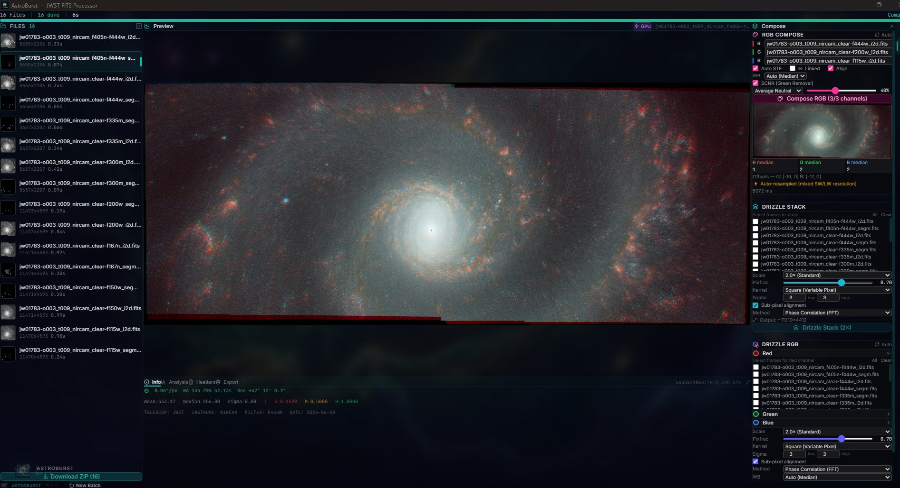
</p>
<p align="center"><em>JWST M51 (Whirlpool Galaxy) RGB composition with auto-resample for mixed SW/LW channels. R: F444W (4.44um, LW), G: F200W (2.0um, SW), B: F115W (1.15um, SW). SCNR Average Neutral 40%, Auto STF, WB Auto Median. The F444W channel was automatically upsampled from 5655x2206 to 11473x4599 via bicubic Catmull-Rom interpolation (PHANGS-JWST Program 01783)</em></p>

<p align="center">
  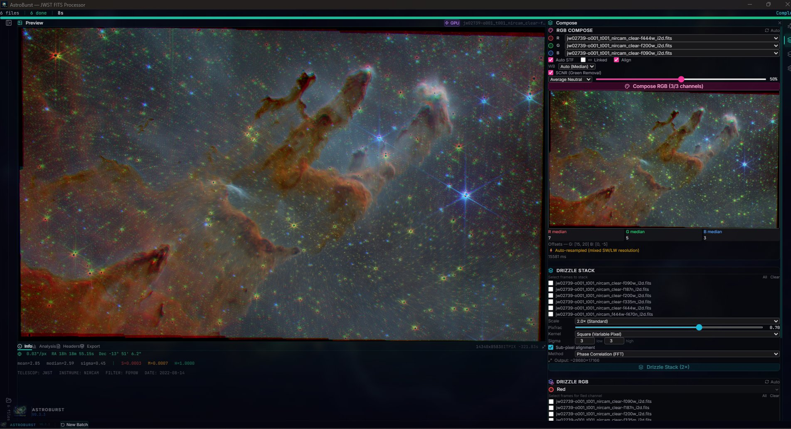
</p>
<p align="center"><em>JWST Pillars of Creation (Carina Nebula) RGB composition. R: F444W, G: F200W, B: F090W with auto-resample, SCNR 50%, showing towering gas pillars with embedded young stars and JWST diffraction spikes (ERO Program 02739)</em></p>

<p align="center">
  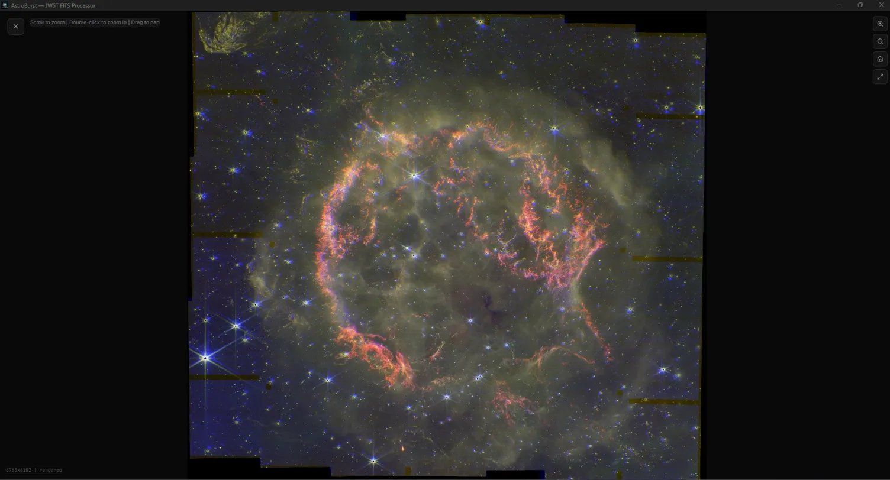
</p>
<p align="center"><em>Cassiopeia A supernova remnant in Deep Zoom mode at full 6765x6102 resolution. R: F444W, G: F356W, B: F162M composition showing filamentary ejecta structure, forward and reverse shocks, and surrounding field stars with JWST diffraction spikes (Program 01947)</em></p>

<p align="center">
  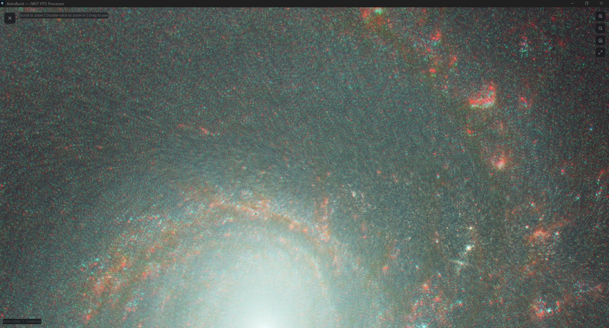
</p>
<p align="center"><em>M51 Deep Zoom detail showing individual HII regions, star clusters, and dust lanes in the spiral arms. Scroll to zoom, double-click to zoom in, drag to pan. RGB composite at 5655x2206 resolution</em></p>

<p align="center">
  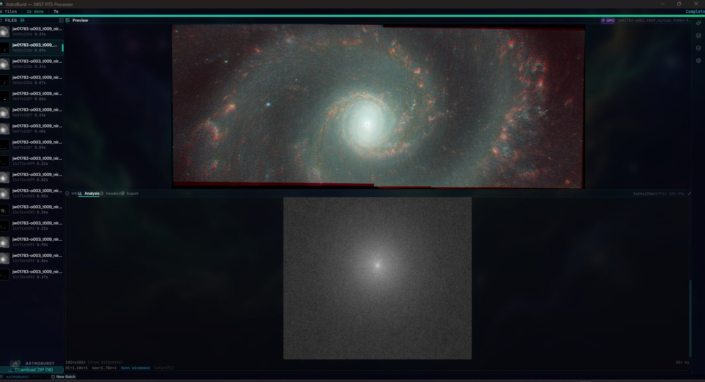
</p>
<p align="center"><em>Full interface with Analysis tab showing FFT Power Spectrum (1024x1024 from 8192x8192, Hann windowed, ln(1+|F|) scale). 16 JWST NIRCam files loaded across 8 filters (F115W through F444W) with per-file dimensions and load times</em></p>

<p align="center">
  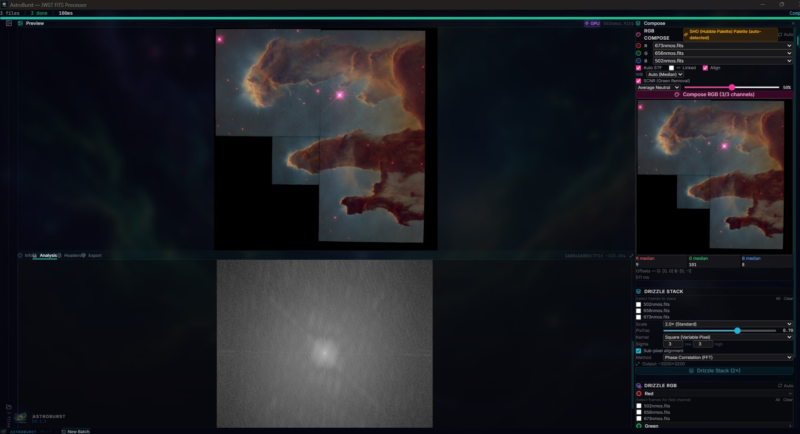
</p>
<p align="center"><em>Hubble WFPC2 narrowband SHO palette (auto-detected from FITS headers). R: [SII] 673nm, G: H-alpha 656nm, B: [OIII] 502nm with SCNR 50% and FFT power spectrum. Filter detection uses keyword matching, wavelength values, and filename patterns with confidence scoring</em></p>

<p align="center">
  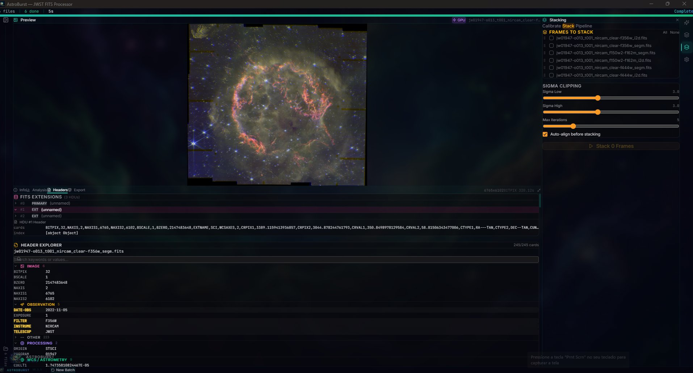
</p>
<p align="center"><em>Cassiopeia A with FITS Extensions browser (3 HDUs), Header Explorer showing 245 cards with categorized sections (Image, Observation, WCS/Astrometry), and Stacking panel with sigma-clipped stacking controls and auto-align (Program 01947, FILTER: F356W)</em></p>

<p align="center">
  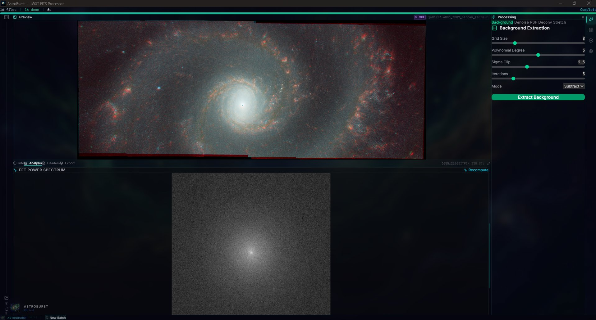
</p>
<p align="center"><em>M51 RGB composite with Processing panel showing Background Extraction (polynomial surface fitting, grid 8, degree 3, sigma clip 2.5, subtract mode) and FFT Power Spectrum analysis below</em></p>

### Processing Panels

<p align="center">
  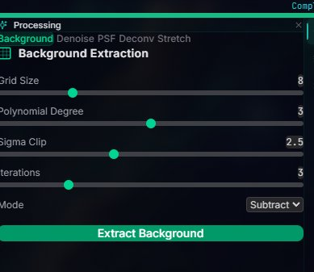
  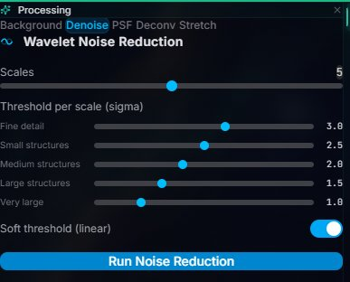
  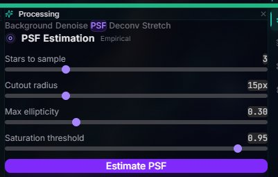
</p>
<p align="center"><em>Processing tools: Background Extraction with configurable grid/degree/sigma, Wavelet Noise Reduction with per-scale thresholds (a trous, 5 scales), and PSF Estimation with star sampling and ellipticity constraints</em></p>

<p align="center">
  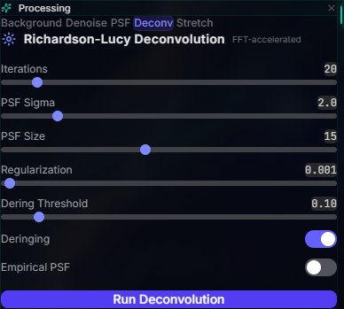
  
</p>
<p align="center"><em>Richardson-Lucy Deconvolution (FFT-accelerated, 20 iterations, Gaussian PSF, Tikhonov regularization, deringing) and Arcsinh Stretch with configurable factor (1.0 linear to 500 strong)</em></p>

### Stacking Panels

<p align="center">
  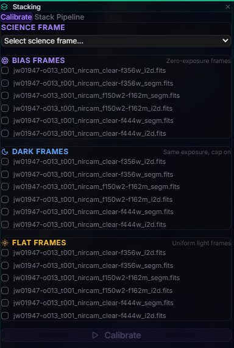
  
  
</p>
<p align="center"><em>Stacking workflow: Calibration frame assignment (Bias, Dark, Flat), Sigma-clipped stacking with configurable thresholds and auto-align, and Calibration Pipeline for one-click multi-channel processing</em></p>

## Features

### Processing Pipeline
- **FITS I/O**: Memory-mapped extraction with ZIP transparency and Multi-Extension FITS (MEF) support with automatic SCI extension selection
- **ASDF format**: First non-Python ASDF implementation: parser with zlib/bzip2/lz4 decompression, Roman Space Telescope data model traversal, gWCS extraction, and transparent AsdfImage-to-Array2 bridge. `.asdf` files are auto-dispatched alongside `.fits` in all commands
- **Smart pipeline**: Unified pipeline runner that auto-detects 2D images vs 3D cubes and routes accordingly; processes FITS, ASDF, ZIP, and directories
- **Batch processing**: Concurrent file processing (3 workers) with Rayon thread pool, ~118 MB/s sustained throughput
- **Bicubic resampling**: Catmull-Rom interpolation with Rayon row-parallelism for mixing JWST NIRCam short-wave (~14K) and long-wave (~7K) data; auto-resample detects resolution groups and upsamples to the largest channel with WCS header update
- **STF rendering**: Screen Transfer Function with shadow/midtone/highlight controls, auto-STF from image statistics
- **Drizzle stacking**: Sub-pixel reconstruction with Square, Gaussian, Lanczos3, and Turbo kernels, configurable scale (1-4x) and pixel fraction
- **RGB composition**: Multi-channel combine with per-channel STF, auto white balance, pyramid alignment, dimension harmonization (5% tolerance crop), auto-resample for mixed resolutions, and SCNR green noise removal
- **Drizzle RGB**: Combined drizzle + RGB with per-channel dimension harmonization and progress tracking
- **Calibration**: Bias, dark, flat-field correction pipeline
- **Sigma-clipped stacking**: Configurable sigma thresholds for outlier rejection with automatic crop-to-intersection for frames with differing dimensions
- **FITS export**: Single-channel and RGB FITS writer with WCS/observation metadata preservation

### Image Enhancement
- **Richardson-Lucy deconvolution**: FFT-based iterative deconvolution with Gaussian PSF, configurable iterations, regularization, and deringing threshold
- **Background extraction**: Polynomial surface fitting (configurable grid size, degree, sigma clipping) with subtract and divide modes for gradient removal
- **Wavelet denoise**: A trous wavelet transform with per-scale sigma thresholds, linear/nonlinear modes, and MAD noise estimation

### Analysis
- **Histogram**: 16384-bin histogram with median, mean, sigma, MAD statistics and auto-STF derivation
- **FFT spectrum**: 2D Fourier power spectrum with Hann window, log-magnitude colormap, and downsampled preview for noise pattern identification
- **Star detection**: PSF-based detection with flux, FWHM, and SNR measurements
- **Header Explorer**: Categorized FITS header browser (Observation, Instrument, Image, WCS, Processing) with keyword search, value copy, and filter detection badge
- **Filter detection**: Automatic narrowband filter identification (H-alpha, [OIII], [SII]) from FITS headers, keywords, wavelength values, and filenames with Hubble Palette (SHO) channel suggestion and confidence scoring

### Spectroscopy & Data Cubes
- 3D FITS cube support (NAXIS3 > 1) with eager and lazy processing modes
- Click-to-extract spectrum at any pixel coordinate
- Wavelength calibration from WCS headers
- Frame navigation and collapsed views (mean/median)

### Astrometry
- Plate solving via astrometry.net API
- WCS coordinate readout (RA/Dec from pixel position)
- Pixel to world coordinate conversion

### Rendering
- **WebGPU** compute shader pipeline for real-time STF preview
- **Binary IPC**: Zero-copy pixel transfer (no base64 encoding)
- **Deep zoom**: Tile pyramid generation with percentile-based stretch for large images (scroll to zoom, double-click, drag to pan)
- Canvas 2D fallback for systems without WebGPU

### Export
- Single-channel and RGB FITS export with WCS/metadata preservation
- Batch PNG export with ZIP packaging (STORE compression for speed)

## Installation

### Download (Recommended)

Download the latest release for your platform:

| Platform | Architecture | Download |
|----------|-------------|----------|
| **macOS** | Apple Silicon (M1+) | [`.dmg` (aarch64)](https://github.com/samuelkriegerbonini-dev/AstroBurst/releases/latest) |
| **macOS** | Intel | [`.dmg` (x86_64)](https://github.com/samuelkriegerbonini-dev/AstroBurst/releases/latest) |
| **Linux** | x86_64 | [`.deb`](https://github.com/samuelkriegerbonini-dev/AstroBurst/releases/latest) / [`.rpm`](https://github.com/samuelkriegerbonini-dev/AstroBurst/releases/latest) / [`.AppImage`](https://github.com/samuelkriegerbonini-dev/AstroBurst/releases/latest) |
| **Linux** | ARM64 | [`.deb`](https://github.com/samuelkriegerbonini-dev/AstroBurst/releases/latest) / [`.AppImage`](https://github.com/samuelkriegerbonini-dev/AstroBurst/releases/latest) |
| **Windows** | x86_64 | [`.msi`](https://github.com/samuelkriegerbonini-dev/AstroBurst/releases/latest) / [`.exe`](https://github.com/samuelkriegerbonini-dev/AstroBurst/releases/latest) |

### One-Line Install

**macOS:**
```bash
curl -fsSL https://raw.githubusercontent.com/samuelkriegerbonini-dev/AstroBurst/main/scripts/install-macos.sh | bash
```

**Linux (Debian/Ubuntu):**
```bash
curl -fsSL https://raw.githubusercontent.com/samuelkriegerbonini-dev/AstroBurst/main/scripts/install-linux.sh | bash
```

### Build from Source

```bash
git clone https://github.com/samuelkriegerbonini-dev/AstroBurst.git
cd AstroBurst
cargo tauri dev
```

**Requirements:** Rust 1.75+, Node.js 18+, Tauri CLI v2. WebGPU requires a compatible GPU driver (Vulkan/Metal/DX12).

## Quick Start

1. **Open files**: Drag and drop `.fits` / `.fit` / `.asdf` files or use the file picker. ZIP-compressed FITS are extracted transparently.
2. **Process**: Files are automatically processed: mmap read, asinh normalize, statistics, PNG render. Progress is shown per-file.
3. **Explore**: Select a processed file to see the preview, histogram, and header data. Adjust STF sliders or click "Auto STF".
4. **GPU mode**: Toggle the CPU/GPU button for real-time WebGPU rendering with instant STF feedback.
5. **RGB Compose**: Assign channels manually or use "Auto" to detect filters from filenames/headers. Mixed SW/LW resolutions are auto-resampled. At least 2 channels required.
6. **Drizzle**: Select multiple frames of the same target for sub-pixel reconstruction. Drizzle RGB combines stacking + composition.
7. **Export**: Download PNG previews or export processed FITS with preserved metadata.

## Usage

### Processing JWST Data

JWST NIRCam files from MAST typically come as Multi-Extension FITS with SCI, ERR, and DQ extensions. AstroBurst automatically selects the SCI extension and merges the primary header for complete metadata.

### Processing Roman Space Telescope Data

AstroBurst is the first non-Python tool with native ASDF support. Roman Space Telescope simulated data (`.asdf` files) are loaded transparently: the ASDF parser handles zlib/bzip2/lz4 block decompression, Roman data model traversal, and gWCS extraction. ASDF files work in all commands (preview, stacking, RGB compose, pipeline) with zero configuration.

### NIRCam Resolution Mixing

NIRCam data comes in two detector resolutions:
- **Short-wave (SW):** F090W, F115W, F150W, F187N, F200W at ~0.031"/px (~14Kx8K)
- **Long-wave (LW):** F300M, F335M, F356W, F444W, F470N at ~0.063"/px (~7Kx4K)

When composing RGB with mixed SW + LW filters, AstroBurst automatically detects the dimension mismatch (>10% ratio) and upsamples the smaller channels to match the largest using bicubic Catmull-Rom interpolation. The compose result shows "Auto-resampled (mixed SW/LW resolution)" when this occurs. WCS headers are updated so astrometry remains valid. Original files are preserved.

Recommended NIRCam RGB combinations:

**Full range (mixed SW/LW, auto-resampled):**
- R: F444W (4.44um) / G: F200W (2.0um) / B: F115W (1.15um)

**LW only (same resolution, no resample):**
- R: F444W (4.44um) / G: F335M (3.35um) / B: F300M (3.0um)

**SW only (highest resolution):**
- R: F200W (2.0um) / G: F150W (1.5um) / B: F115W (1.15um)

### Processing Hubble Data

HST narrowband filters are automatically detected from FITS headers:
- **H-alpha (656nm)** to G channel (SHO palette)
- **[OIII] (502nm)** to B channel
- **[SII] (673nm)** to R channel

The Header Explorer shows the detected filter with confidence level (High/Medium/Low based on keyword source) and an "Assign" button for direct channel mapping.

### Spectroscopy

For 3D FITS cubes (IFU data), click anywhere on the preview image to extract the spectrum at that pixel coordinate. Wavelength calibration is read from WCS headers when available.

## Architecture

```
+--------------------------------------------------+
|                     Frontend                      |
|           React + TypeScript + Tailwind           |
|                                                   |
|  Layout: IntelliJ-style panels                    |
|    Center: persistent preview                     |
|    Bottom: Info | Analysis | Headers | Export     |
|    Right:  Processing | Compose | Stacking | Cfg  |
|                                                   |
|  Context: 6 split PreviewContexts                 |
|  Hooks: useBackend / useFileQueue / useTimer      |
|                      |                            |
|              useBackend.ts (IPC)                   |
+----------------------+----------------------------+
                       | Tauri Commands (42)
+----------------------+----------------------------+
|                      Backend                      |
|                 Rust + Tauri v2                    |
|                                                   |
|  I/O:      mmap FITS parser, MEF scanner,         |
|            ASDF parser (zlib/bzip2/lz4),          |
|            FITS writer (mono + RGB)               |
|  Imaging:  deconvolution (RL), background,        |
|            wavelet denoise, stf, resample, scnr   |
|  Compose:  rgb (auto-resample), drizzle_rgb       |
|  Stack:    sigma-clip, drizzle, align, calibrate  |
|  Analysis: stars, histogram, fft                  |
|  Meta:     header_discovery, filter detection     |
|  Astro:    plate_solve, wcs transforms            |
|  Cube:     eager + lazy, spectrum, frame nav      |
+--------------------------------------------------+
```

**Key design decisions:**
- All image data stays in f32/f64 with no integer quantization at any stage
- Binary IPC for GPU pixel transfer with zero base64 overhead
- Concurrent file processing with `requestAnimationFrame` yields so UI stays responsive during batch operations
- Dimension harmonization with 5% tolerance: channels with slight size differences are auto-cropped instead of rejected
- Auto-resample for large dimension mismatches (>10% ratio): bicubic Catmull-Rom upsample to largest channel dimensions
- Crop-to-intersection stacking: frames with different dimensions are cropped to their common overlap region
- Narrowband filter detection via regex matching on header keywords, wavelength values, and filename patterns
- ASDF auto-dispatch: `.asdf` files are transparently routed through the same command layer as `.fits`

## Roadmap
| Version  | Features                                                  | Status            |
|:---------|:----------------------------------------------------------|:------------------|
| **v0.3** | Deconvolution, background extraction, wavelet denoise, ASDF format, smart pipeline, auto-resample | Released          |
| **v0.4** | Multi-extension FITS ERR/DQ/VAR propagation, MAST API integration, star removal | Next              |
| **v0.5** | Photometric color calibration (Gaia DR3), PixelMath expressions | Planned           |
| **v1.0** | Full GPU pipeline, plugin system (WASM), Python scripting | Planned           |

## Contributing

Contributions are welcome. See [CONTRIBUTING.md](CONTRIBUTING.md) for guidelines.

**Areas welcoming contributions:**
- Multi-extension FITS ERR/DQ/VAR error propagation
- MAST API integration for direct JWST/HST data download
- Star removal algorithms
- Photometric calibration (Gaia DR3 cross-match)
- WebGPU compute shader pipeline expansion
- Test data curation (public FITS from MAST, ESA archives)
- ASDF format testing with real Roman Space Telescope simulated data
- Documentation and processing tutorials
- Platform-specific packaging and testing

## Support

AstroBurst is free and open source with no subscriptions and no feature locks.

If it saves you time or helps your astrophotography workflow, consider supporting development:

<p align="center">
  <a href="https://ko-fi.com/astroburst">
    
  </a>
</p>

Your support helps cover development time for new features (Gaia DR3 calibration, MAST integration, WASM plugins).

**Supporters get:**
See [membership tiers](https://ko-fi.com/astroburst/tiers) for details.

## Supporters

Thanks to everyone supporting AstroBurst development:

<!-- SUPPORTERS:START -->
*Be the first to support!*
<!-- SUPPORTERS:END -->

## License

GPLv3. See [LICENSE](LICENSE) for details.

---

<p align="center">
  <sub>Created by <a href="https://github.com/samuelkriegerbonini-dev">Samuel Krieger</a> / Built with Rust</sub>
</p>
