<p align="center">
  
</p>

<h1 align="center">AstroBurst</h1>

<p align="center">
  <strong>High-Performance Astronomical Image Processor</strong><br>
  <em>Rust + Tauri + WebGPU. Process JWST, Hubble, and Roman Space Telescope data at native speed.</em>
</p>

<p align="center">
  <a href="https://github.com/samuelkriegerbonini-dev/AstroBurst/releases"></a>
  <a href="https://github.com/samuelkriegerbonini-dev/AstroBurst/actions"></a>
  
  
  <a href="LICENSE"></a>
  
  <a href="https://ko-fi.com/astroburst"></a>
</p>

<p align="center">
  <a href="#installation">Install</a> &middot;
  <a href="#features">Features</a> &middot;
  <a href="#quick-start">Quick Start</a> &middot;
  <a href="#getting-data">Data</a> &middot;
  <a href="#usage">Usage</a> &middot;
  <a href="#architecture">Architecture</a> &middot;
  <a href="#roadmap">Roadmap</a> &middot;
  <a href="#contributing">Contributing</a>
</p>

---

AstroBurst is an open-source desktop app for processing astronomical images. Drop in your FITS or ASDF files, compose RGB from narrowband channels, stack with drizzle, and export. Everything runs locally on your machine with no cloud dependencies.

It's built on Rust for the heavy lifting, React for the interface, and WebGPU for real-time preview. The result is a tool that opens a 2 GB IFU datacube in 300 ms, processes 10 frames at 1.4 GB/s, and renders STF adjustments in 8 ms on GPU.

> **What's new in v0.4.2**: Live composite STF re-stretch without recomposing, narrowband palette system (SHO/HOO/HOS/NaturalColor/Custom), synthetic FITS generation for testing, PNG/FITS export pipeline with 16-bit and multi-BITPIX support, per-channel STF in RGB PNG export, aligned channel FITS export with WCS offset correction, Cephes-precision SIMD log (< 1 ULP), moment-based PSF FWHM measurement, and parallel triangle matching for affine alignment. See the [changelog](CHANGELOG.md).
>
> **v0.4.x highlights**: Star-based affine alignment for rotational misalignment, stability-based auto white balance, SCNR luminance redistribution to R/B, arcsinh stretch, live composite STF re-stretch, parallel drizzle, median/MAD sigma clipping (Stetson 1987), full-precision SIMD log, synthetic FITS generator, and a full numerical correctness audit across the math pipeline. The frontend was refactored into 11 domain services with shared UI primitives.

## Screenshots

<p align="center">
  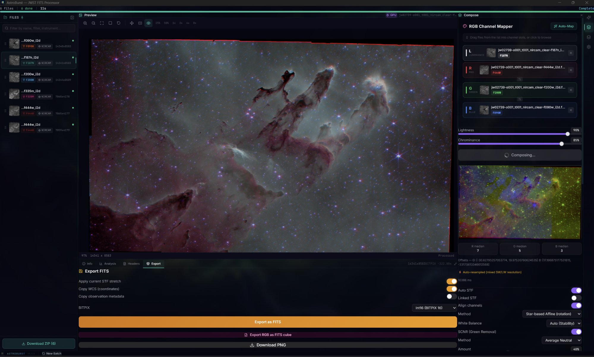
</p>
<p align="center"><em>JWST Pillars of Creation (M16) composed from F444W / F200W / F090W with star-based affine alignment handling rotation between channels. Luminance layer from F187N. Export panel with FITS and PNG output options. Auto-resampled mixed SW/LW resolution.</em></p>

<p align="center">
  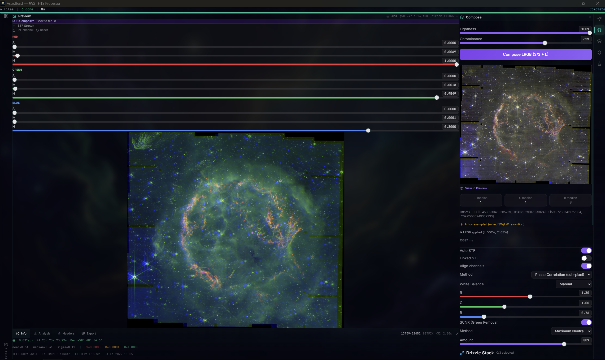
</p>
<p align="center"><em>Cassiopeia A LRGB with per-channel STF stretch sliders (R/G/B shadow, midtone, highlight). Manual white balance (R: 1.38, G: 1.00, B: 0.76), SCNR Maximum Neutral at 88%, phase correlation alignment. F150W2 as luminance. 13759x12451 auto-resampled mixed SW/LW resolution.</em></p>

<p align="center">
  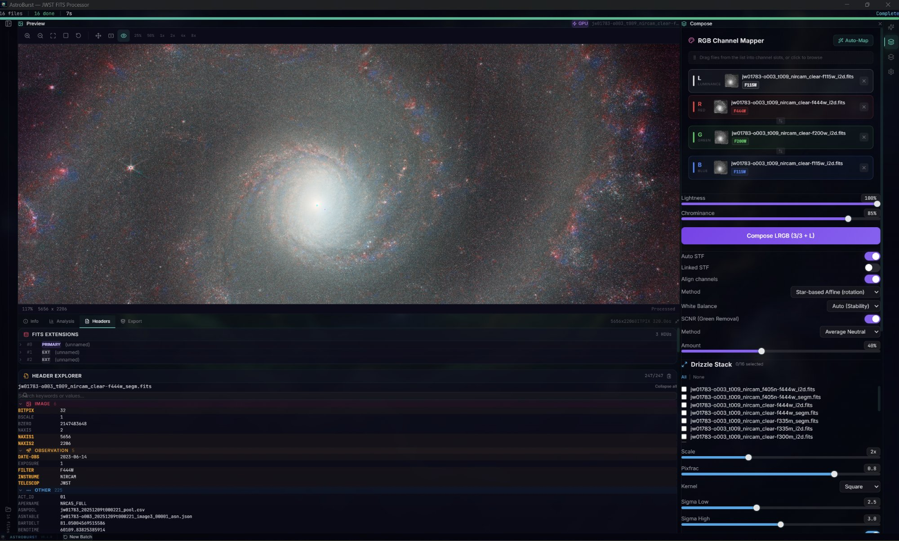
</p>
<p align="center"><em>NGC 628 (M74) LRGB composition from 16 JWST NIRCam files. F115W as luminance, F444W / F200W / F115W as RGB with star-based affine alignment, stability white balance, and SCNR Average Neutral at 40%. Drizzle stack panel and header explorer with categorized keyword browser visible below.</em></p>

<p align="center">
  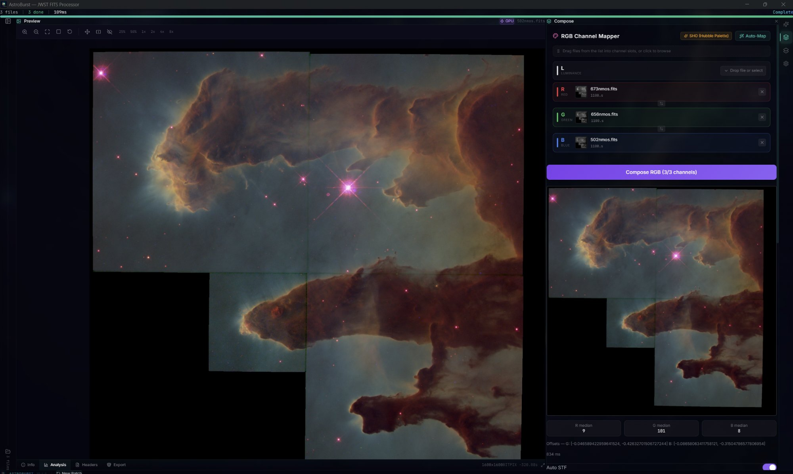
</p>
<p align="center"><em>HST Eagle Nebula (M16) narrowband SHO palette auto-detected from FITS headers. [SII] 673nm mapped to R, H-alpha 656nm to G, [OIII] 502nm to B. One-click Hubble Palette assignment with Auto-Map.</em></p>

<details>
<summary><strong>More screenshots</strong></summary>

<p align="center">
  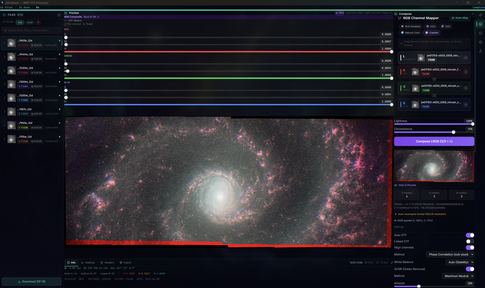
</p>
<p align="center"><em>NGC 628 LRGB with per-channel STF sliders and Custom palette selected. F335M as luminance, F444W / F200W / F187N as RGB. Phase correlation alignment, SCNR Maximum Neutral at 38%. Palette selector showing SHO, HOO, HOS, Natural Color, and Custom presets.</em></p>

<p align="center">
  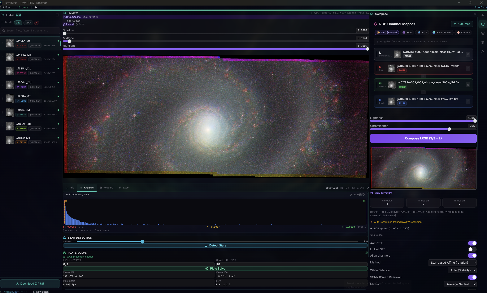
</p>
<p align="center"><em>NGC 628 (M74) LRGB with SHO (Hubble) palette selected. F150W as luminance, F444W / F200W / F115W as RGB with star-based affine alignment, stability white balance, and SCNR Average Neutral. Analysis tab showing histogram, star detection, and plate solve results below. Palette selector chips visible in compose panel.</em></p>

<p align="center">
  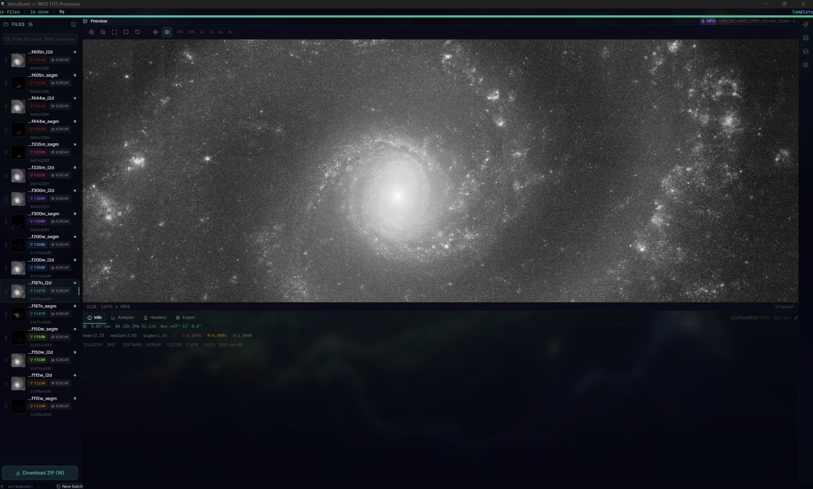
</p>
<p align="center"><em>16 JWST NIRCam files loaded across 8 filters (F405N through F115W). Info panel showing pixel scale (0.063"/px), WCS coordinates (RA/Dec), image statistics (mean, median, sigma), and instrument metadata.</em></p>

<p align="center">
  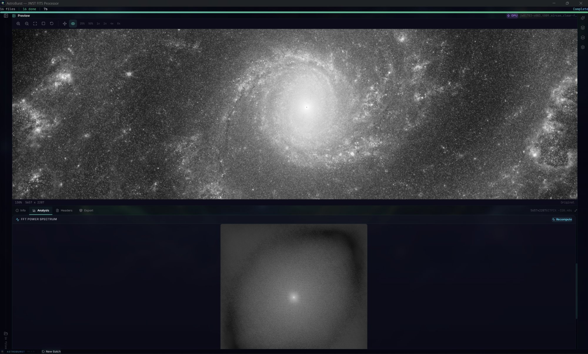
</p>
<p align="center"><em>FFT power spectrum analysis of NGC 628. The frequency-domain view reveals the galaxy's spiral arm structure as directional patterns radiating from the center.</em></p>

<p align="center">
  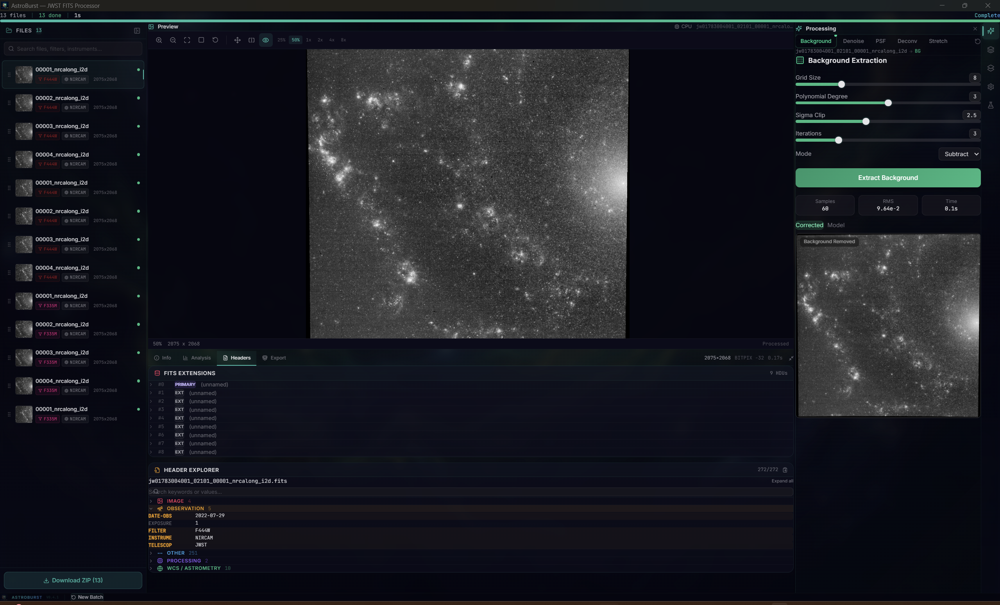
</p>
<p align="center"><em>Background extraction on 13 JWST NIRCam frames. Polynomial surface fitting (degree 3) with sigma-clipped grid sampling. Processing panel with corrected/model preview. Header explorer showing 9 HDUs and 272 keywords with categorized browser (Observation, Instrument, Image, WCS, Processing).</em></p>

<p align="center">
  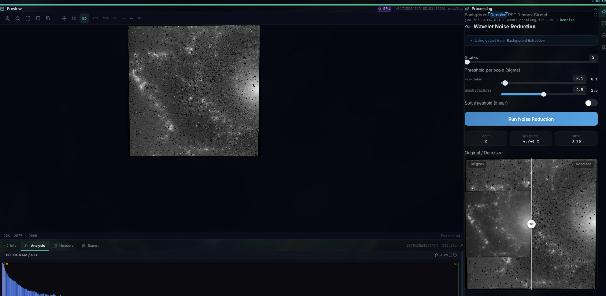
</p>
<p align="center"><em>Wavelet a-trous noise reduction with 2 scales and per-scale sigma thresholds (fine detail: 0.1, small structures: 2.5). Side-by-side comparison showing noise suppression while preserving faint nebular structure. Histogram and STF controls below.</em></p>

<p align="center">
  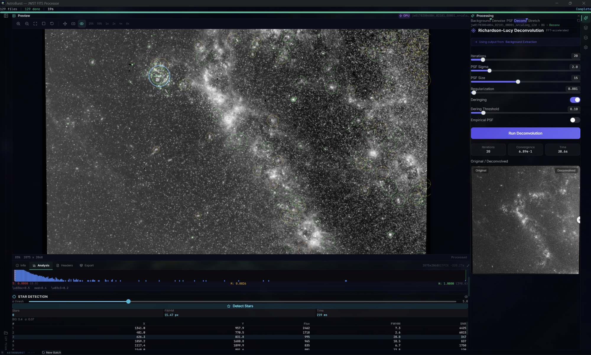
</p>
<p align="center"><em>Richardson-Lucy deconvolution (FFT-accelerated) with 20 iterations, Tikhonov regularization (0.001), and deringing. Processing chain: Background Extraction > Denoise > PSF > Deconv. Star detection table showing X/Y coordinates, flux, FWHM, and SNR for detected sources.</em></p>

### Processing Panels

<p align="center">
  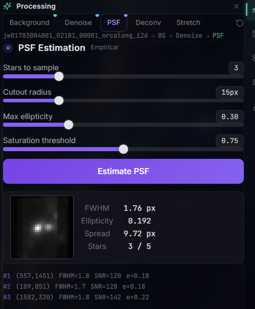
  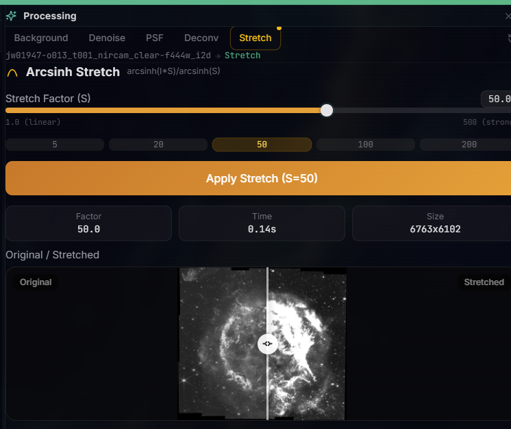
</p>
<p align="center"><em>Left: Empirical PSF estimation with moment-based FWHM measurement. FWHM 1.76 px, ellipticity 0.192, 3/5 stars used. Processing chain visible (BG > Denoise > PSF). Right: Arcsinh stretch (S=50) on Cassiopeia A 6763x6102 with original/stretched comparison and click-to-edit value display.</em></p>

<p align="center">
  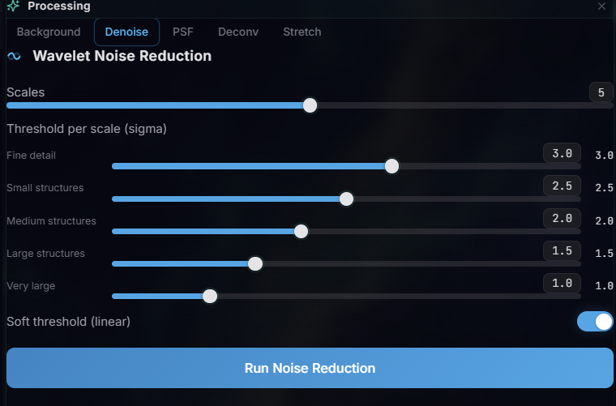
  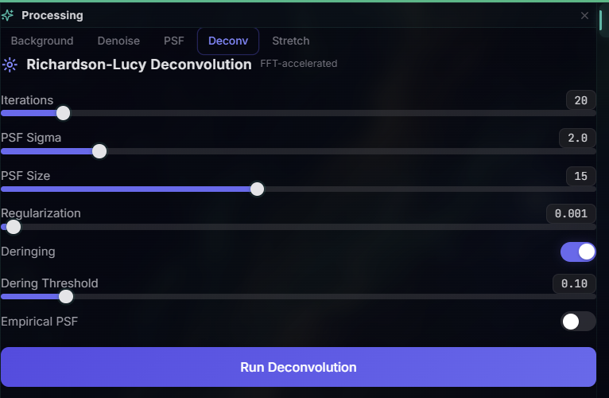
</p>
<p align="center"><em>Left: Wavelet a-trous noise reduction with 5 scales and per-scale sigma thresholds (click-to-edit sliders). Soft threshold (linear) toggle. Right: Richardson-Lucy deconvolution (FFT-accelerated), 20 iterations, PSF sigma 2.0, Tikhonov regularization (0.001), deringing with threshold control.</em></p>

<p align="center">
  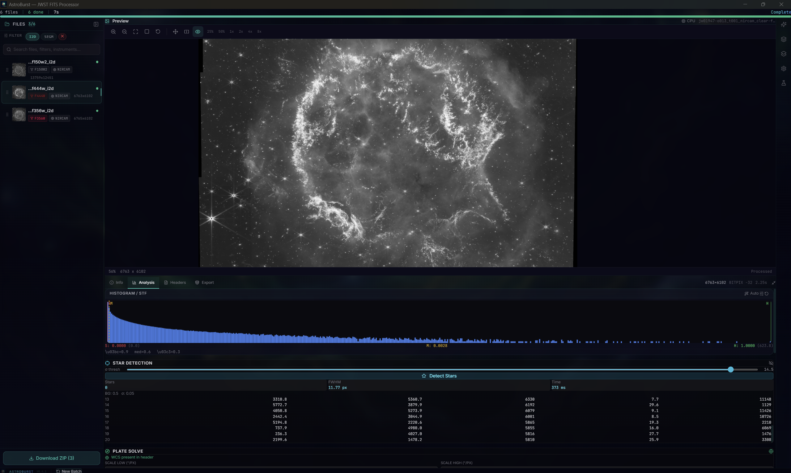
</p>
<p align="center"><em>Cassiopeia A single-channel analysis. 6763x6102 at 56% zoom. Histogram with auto-STF, star detection table (8 stars with flux, FWHM, SNR columns), and plate solve section. Filter chips (I2D, SEGM) and search bar in file list.</em></p>

### Stacking Panels

<p align="center">
  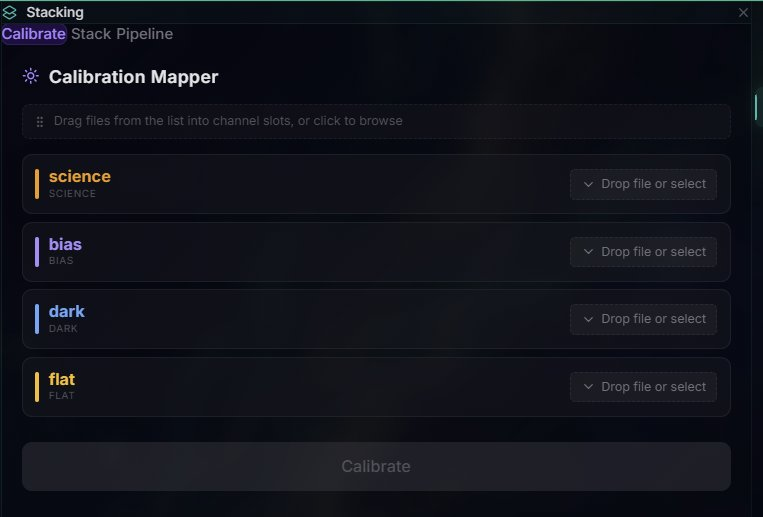
  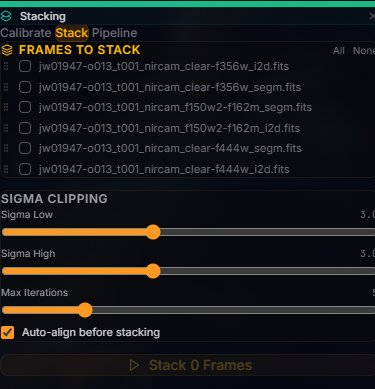
  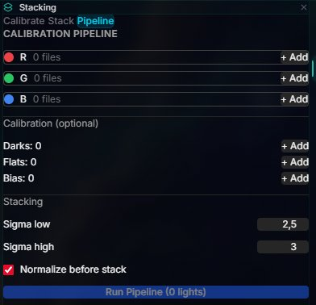
</p>
<p align="center"><em>Left: Calibration mapper with science, bias, dark, and flat frame slots. Center: Sigma-clipped stacking with configurable low/high thresholds, max iterations, and auto-align. Right: Full calibration pipeline with per-channel file assignment, calibration frames, and sigma-clipped stacking.</em></p>

</details>

## Features

### Core Pipeline
- **FITS + ASDF**: Memory-mapped I/O. MEF with auto SCI selection. First non-Python ASDF reader (zlib/bzip2/lz4, Roman Space Telescope gWCS). ZIP transparency. Multi-BITPIX export (16/float32/float64).
- **RGB Composition**: Per-channel STF with live re-stretch, dual alignment (FFT phase correlation or star-based affine), stability-based white balance, SCNR with luminance redistribution, auto-resample for mixed resolutions. Composite cache enables instant STF adjustments without recomposing.
- **Drizzle**: Sub-pixel reconstruction (Square / Gaussian / Lanczos3), 1-4x scale, sigma-clipped rejection with flat-storage accumulator.
- **Calibration**: Bias, dark, flat correction with median-normalized flats. Crop-to-intersection for mismatched dimensions.
- **Smart Pipeline**: Auto-detects 2D images vs 3D cubes per file and routes accordingly.
- **Export**: FITS (mono, RGB, aligned channels with WCS offset correction), PNG (8/16-bit, with optional STF stretch), ZIP batch.

### Enhancement
- **Deconvolution**: Richardson-Lucy (FFT-based, Tikhonov regularization, deringing)
- **Background**: Polynomial surface fitting with sigma-clipped grid sampling
- **Wavelet**: A trous multi-scale denoise with per-scale thresholds (up to 8 scales)
- **Stretch**: Arcsinh stretch with configurable factor for non-linear tone mapping

### Analysis
- 16K-bin histogram with auto-STF
- FFT power spectrum with Hann window
- Star detection (flux, FWHM, SNR)
- Empirical PSF estimation with moment-based FWHM (eigenvalue decomposition, subpixel peak interpolation)
- Narrowband filter auto-detection (H-alpha, [OIII], [SII]) with multi-palette support (SHO, HOO, HOS, NaturalColor, Custom)
- Full header explorer with categorized keyword browser

### Synthetic Data
- Star field generation with configurable count and flux distribution
- PSF modeling (Gaussian, Moffat)
- Noise injection (Poisson, Gaussian, readout)
- Stack generation for testing calibration and alignment pipelines

### Rendering
- WebGPU compute shader for real-time STF preview (8 ms at 4K)
- Binary IPC with zero base64 overhead
- Deep zoom tile pyramid with percentile-based stretch
- Canvas 2D fallback

### Astrometry
- Plate solving via astrometry.net (auto-downsample for large images)
- WCS coordinate readout and pixel/world conversion

## Installation

### Download

| Platform | Download |
|----------|----------|
| **macOS** (Apple Silicon) | [`.dmg`](https://github.com/samuelkriegerbonini-dev/AstroBurst/releases/latest) |
| **macOS** (Intel) | [`.dmg`](https://github.com/samuelkriegerbonini-dev/AstroBurst/releases/latest) |
| **Linux** | [`.deb`](https://github.com/samuelkriegerbonini-dev/AstroBurst/releases/latest) / [`.AppImage`](https://github.com/samuelkriegerbonini-dev/AstroBurst/releases/latest) / [`.rpm`](https://github.com/samuelkriegerbonini-dev/AstroBurst/releases/latest) |
| **Windows** | [`.msi`](https://github.com/samuelkriegerbonini-dev/AstroBurst/releases/latest) / [`.exe`](https://github.com/samuelkriegerbonini-dev/AstroBurst/releases/latest) |

### One-liner

```bash
# macOS
curl -fsSL https://raw.githubusercontent.com/samuelkriegerbonini-dev/AstroBurst/main/scripts/install-macos.sh | bash

# Linux (Debian/Ubuntu)
curl -fsSL https://raw.githubusercontent.com/samuelkriegerbonini-dev/AstroBurst/main/scripts/install-linux.sh | bash
```

### Build from source

```bash
git clone https://github.com/samuelkriegerbonini-dev/AstroBurst.git
cd AstroBurst
cargo tauri dev
```

Requires Rust 1.75+, Node.js 18+, Tauri CLI v2. WebGPU needs Vulkan/Metal/DX12.

## Quick Start

1. **Drop files** into the window (`.fits`, `.fit`, `.asdf`, or `.zip`). They're processed automatically.
2. **Explore**: Click a file to see its preview, histogram, and headers. Tweak STF sliders or hit Auto STF.
3. **Compose RGB**: Assign channels manually or click Auto to detect filters from headers. Pick Phase Correlation (default, sub-pixel) or Affine (handles rotation) for alignment.
4. **Drizzle**: Select 2+ frames of the same target for sub-pixel reconstruction. Drizzle RGB combines stacking with composition.
5. **Export**: PNG previews or FITS with preserved WCS metadata.

## Getting Data

AstroBurst works with publicly available data from NASA and ESA archives. No account required for most downloads.

### MAST (JWST, Hubble, Roman)

The [MAST Portal](https://mast.stsci.edu/search/ui/#/jwst) is the primary source for JWST and Hubble data. To find calibrated images ready for processing:

1. Go to **[MAST Search](https://mast.stsci.edu/search/ui/#/jwst)**
2. Search by target name (e.g., "M51", "Carina Nebula", "Cassiopeia A")
3. Filter by **Instrument**: NIRCam or MIRI
4. Filter by **Product Level**: Level 2b/2c (calibrated single exposures) or Level 3 (combined mosaics)
5. Download the `_cal.fits` or `_i2d.fits` files

**Quick links to popular targets:**

| Target | Filters | Link |
|--------|---------|------|
| Pillars of Creation | NIRCam F090W/F187N/F200W/F335M/F444W | [MAST](https://mast.stsci.edu/search/ui/#/jwst/results?resolve=true&target=M16) |
| Carina Nebula | NIRCam F090W/F200W/F444W | [MAST](https://mast.stsci.edu/search/ui/#/jwst/results?resolve=true&target=Carina%20Nebula) |
| Cassiopeia A | NIRCam F162M/F356W/F444W | [MAST](https://mast.stsci.edu/search/ui/#/jwst/results?resolve=true&target=Cassiopeia%20A) |
| M51 Whirlpool | NIRCam F115W/F200W/F335M/F444W | [MAST](https://mast.stsci.edu/search/ui/#/jwst/results?resolve=true&target=M51) |
| Jupiter | NIRCam F164N/F212N/F360M | [MAST](https://mast.stsci.edu/search/ui/#/jwst/results?resolve=true&target=Jupiter) |

For Roman Space Telescope simulated data (`.asdf` files), filter by instrument **WFI** on the MAST portal.

### ESA Hubble Archive

The [ESA Hubble Science Archive](https://hst.esac.esa.int/ehst/) provides an alternative interface for HST data. Useful for narrowband imaging (H-alpha, [OIII], [SII]) that works well with the automatic SHO palette detection.

### Sample Data

The repository includes three HST/WFPC2 narrowband FITS files in `tests/sample-data/` for quick testing: [OIII] 502nm, H-alpha 656nm, and [SII] 673nm of the Eagle Nebula (M16). Public domain (NASA/ESA).

## Usage

### JWST NIRCam

NIRCam has two detector resolutions: short-wave (~0.031"/px, ~14K) and long-wave (~0.063"/px, ~7K). When you compose RGB with mixed SW+LW filters, AstroBurst detects the mismatch and auto-resamples the smaller channels via bicubic interpolation. WCS headers are updated so astrometry stays valid.

**Recommended combinations:**

| Type | R | G | B |
|------|---|---|---|
| Full range (auto-resampled) | F444W | F200W | F115W |
| LW only (same resolution) | F444W | F335M | F300M |
| SW only (highest res) | F200W | F150W | F115W |

### Hubble Narrowband

HST narrowband filters are auto-detected from FITS headers. Five palette presets are available: SHO (Hubble Palette, default), HOO, HOS, NaturalColor, and Custom. The palette selector in Smart Channel Mapper lets you switch between them. SHO maps [SII] 673nm to R, H-alpha 656nm to G, [OIII] 502nm to B. HOO maps Ha to R and OIII to both G and B. Custom mode clears all assignments for fully manual mapping.

### Roman Space Telescope (ASDF)

AstroBurst is the first non-Python tool with native ASDF support. Roman `.asdf` files are loaded transparently through the same pipeline as FITS, including zlib/bzip2/lz4 decompression and gWCS extraction.

### 3D Cubes

For IFU data (NAXIS3 > 1), click anywhere on the preview to extract the spectrum at that pixel. Wavelength calibration is read from WCS headers when available.

## Architecture

```
Frontend (React + TypeScript + Tailwind)
+-- 11 domain services (compose, fits, analysis, header, synth, ...)
+-- 8 shared UI primitives (Slider, Toggle, RunButton, ...)
+-- 7 split PreviewContexts for minimal re-renders
+-- infrastructure/tauri/ IPC layer
+-- Lazy-loaded panels via React.lazy + Suspense
         |
         | Tauri Commands (45)
         v
Backend (Rust + Tauri v2)
+-- cmd/     45 command handlers
+-- core/    alignment (phase correlation + affine), analysis,
|            astrometry, compose, cube, imaging, metadata, stacking, synth
+-- domain/  orchestration (calibration, drizzle, cube, plate solve)
+-- infra/   FITS mmap, ASDF reader, cache, config, render, progress
+-- types/   shared types (AlignMethod, WhiteBalance, StfParams, ...)
+-- math/    NaN-safe median/MAD, sigma clipping, SIMD (Cephes-precision log)
```

The frontend went through a multi-phase refactoring in v0.4.0: the monolithic `useBackend.ts` hook was split into 11 domain-specific services (plus `synth.service.ts` added in v0.4.2) with a shared `infrastructure/tauri/` IPC layer, 18 JSX files were converted to TSX, types were split by domain, and 8 shared UI primitives replaced ~1,370 lines of duplicated code across processing panels.

**Design principles:**
- All pixel data stays in f32/f64. No integer quantization at any stage.
- Dual alignment: FFT phase correlation (sub-pixel, O(n log n)) as default, star-based affine (triangle asterism + RANSAC) for rotation. Automatic fallback chain.
- White balance picks the channel with lowest noise (MAD/median) as reference, not always G.
- SCNR redistributes lost luminance to R/B via BT.709 weights instead of adding it back to G.
- Drizzle uses flat contiguous storage instead of per-pixel heap allocations. Parallel row computation.
- Sigma clipping uses median/MAD (Stetson 1987, HST DrizzlePac standard) instead of mean/stddev.
- NaN values sort to end everywhere: median, MAD, sigma clipping, auto-STF.
- Plate solve auto-downsamples images >2048px before upload.
- Binary IPC for GPU pixels: 16-byte header + raw f32 array, zero JSON/base64.
- SIMD log uses Cephes degree-8 minimax polynomial with range reduction (< 1 ULP for f32).
- All JSON response keys use shared constants from `types/constants.rs`. Zero hardcoded string keys in `cmd/`.

## Roadmap

| Version | What | Status |
|:--------|:-----|:-------|
| **v0.4** | Affine alignment, stability WB, SCNR redistribution, arcsinh stretch, numerical audit, frontend refactoring | **Released** |
| **v0.5** | FITS ERR/DQ/VAR propagation, MAST API, log-polar phase correlation | Next |
| **v0.6** | Star removal, Gaia DR3 photometric calibration, PixelMath | Planned |
| **v0.7** | Mosaic stitching, gradient-aware background, local normalization | Planned |
| **v1.0** | Full WebGPU pipeline, WASM plugins, Python scripting | Planned |

## Contributing

Contributions are welcome. See [CONTRIBUTING.md](CONTRIBUTING.md) for guidelines.

Some areas where help would be especially valuable:
- FITS ERR/DQ/VAR error propagation through the processing chain
- MAST API integration for direct JWST/HST data access
- Star removal algorithms
- Gaia DR3 cross-match for photometric calibration
- Log-polar phase correlation for rotational misalignment
- WebGPU compute shaders for stacking and alignment
- Test data curation from public archives (MAST, ESA)
- ASDF testing with real Roman Space Telescope simulated data

## Support

AstroBurst is free, open-source, with no subscriptions and no feature locks.

If it helps your work, consider supporting development:

<p align="center">
  <a href="https://ko-fi.com/astroburst">
    
  </a>
</p>

See [membership tiers](https://ko-fi.com/astroburst/tiers) for details.

## Supporters

<!-- SUPPORTERS:START -->
*Be the first to support!*
<!-- SUPPORTERS:END -->

## License

GPLv3. See [LICENSE](LICENSE).

---

<p align="center">
  <sub>Created by <a href="https://github.com/samuelkriegerbonini-dev">Samuel Krieger</a></sub>
</p>
