<p align="center">
  
</p>

<h1 align="center">AstroBurst</h1>

<p align="center">
  <strong>High-Performance Astronomical Image Processor</strong><br>
  <em>The first FITS processor built on the Rust · Tauri · WebGPU stack</em>
</p>

<p align="center">
  <a href="https://github.com/samuelkriegerbonini-dev/AstroBurst/releases"></a>
  <a href="https://github.com/samuelkriegerbonini-dev/AstroBurst/actions"></a>
  
  
  <a href="LICENSE"></a>
  
</p>

<p align="center">
  <a href="#installation">Install</a> ·
  <a href="#features">Features</a> ·
  <a href="#quick-start">Quick Start</a> ·
  <a href="#usage">Usage</a> ·
  <a href="#architecture">Architecture</a> ·
  <a href="#contributing">Contributing</a>
</p>

---

AstroBurst is a native desktop application for processing astronomical FITS images. It combines a high-performance Rust backend with a modern React frontend, delivering GPU-accelerated rendering with a fraction of the memory footprint of legacy tools — targeting both professional astronomers and advanced astrophotographers.

**v0.2.0** brings Multi-Extension FITS support, bicubic resampling for mixed SW/LW NIRCam data, dimension-safe RGB/Drizzle pipelines, narrowband filter auto-detection, concurrent file processing, and binary IPC for GPU rendering. See the [changelog](CHANGELOG.md) for details.

## Screenshots

<p align="center">
  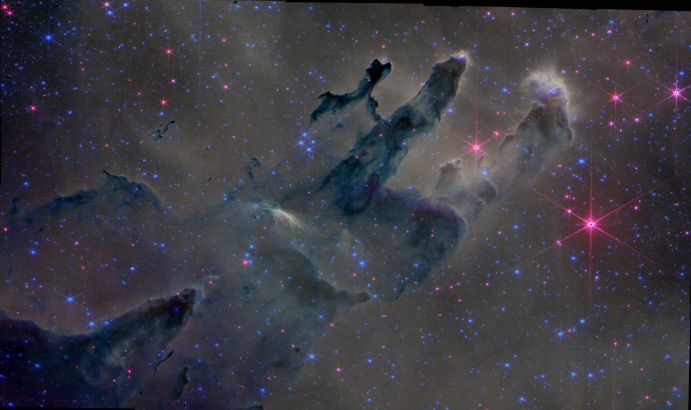
</p>
<p align="center"><em>JWST Pillars of Creation — NIRCam F470N/F444W/F335M RGB composition (Proposal 2739)</em></p>

<p align="center">
  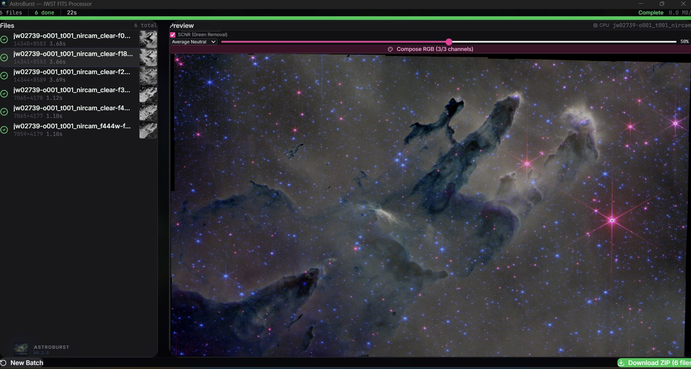
</p>
<p align="center"><em>AstroBurst interface — 6 JWST NIRCam filters loaded with RGB composition and SCNR green removal</em></p>

<p align="center">
  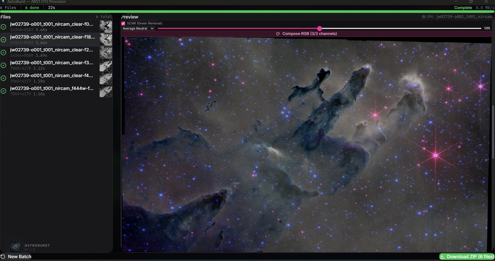
</p>
<p align="center"><em>RGB composition with SCNR (Average Neutral) at 50% — removing green cast from NIRCam data</em></p>

<p align="center">
  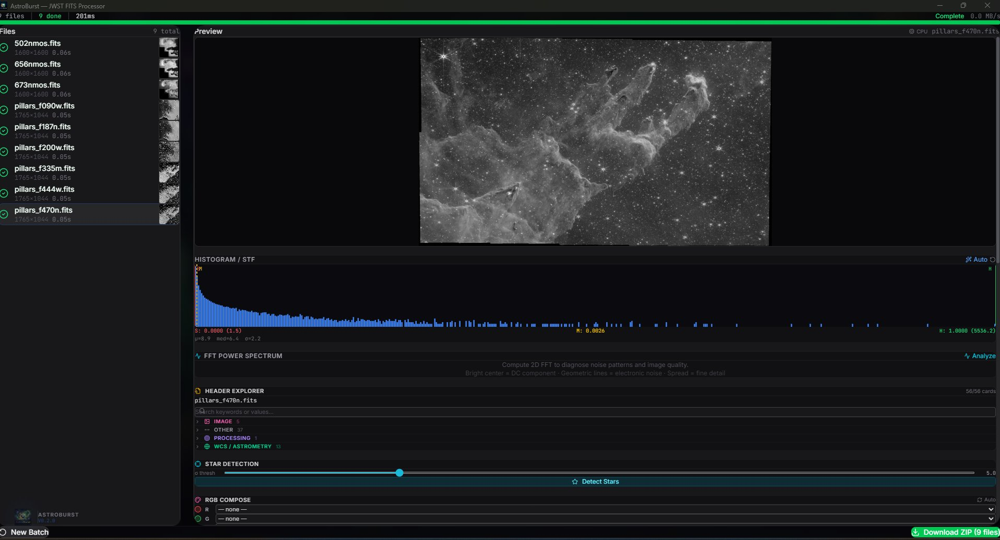
</p>
<p align="center"><em>Single-channel FITS preview (NIRCam F470N) with histogram/STF and header categories</em></p>

<p align="center">
  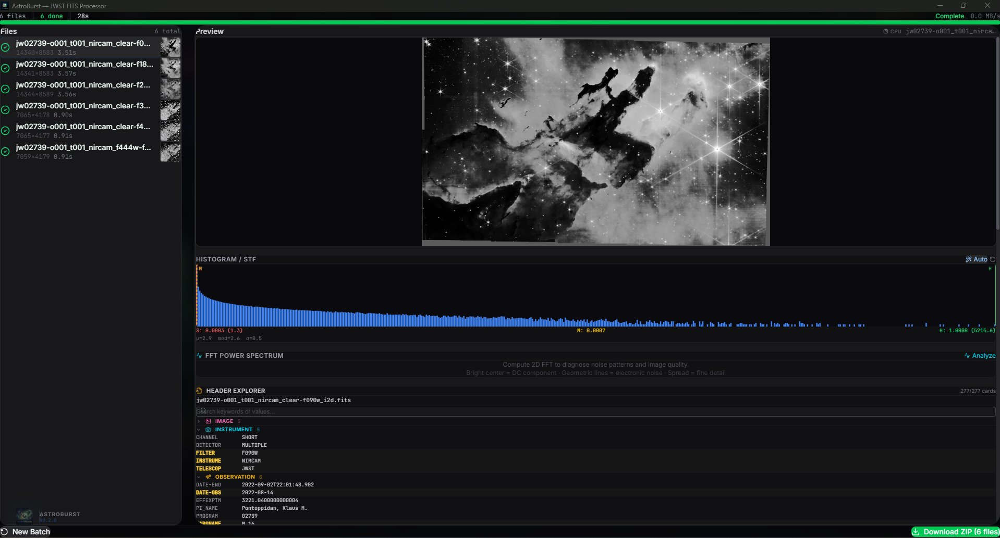
</p>
<p align="center"><em>JWST NIRCam F090W — preview with auto-STF histogram and categorized FITS header explorer</em></p>

<p align="center">
  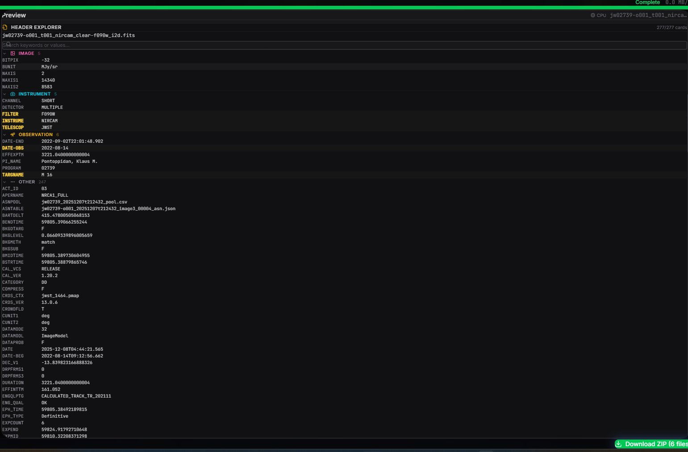
</p>
<p align="center"><em>FITS Header Explorer — categorized view (Image, Instrument, Observation) with 277 cards from JWST NIRCam MEF</em></p>

<p align="center">
  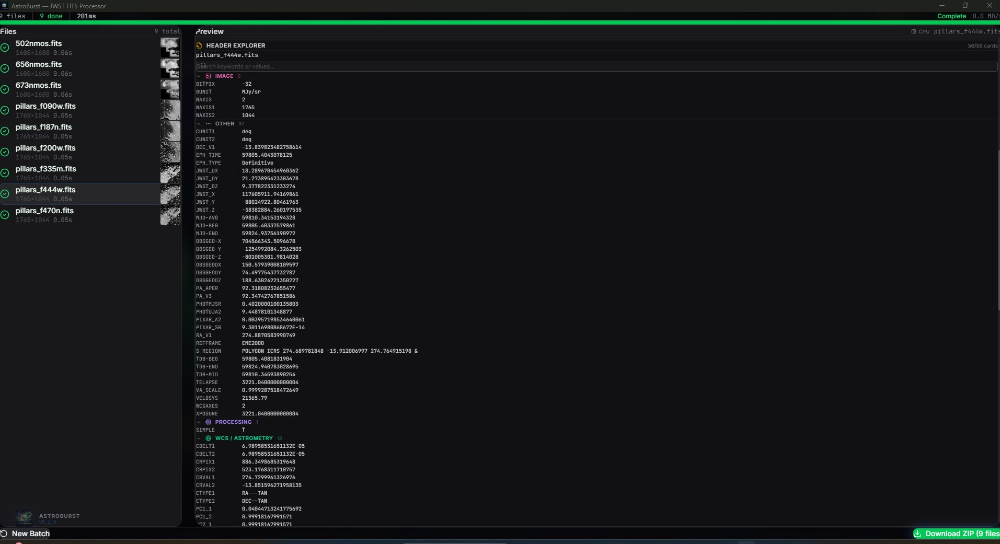
</p>
<p align="center"><em>WCS/Astrometry header section — RA/DEC coordinates, CD matrix, CTYPE projections, and PC rotation</em></p>

<p align="center">
  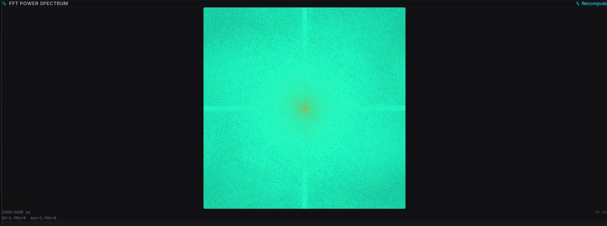
</p>
<p align="center"><em>2D FFT power spectrum with log-magnitude colormap for noise pattern identification</em></p>

<p align="center">
  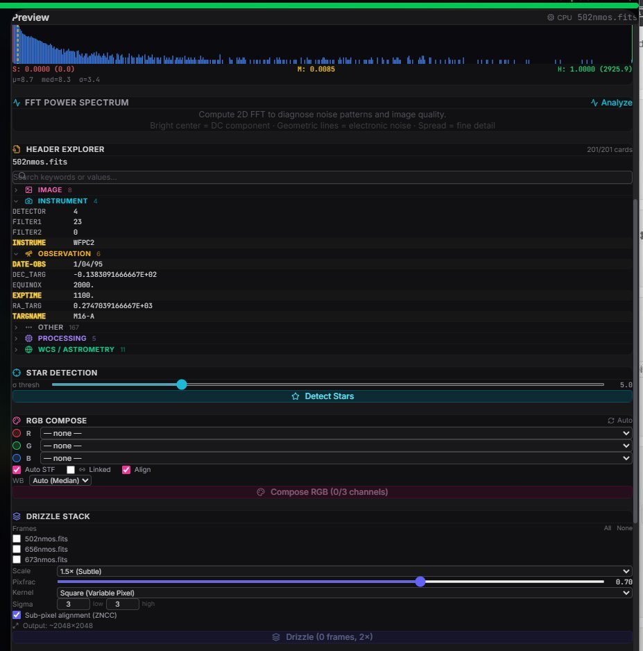
</p>
<p align="center"><em>Hubble WFPC2 data — histogram, FFT, header explorer, star detection, RGB compose, and drizzle stack panels</em></p>

<p align="center">
  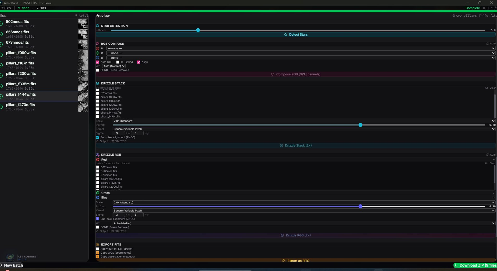
</p>
<p align="center"><em>Star detection, RGB composition, drizzle stack, and drizzle RGB panels with full configuration</em></p>

<p align="center">
  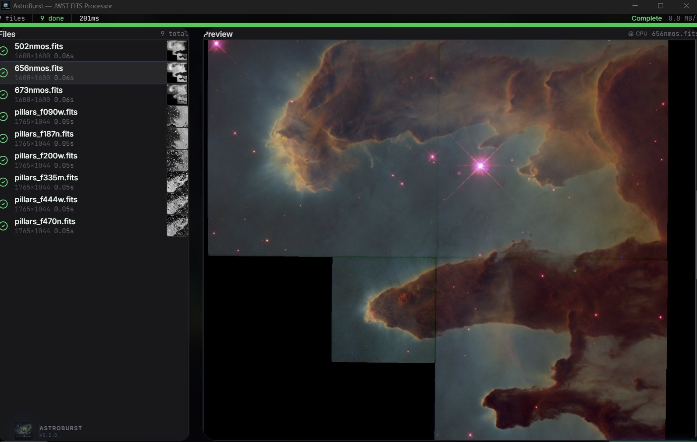
</p>
<p align="center"><em>Mixed dataset — 3 Hubble narrowband + 6 JWST NIRCam filters composited as Pillars of Creation</em></p>

<p align="center">
  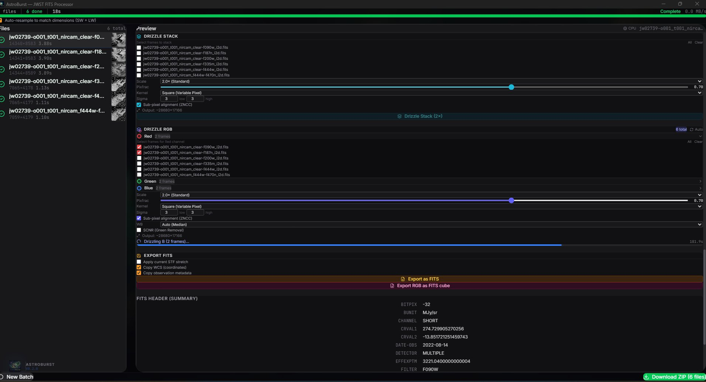
</p>
<p align="center"><em>Drizzle RGB pipeline — per-channel frame selection, sub-pixel alignment (ZNCC), and active drizzle progress</em></p>

<p align="center">
  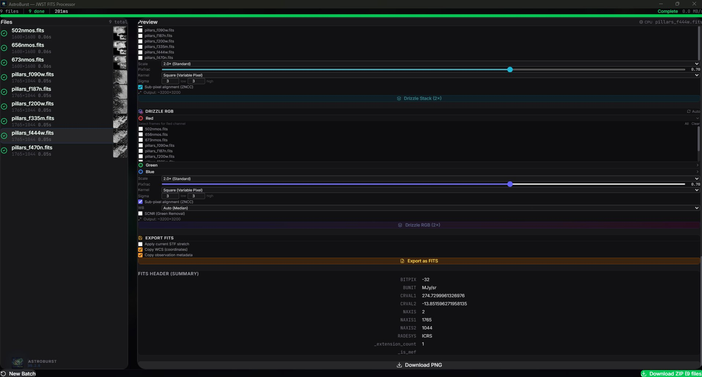
</p>
<p align="center"><em>Drizzle RGB export options — FITS export with WCS/metadata preservation and header summary</em></p>

## Features

### Processing Pipeline
- **FITS I/O** — Memory-mapped extraction with ZIP transparency and Multi-Extension FITS (MEF) support with automatic SCI extension selection
- **Batch processing** — Concurrent file processing (3 workers) with Rayon thread pool, ~118 MB/s sustained throughput
- **Bicubic resampling** — Catmull-Rom interpolation (α = −0.5) with Rayon row-parallelism for mixing JWST NIRCam short-wave (~14K) and long-wave (~7K) data; auto-resample detects resolution groups and resamples to target dimensions with WCS header update
- **STF rendering** — Screen Transfer Function with shadow/midtone/highlight controls, auto-STF from image statistics
- **Drizzle stacking** — Sub-pixel reconstruction with Square, Gaussian, Lanczos3, and Turbo kernels, configurable scale (1–4×) and pixel fraction
- **RGB composition** — Multi-channel combine with per-channel STF, auto white balance, pyramid alignment, dimension harmonization (5% tolerance crop), and SCNR green noise removal
- **Drizzle RGB** — Combined drizzle + RGB with per-channel dimension harmonization and progress tracking
- **Calibration** — Bias, dark, flat-field correction pipeline
- **Sigma-clipped stacking** — Configurable sigma thresholds for outlier rejection
- **FITS export** — Single-channel and RGB FITS writer with WCS/observation metadata preservation

### Analysis
- **Histogram** — 16384-bin histogram with median, mean, σ, MAD statistics and auto-STF derivation
- **FFT spectrum** — 2D Fourier power spectrum with log-magnitude colormap for noise pattern identification
- **Star detection** — PSF-based detection with flux, FWHM, and SNR measurements
- **Header Explorer** — Categorized FITS header browser (Observation, Instrument, Image, WCS, Processing) with keyword search, value copy, and filter detection badge
- **Filter detection** — Automatic narrowband filter identification (Hα, [OIII], [SII]) from FITS headers, keywords, wavelength values, and filenames with Hubble Palette (SHO) channel suggestion and confidence scoring

### Spectroscopy & Data Cubes
- 3D FITS cube support (NAXIS3 > 1)
- Click-to-extract spectrum at any pixel coordinate
- Wavelength calibration from WCS headers
- Frame navigation and collapsed views (mean/median)

### Astrometry
- Plate solving via astrometry.net API
- WCS coordinate readout
- Pixel ↔ world coordinate conversion

### Rendering
- **WebGPU** compute shader pipeline for real-time STF preview
- **Binary IPC** — Zero-copy pixel transfer (no base64 encoding)
- **Deep zoom** — Tile pyramid generation for large images
- Canvas 2D fallback for systems without WebGPU

### Export
- Single-channel and RGB FITS export with WCS/metadata preservation
- Batch PNG export with ZIP packaging (STORE compression for speed)

## Installation

### Download (Recommended)

Download the latest release for your platform:

| Platform | Architecture | Download |
|----------|-------------|----------|
| **macOS** | Apple Silicon (M1+) | [`.dmg` (aarch64)](https://github.com/samuelkriegerbonini-dev/AstroBurst/releases/latest) |
| **macOS** | Intel | [`.dmg` (x86_64)](https://github.com/samuelkriegerbonini-dev/AstroBurst/releases/latest) |
| **Linux** | x86_64 | [`.deb`](https://github.com/samuelkriegerbonini-dev/AstroBurst/releases/latest) · [`.rpm`](https://github.com/samuelkriegerbonini-dev/AstroBurst/releases/latest) · [`.AppImage`](https://github.com/samuelkriegerbonini-dev/AstroBurst/releases/latest) |
| **Linux** | ARM64 | [`.deb`](https://github.com/samuelkriegerbonini-dev/AstroBurst/releases/latest) · [`.AppImage`](https://github.com/samuelkriegerbonini-dev/AstroBurst/releases/latest) |
| **Windows** | x86_64 | [`.msi`](https://github.com/samuelkriegerbonini-dev/AstroBurst/releases/latest) · [`.exe`](https://github.com/samuelkriegerbonini-dev/AstroBurst/releases/latest) |

### One-Line Install

**macOS:**
```bash
curl -fsSL https://raw.githubusercontent.com/samuelkriegerbonini-dev/AstroBurst/main/scripts/install-macos.sh | bash
```

**Linux (Debian/Ubuntu):**
```bash
curl -fsSL https://raw.githubusercontent.com/samuelkriegerbonini-dev/AstroBurst/main/scripts/install-linux.sh | bash
```

### Build from Source

```bash
git clone https://github.com/samuelkriegerbonini-dev/AstroBurst.git
cd AstroBurst
cargo tauri dev
```

**Requirements:** Rust 1.75+, Node.js 18+, Tauri CLI v2. WebGPU requires a compatible GPU driver (Vulkan/Metal/DX12).

## Quick Start

1. **Open FITS files** — Drag and drop `.fits` / `.fit` files or use the file picker. ZIP-compressed FITS are extracted transparently.
2. **Process** — Files are automatically processed: mmap read → asinh normalize → statistics → PNG render. Progress is shown per-file.
3. **Auto-resample** — Enable the "Auto-resample" checkbox before processing to automatically match dimensions when mixing short-wave and long-wave NIRCam data.
4. **Explore** — Select a processed file to see the preview, histogram, and header data. Adjust STF sliders or click "Auto STF".
5. **GPU mode** — Toggle the CPU/GPU button for real-time WebGPU rendering with instant STF feedback.
6. **RGB Compose** — Assign channels manually or use "Auto" to detect filters from filenames/headers. At least 2 channels required.
7. **Drizzle** — Select multiple frames of the same target for sub-pixel reconstruction. Drizzle RGB combines stacking + composition.
8. **Export** — Download PNG previews or export processed FITS with preserved metadata.

## Usage

### Processing JWST Data

JWST NIRCam files from MAST typically come as Multi-Extension FITS with SCI, ERR, and DQ extensions. AstroBurst automatically selects the SCI extension and merges the primary header for complete metadata.

NIRCam data comes in two detector resolutions:
- **Short-wave (SW):** F090W, F150W, F187N, F200W → ~14340×8583 px
- **Long-wave (LW):** F335M, F444W, F470N → ~7065×4178 px

When composing RGB with mixed SW + LW filters, enable **Auto-resample** before processing. AstroBurst detects the two resolution groups (threshold: 1.5× area ratio), resamples the larger group to the smaller using bicubic Catmull-Rom interpolation, and updates WCS headers (CRPIX, CD matrix / CDELT) so astrometry remains valid. Original files are preserved — resampled versions are saved as `{name}_resampled.fits`.

For RGB composition of NIRCam short-wave data:
- **B:** F090W (0.9μm)
- **G:** F150W (1.5μm)
- **R:** F200W (2.0μm)

For Drizzle RGB, assign the two detector modules (NRCA + NRCB) per channel.

### Processing Hubble Data

HST narrowband filters are automatically detected from FITS headers:
- **Hα (656nm)** → G channel (SHO palette)
- **[OIII] (502nm)** → B channel
- **[SII] (673nm)** → R channel

The Header Explorer shows the detected filter with confidence level (High/Medium/Low based on keyword source) and an "Assign" button for direct channel mapping.

### Spectroscopy

For 3D FITS cubes (IFU data), click anywhere on the preview image to extract the spectrum at that pixel coordinate. Wavelength calibration is read from WCS headers when available.

## Architecture

```
┌─────────────────────────────────────────────────┐
│                    Frontend                      │
│           React + TypeScript + Tailwind          │
│                                                  │
│  Hooks: useBackend · useFileQueue · useTimer     │
│  Panels: Preview · Histogram · RGB · Drizzle     │
│          Header · FFT · Stars · Spectroscopy     │
│  Badge:  ResampleBadge                           │
│                       │                          │
│               useBackend.ts (IPC)                │
└───────────────────────┬─────────────────────────┘
                        │ Tauri Commands (37)
┌───────────────────────┴─────────────────────────┐
│                     Backend                      │
│                Rust + Tauri v2                    │
│                                                  │
│  I/O:     mmap FITS parser, MEF scanner,         │
│           FITS writer (mono + RGB)               │
│  Domain:  drizzle, rgb_compose, resample, stf,   │
│           calibrate, stacking, scnr              │
│  Analysis: stars, histogram, fft                 │
│  Meta:    header_discovery, filter detection     │
│  Astro:   plate_solve, wcs transforms            │
│  Cube:    spectrum extraction, frame nav          │
└─────────────────────────────────────────────────┘
```

**Key design decisions:**
- All image data stays in f32/f64 — no integer quantization at any stage
- Binary IPC for GPU pixel transfer — zero base64 overhead
- Concurrent file processing with `requestAnimationFrame` yields — UI stays responsive during batch operations
- Dimension harmonization with 5% tolerance — channels with slight size differences are auto-cropped instead of rejected
- Bicubic resampling for large dimension mismatches (>1.5× area ratio) — preserves flux distribution and updates WCS
- Narrowband filter detection via regex matching on header keywords, wavelength values, and filename patterns

## Performance

Measured on consumer hardware (NVMe SSD, multi-core CPU):

| Operation | Data Size | Time | Throughput |
|-----------|-----------|------|------------|
| Batch process (19 JWST NIRCam) | 19.5 GB | 2m 49s | ~118 MB/s |
| RGB compose (14340×8583 × 3ch) | ~1.4 GB | 410 ms | — |
| Resample (14340×8583 → 7065×4178) | ~470 MB | <2s | — |
| Drizzle 2× (2 frames, 14K) | ~1 GB | ~8s | — |
| STF render (GPU, 14K image) | ~470 MB | <16ms | — |

## Contributing

Contributions are welcome. See [CONTRIBUTING.md](CONTRIBUTING.md) for guidelines.

**Areas welcoming contributions:**
- Deconvolution algorithms (Richardson-Lucy, Wiener)
- Background extraction / gradient modeling
- WebGPU compute shader pipeline expansion
- Test data curation (public FITS from MAST, ESA archives)
- Documentation and processing tutorials
- Platform-specific packaging and testing

## Roadmap

See [OVERVIEW_PT.md](docs/OVERVIEW_PT.md) for a detailed roadmap and market analysis (in Portuguese).

**Next milestones:**
- **v0.3** — Deconvolution, background extraction, noise reduction
- **v0.4** — Star removal, photometric color calibration (Gaia DR3)
- **v0.5** — PixelMath expressions, mosaic stitching
- **v1.0** — Full GPU pipeline, plugin system (WASM), Python scripting

## License

MIT. See [LICENSE](LICENSE) for details.
