<p align="center">
  
</p>

<h1 align="center">AstroBurst</h1>

<p align="center">
  <strong>High-Performance Astronomical Image Processor</strong><br>
  <em>Rust + Tauri + WebGPU. Process JWST, Hubble, and Roman Space Telescope data at native speed.</em>
</p>

<p align="center">
  <a href="https://github.com/samuelkriegerbonini-dev/AstroBurst/releases"></a>
  <a href="https://github.com/samuelkriegerbonini-dev/AstroBurst/actions"></a>
  
  
  <a href="LICENSE"></a>
  
  <a href="https://ko-fi.com/astroburst"></a>
</p>

<p align="center">
  <a href="#installation">Install</a> &middot;
  <a href="#features">Features</a> &middot;
  <a href="#quick-start">Quick Start</a> &middot;
  <a href="#getting-data">Data</a> &middot;
  <a href="#usage">Usage</a> &middot;
  <a href="#architecture">Architecture</a> &middot;
  <a href="#roadmap">Roadmap</a> &middot;
  <a href="#contributing">Contributing</a>
</p>

---

<p align="center">
  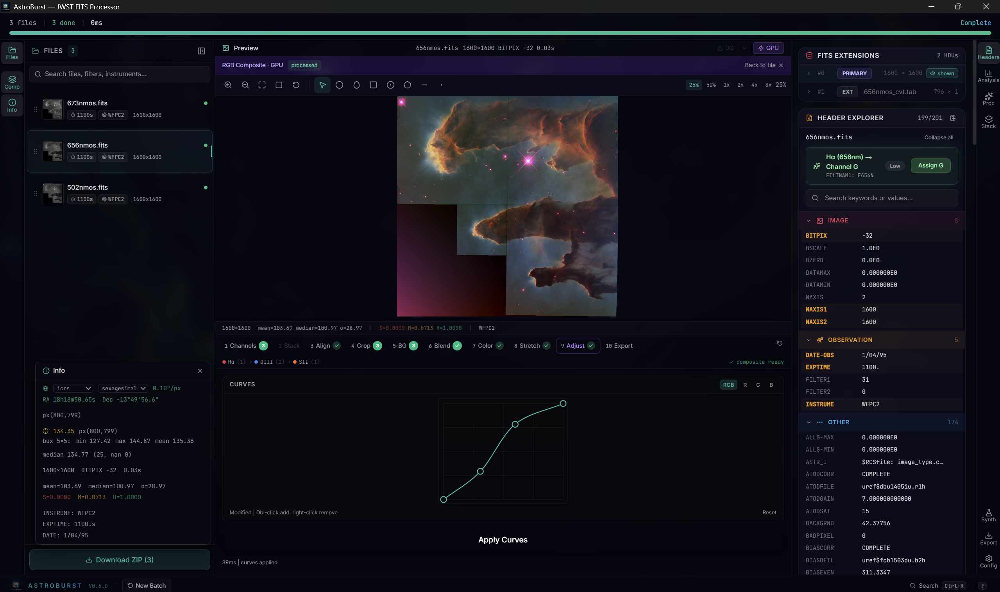
</p>

AstroBurst is an open-source desktop app for processing astronomical images. Drop in your FITS or ASDF files, compose RGB from narrowband channels, stack with sigma clipping, and export. Everything runs locally on your machine with no cloud dependencies.

It's built on Rust for the heavy lifting, React for the interface, and WebGPU for real-time preview. The result is a tool that opens a 2 GB IFU datacube in 300 ms, processes 10 frames at 1.4 GB/s, and renders STF adjustments in 8 ms on GPU.

> **What's new in v0.5.5**: **GPU RGB preview** — full-color composites now render on the GPU, not just mono. A new WebGPU pipeline uploads the three channels as separate `r32float` textures and runs **per-channel STF in the shader** (MTF identical to the CPU worker and Rust backend), with automatic fallback to the PNG composite when WebGPU is unavailable or the device is lost. **Live per-channel RGB STF**: a dedicated panel restretches each channel's shadow/midtone live on the GPU with no backend round-trip. **Header → wavelength channel mapping**: a canonical filter→wavelength table now drives a **dynamic Auto-Map** that gives each broadband filter its own λ-labelled channel (JWST NIRCam F090W–F444W → five distinct channels, grouped by nm), and a new **Auto (λ) blend** spreads any number of channels across R/G/B by wavelength — auto-applied to untouched broadband stacks without overriding palettes or manual weights. Plus a GPU/CPU preview audit: STF parity, full-image extrema for preview normalization, device-loss/uncaptured-error fallback, an oversized-texture guard, and a contrast-weighted hybrid downsample that preserves faint stars. The Compose tool moved to the left tool strip. 375 backend tests green. See the [changelog](CHANGELOG.md).
>
> **What's new in v0.5.4**: **Foroosh sub-pixel phase correlation** — FFT registration now uses a closed-form Dirichlet-peak estimator instead of a 3-point parabola, removing a systematic ~0.1 px peak-locking bias on every frame for visibly tighter stacked stars. **NaN-aware bicubic resampling** so a single blank/out-of-footprint pixel no longer poisons its 4×4 neighborhood or erodes stack borders pass after pass. New controls wired end-to-end: **Drizzle RGB** gains rejection thresholds (sigma low/high), **manual per-channel white balance**, and an **alignment-method selector** (phase correlation or star-based); the **subframe selector** exposes the four quality-scoring weights (FWHM / eccentricity / SNR / noise); and **plate solve** adds a scale-units selector (arcsec/px, arcmin/deg width) and an explicit downsample factor. Plus correctness fixes: calibration validates master-vs-light dimensions (no more panic or silent mis-calibration on mismatched masters), master flats normalize by the **median** (robust to gradients/dust), all-blank stacked pixels stay **NaN** instead of collapsing to 0 (so they no longer bias background and stretch), affine alignment **rejects reflections**, and the drizzle Lanczos kernel guards low-coverage division. 364 backend tests green. See the [changelog](CHANGELOG.md).
>
> **What's new in v0.5.2**: **GHS stretch** (Generalized Hyperbolic Stretch with D/b/SP/LP/HP controls), **OSC debayer** (RGGB/BGGR/GRBG/GBRG with XBAYROFF/YBAYROFF, bilinear or super-pixel), **interactive photometry** (click a star for centroid, net flux, instrumental magnitude, SNR, FWHM — with optional Gaia DR3 cross-match), **SPCC against real Gaia DR3** via VizieR cone search, **SIP distortion** support in WCS, a dedicated **Drizzle RGB** stacking tab, truly **linked STF** (preview == restretch == export, bit-exact), and labeled plate-solve annotation overlays. Plus a deep correctness audit: NaN-safe wavelet/deconvolution/calibration (stacked images with blank edges no longer break tools), per-kernel drizzle footprints (Gaussian/Lanczos3 now actually differ from Square), fixed 16-bit PNG export endianness, and dozens of math fixes across alignment, photometry and WCS. 347 backend tests green. See the [changelog](CHANGELOG.md).
>
> **v0.4.x highlights**: 11-step ComposeWizard pipeline with tone curves, non-destructive composite (ORIG/KEY dual cache), masked stretch with star protection, SPCC color calibration, star-based affine alignment with rotation correction, stability white balance (MAD/median reference), SCNR luminance redistribution (BT.709), blend presets (SHO/HOO/Foraxx/Dynamic HOO/Hubble Legacy), live composite STF re-stretch, synthetic FITS generation, subframe selector with per-channel star metrics, and a full numerical correctness audit. The frontend was refactored into 12 domain services with shared UI primitives.

## Screenshots

<p align="center">
  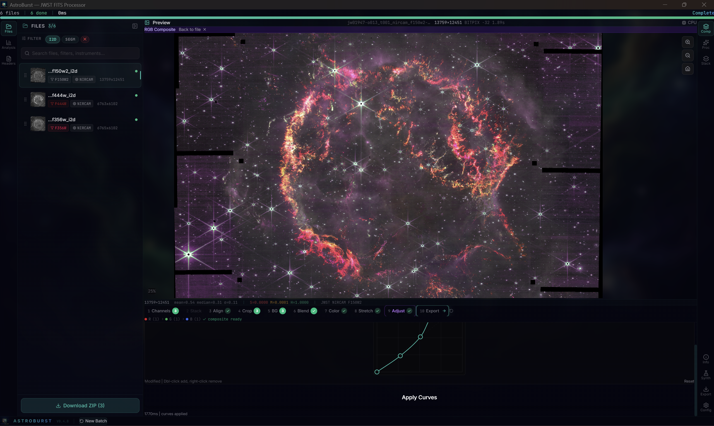
</p>
<p align="center"><em>Narrowband composite of the <strong>Pillars of Creation</strong> (Hα / OIII / SII → SHO) in the full-screen preview, straight out of the ComposeWizard — the mosaic edges left by channel registration are still visible and get trimmed by the Crop step. The panels below walk through that exact pipeline, step by step (across HST narrowband and JWST NIRCam data).</em></p>

<p align="center">
  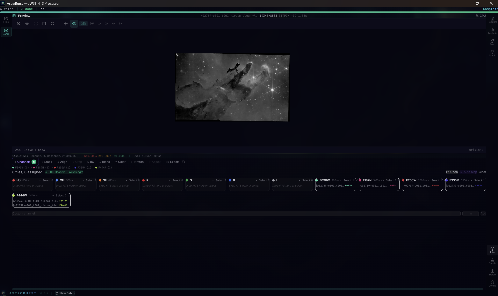
</p>
<p align="center"><em><strong>1 · Channels.</strong> Filters auto-detected from FITS headers and mapped to channel bins by wavelength — the new <strong>dynamic Auto-Map</strong> gives each broadband filter its own λ-labelled channel (here JWST NIRCam F090W–F444W → distinct channels, grouped by nm), backed by a canonical filter→wavelength table shared by the backend and UI. The Header Explorer lists extensions and categorized keywords, with per-bin file slots. With one frame per channel the optional <strong>2 · Stack</strong> step (sigma-clipped integration, subframe selector, drizzle) is skipped.</em></p>

<p align="center">
  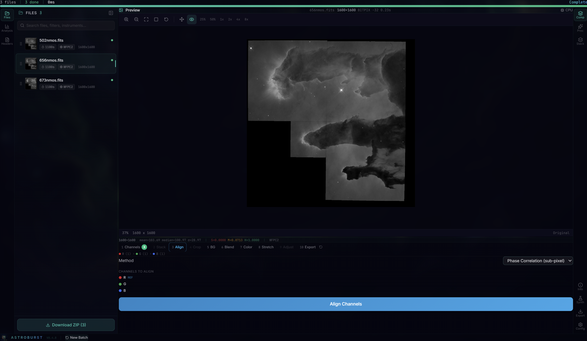
</p>
<p align="center"><em><strong>3 · Align.</strong> Sub-pixel channel registration — Phase Correlation (FFT, default) or star-based affine for rotation/scale, with an automatic fallback chain — so the three narrowband layers overlay exactly.</em></p>

<p align="center">
  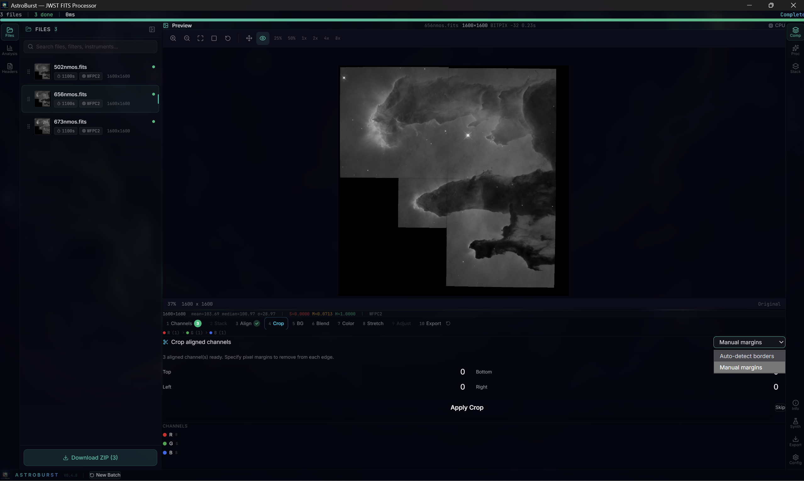
</p>
<p align="center"><em><strong>4 · Crop.</strong> Trim to the field the channels share after alignment, with manual margins or auto-detected borders to drop the non-overlapping edges left by registration.</em></p>

<p align="center">
  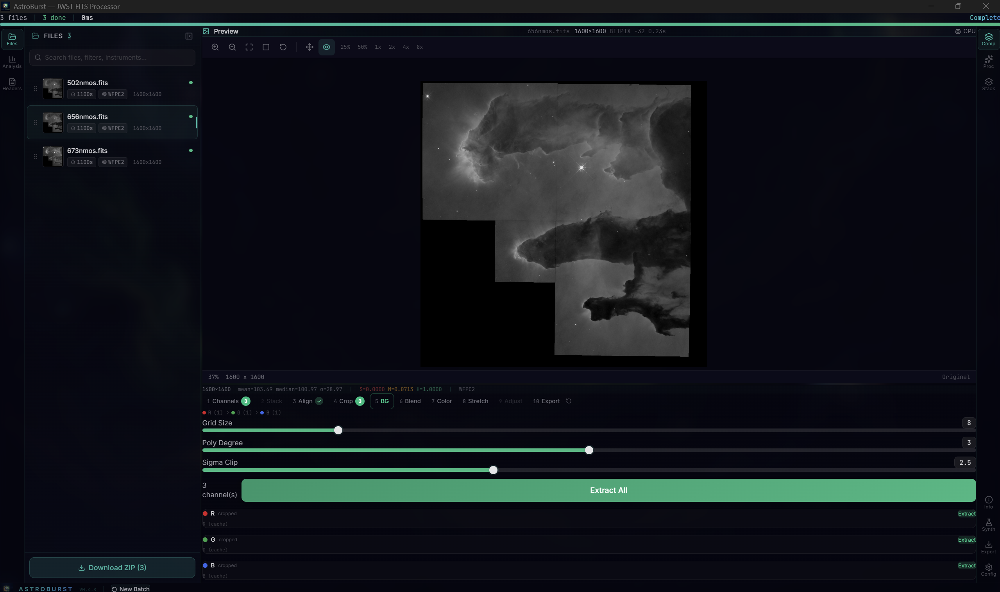
</p>
<p align="center"><em><strong>5 · Background.</strong> Gradient and light-pollution removal via a grid-sampled polynomial surface — grid size, polynomial degree (1-5), sigma-clipped rejection of stars and nebulosity, and subtract or divide mode — applied per channel.</em></p>

<p align="center">
  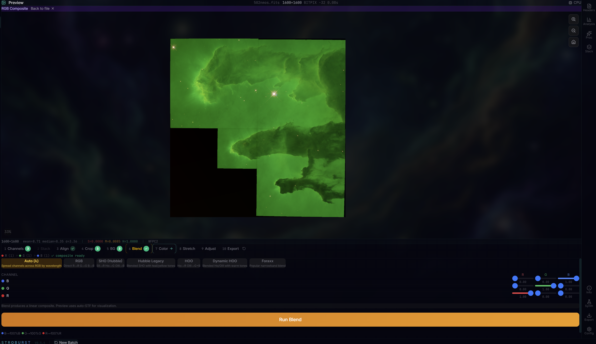
</p>
<p align="center"><em><strong>6 · Blend.</strong> Channels mapped to R/G/B through a per-channel weight matrix, shown here as a node graph — the green cast you see is exactly what the next step neutralizes. Presets: RGB, SHO, HOO, Dynamic HOO, Foraxx, Hubble Legacy, plus the new <strong>Auto (λ)</strong>, which spreads any number of channels across R/G/B by wavelength and auto-applies to untouched broadband stacks without overriding a palette or manual weights.</em></p>

<p align="center">
  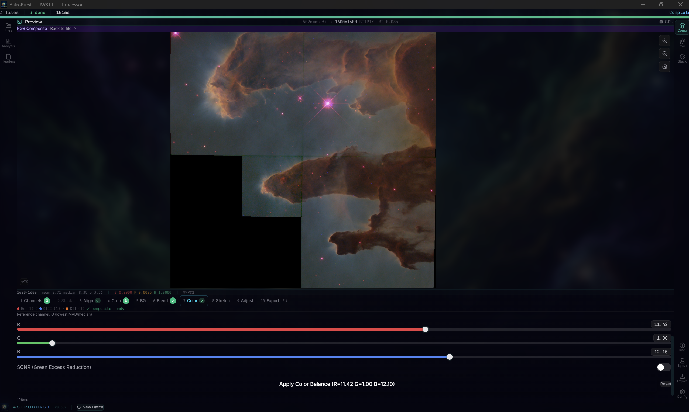
</p>
<p align="center"><em><strong>7 · Color.</strong> White balance (Auto / SPCC / Manual / None) plus SCNR green-excess reduction (average/maximum neutral) with luminance redistribution — taming the green SHO cast into a balanced palette. Includes a narrowband-aware warning.</em></p>

<p align="center">
  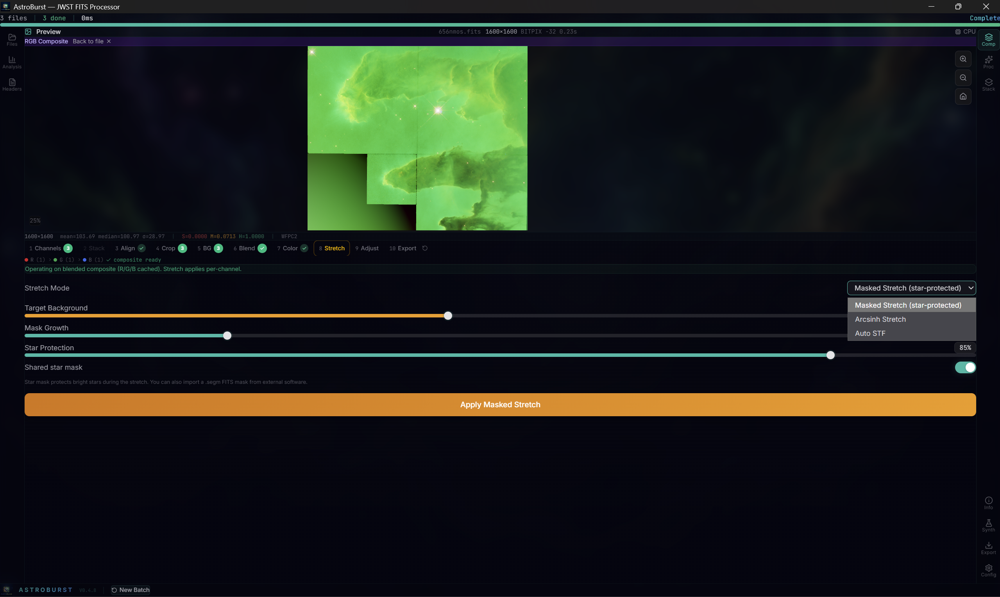
</p>
<p align="center"><em><strong>8 · Stretch.</strong> Masked Stretch (star-protected MTF) with iterations, target background presets, star protection, mask growth/softness, and luminance protection to avoid chromatic halos. The step also offers <strong>GHS</strong> (Generalized Hyperbolic Stretch), arcsinh, and linked or per-channel STF.</em></p>

<p align="center">
  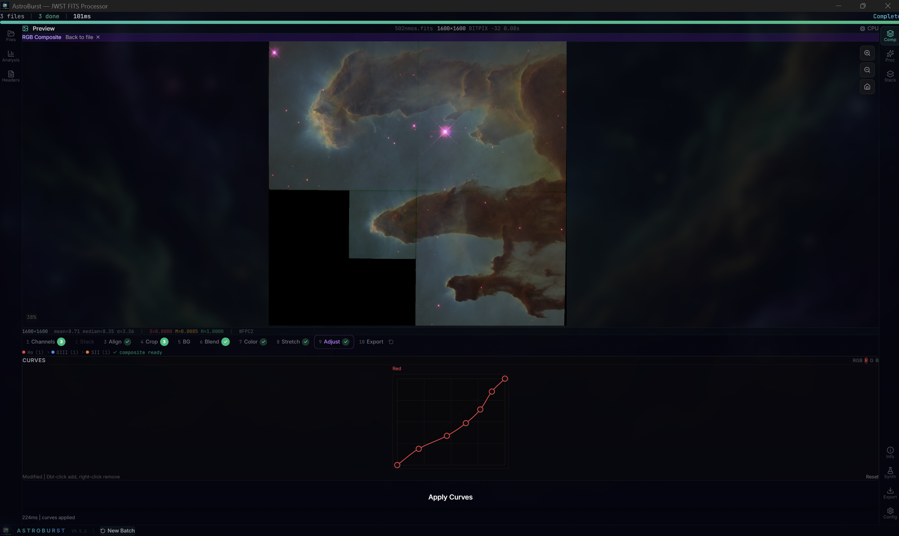
</p>
<p align="center"><em><strong>9 · Adjust.</strong> Spline-based tone curves (monotone Fritsch-Carlson interpolation) with per-channel R/G/B and linked modes — the finishing touch before <strong>10 · Export</strong>.</em></p>

<details>
<summary><strong>Analysis, processing tools &amp; more results</strong></summary>

<p align="center">
  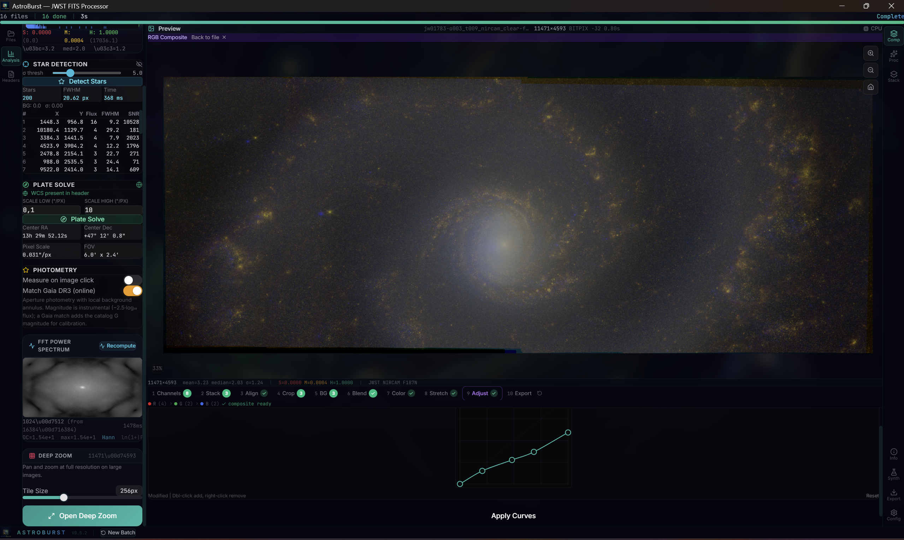
</p>
<p align="center"><em><strong>Analysis.</strong> Star detection with FWHM/SNR and overlay circles, plate solving (RA/Dec, pixel scale, field of view, labeled object annotations), <strong>interactive photometry</strong> — click a star for centroid, net flux, instrumental magnitude and SNR, with optional Gaia DR3 cross-match — an FFT power spectrum with a Hann window, a 16K-bin histogram with auto-STF, and deep-zoom tiles.</em></p>

<p align="center">
  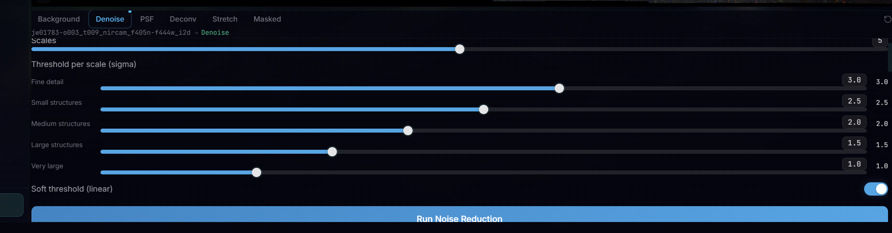
</p>
<p align="center"><em><strong>Wavelet denoise.</strong> À-trous wavelet noise reduction with per-scale sigma thresholds (fine detail through very-large structures) and a soft/linear threshold option that preserves faint signal.</em></p>

<p align="center">
  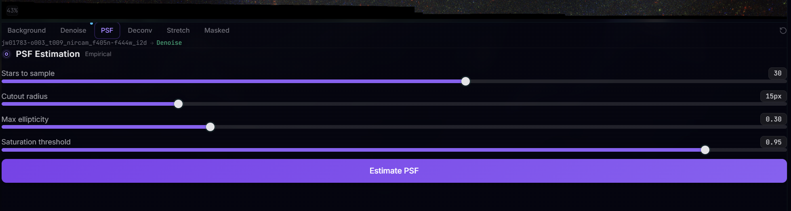
</p>
<p align="center"><em><strong>PSF estimation.</strong> Empirical point-spread-function measurement from sampled stars — count, cutout radius, max ellipticity, and saturation rejection — feeding the deconvolution kernel.</em></p>

<p align="center">
  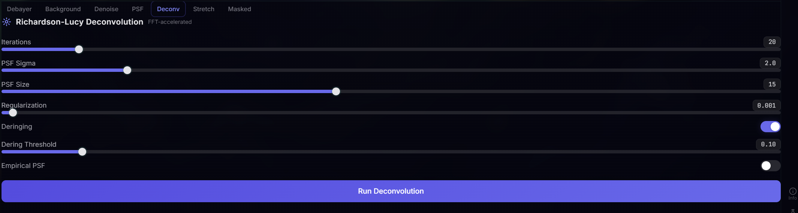
</p>
<p align="center"><em><strong>Deconvolution.</strong> FFT-based Richardson-Lucy with Tikhonov regularization, configurable PSF (synthetic or empirical), iterations, and deringing.</em></p>

<p align="center">
  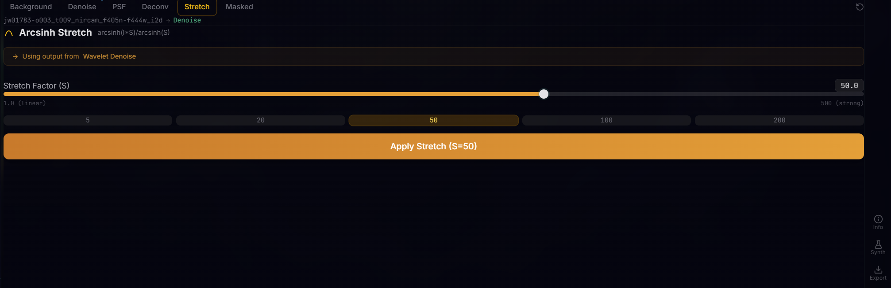
</p>
<p align="center"><em><strong>Arcsinh stretch.</strong> Flux-preserving asinh stretch with a single intensity factor, chainable after denoise or deconvolution and reading the previous tool's output.</em></p>

<p align="center">
  
</p>
<p align="center"><em><strong>Headers.</strong> Categorized FITS keyword browser (image, observation, instrument, WCS, other) with search and per-keyword copy — here over an amateur NGC 6744 RGB frame — plus a multi-extension (MEF) selector with auto SCI detection.</em></p>

<p align="center">
  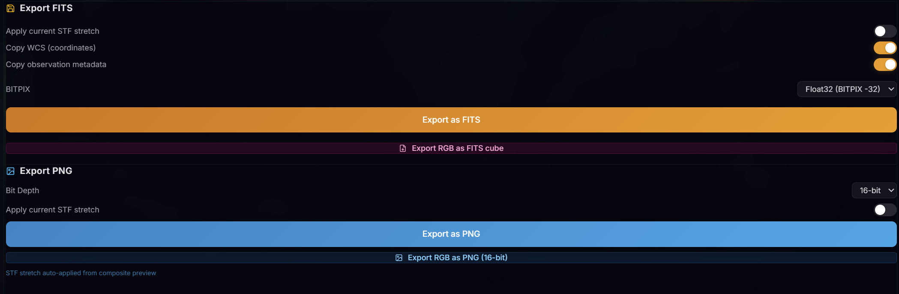
</p>
<p align="center"><em><strong>10 · Export.</strong> FITS export with selectable BITPIX (16 / float32 / float64), WCS and metadata preservation toggles, <code>PROGRAM</code>/<code>HISTORY</code> provenance cards, and an RGB FITS cube — alongside PNG export at 8 or 16 bits with optional STF stretch.</em></p>

<p align="center">
  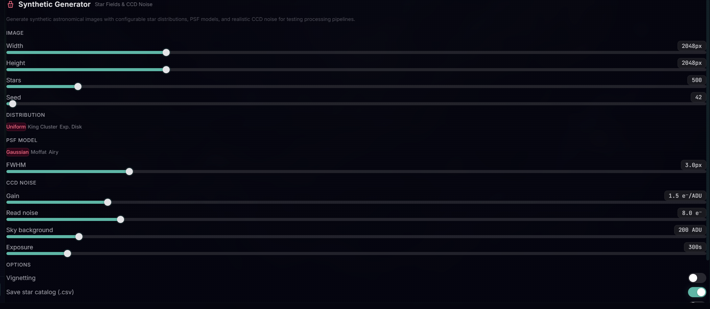
</p>
<p align="center"><em><strong>Synthetic data.</strong> Configurable star-field generator — uniform, King cluster, or exponential-disk distributions, PSF models (Gaussian/Moffat/Airy), a CCD noise model (gain, read noise, sky background, exposure), optional vignetting, and a ground-truth star catalog CSV for validating photometry and alignment.</em></p>

<p align="center">
  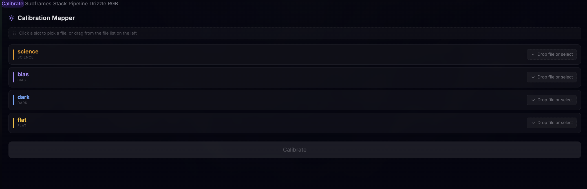
</p>
<p align="center"><em><strong>Calibration.</strong> The Calibration Mapper — drag science, bias, dark, and flat frames into slots for master-based correction, with EXPTIME-ratio dark scaling when a bias master makes the dark scalable.</em></p>

<p align="center">
  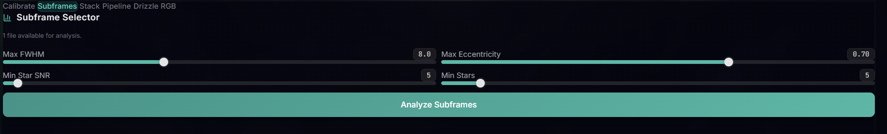
</p>
<p align="center"><em><strong>Subframe selector.</strong> Per-frame quality gating by max FWHM, max eccentricity, minimum star SNR, and minimum star count — the resulting weights drive the weighted integration.</em></p>

<p align="center">
  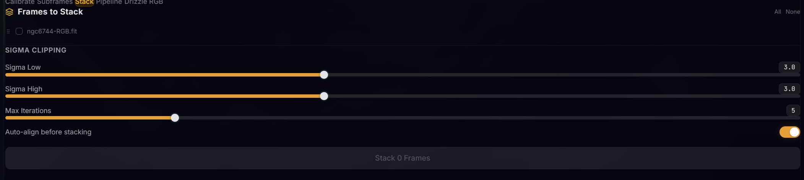
</p>
<p align="center"><em><strong>Stacking.</strong> Sigma-clipped integration with asymmetric low/high thresholds, iteration control, and auto-align before stacking.</em></p>

<p align="center">
  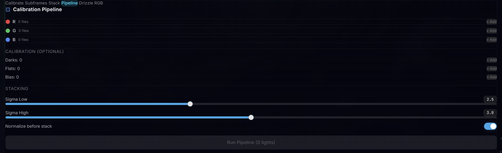
</p>
<p align="center"><em><strong>Batch pipeline.</strong> End-to-end R/G/B lights + optional darks/flats/bias → calibrate → normalize → sigma-clip stack, in one run.</em></p>

<p align="center">
  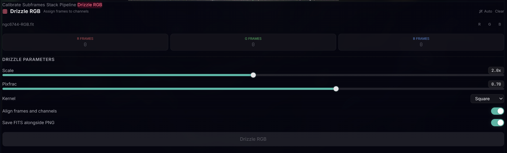
</p>
<p align="center"><em><strong>Drizzle RGB.</strong> Per-channel frame assignment with filename auto-detect, scale (1-4x), pixfrac, and Square/Gaussian/Lanczos3 kernels — each with its true footprint — plus channel re-registration after drizzling and optional FITS output.</em></p>

<p align="center">
  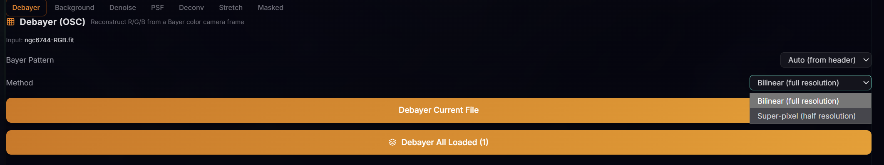
</p>
<p align="center"><em><strong>Debayer (OSC).</strong> Reconstruct R/G/B from one-shot-color Bayer frames — pattern auto-detected from headers (RGGB/BGGR/GRBG/GBRG with XBAYROFF/YBAYROFF), bilinear full-resolution or super-pixel half-resolution, single file or batch.</em></p>

<p align="center">
  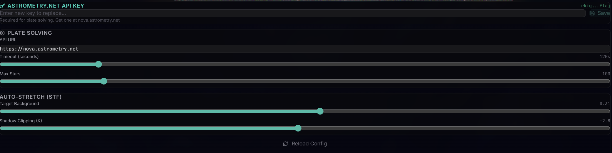
</p>
<p align="center"><em><strong>Settings.</strong> Astrometry.net API key storage, plate-solve endpoint/timeout/star limits, and auto-STF tuning (target background, shadow clipping K).</em></p>

<p align="center">
  
</p>
<p align="center"><em><strong>More results.</strong> The same end-to-end pipeline on a JWST supernova remnant — violet/pink filaments and orange knots over a dense star field — finished with the tone-curve editor.</em></p>

<p align="center">
  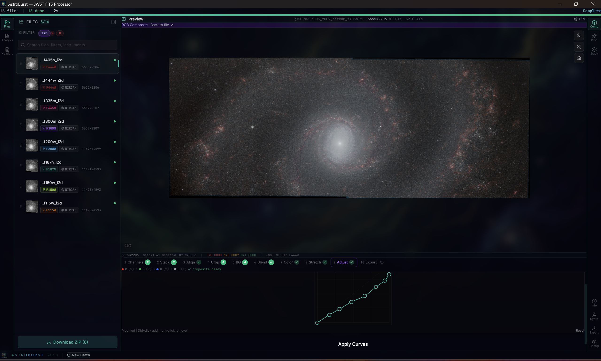
</p>
<p align="center"><em><strong>And a galaxy.</strong> A face-on spiral from eight JWST NIRCam filters (F115W–F405N) composed into an RGB + L stack. The short-wave (~11.5K px) and long-wave (~5.7K px) detectors are auto-resampled to a common grid and registered before blending, so the pink star-forming knots threading the arms and the dense field of resolved stars stay crisp — finished with the tone-curve editor.</em></p>

</details>

## Features

### ComposeWizard (10-Step Pipeline)
1. **Channels**: Auto-detect narrowband filters from headers, drag-and-drop assignment, JWST wavelength mapping, custom bins
2. **Stack**: Per-channel sigma-clipped stacking with a subframe selector (star count, FWHM, SNR, and a per-frame quality weight that drives **weighted integration**), auto-align, and optional **drizzle** super-resolution (scale, pixfrac, kernel)
3. **Align**: Phase correlation (sub-pixel) or star-based affine (rotation/scale), automatic fallback
4. **Crop**: Auto-detect valid data intersection across aligned channels, border scan with configurable margins
5. **Background**: Polynomial surface extraction with sigma-clipped grid sampling (subtract/divide)
6. **Blend**: Preset palettes (SHO, HOO, Foraxx, Dynamic HOO, Hubble Legacy, RGB) with spectral wavelength resolver for any bin configuration
7. **Color**: Stability-based auto white balance (MAD/median reference) + SCNR green removal (average/maximum neutral) with BT.709 luminance redistribution. Narrowband warning for SHO/HOO workflows.
8. **Stretch**: Masked stretch with star protection (growth/protection + shared-luminance mask), GHS (Generalized Hyperbolic Stretch), arcsinh, or linked/per-channel STF
9. **Adjust**: Spline-based tone curves with per-channel R/G/B and linked RGB modes
10. **Export**: PNG (8/16-bit), FITS RGB with WCS/metadata preservation and `PROGRAM`/`HISTORY` provenance cards, ZIP bundle with all channels + composite

### Core Pipeline
- **FITS + ASDF**: Memory-mapped I/O. MEF with auto SCI selection. First non-Python ASDF reader (zlib/bzip2/lz4, Roman Space Telescope gWCS). ZIP transparency. Multi-BITPIX export (16/float32/float64).
- **Non-destructive composite**: ORIG/KEY dual-layer cache. WB and SCNR reconstruct from immutable originals every time. Reset to blend with one click.
- **Dual alignment**: FFT phase correlation (sub-pixel, O(n log n)) as default, star-based affine (triangle asterism + RANSAC, 500 iterations) for rotation. Automatic fallback chain: affine > rigid > phase correlation > identity.
- **STF consistency**: GPU shader, CPU worker, and Rust backend produce pixel-identical output via symmetric denominator protection and unified padding threshold.
- **Calibration**: Bias, dark, flat correction with median-combined masters, EXPTIME-ratio dark scaling (when a bias master makes the dark scalable), and strict master/light dimension validation.
- **Debayer (OSC)**: RGGB/BGGR/GRBG/GBRG auto-detected from headers (incl. XBAYROFF/YBAYROFF), bilinear or super-pixel, single file or batch.
- **Smart Pipeline**: Auto-detects 2D images vs 3D cubes per file and routes accordingly.

### Enhancement
- **Deconvolution**: Richardson-Lucy (FFT-based, Tikhonov regularization, deringing)
- **Background**: Polynomial surface fitting with sigma-clipped grid sampling
- **Wavelet**: A trous multi-scale denoise with per-scale thresholds (up to 8 scales)
- **Stretch**: GHS (Generalized Hyperbolic Stretch with symmetry point and shadow/highlight protection), arcsinh, masked stretch with star protection, linked/per-channel STF
- **SPCC**: Spectrophotometric color calibration against real Gaia DR3 (VizieR cone search, default feature) with synthetic-catalog fallback

### Analysis
- 16K-bin histogram with auto-STF
- FFT power spectrum with Hann window
- Star detection (flux, median FWHM, SNR) with overlay circles
- Interactive photometry: click a star for centroid, net flux, instrumental magnitude, SNR and FWHM, with optional Gaia DR3 cross-match
- Empirical PSF estimation with moment-based FWHM (eigenvalue decomposition, subpixel peak interpolation)
- Narrowband filter auto-detection (H-alpha, [OIII], [SII]) with multi-palette support (SHO, HOO, HOS, NaturalColor, Custom)
- Spectroscopy with automatic wavelength unit conversion (M, NM, ANGSTROM, HZ)
- Full header explorer with categorized keyword browser

### Synthetic Data
- Star field generation with configurable count and flux distribution (uniform, King cluster, exponential disk)
- PSF modeling (Gaussian, Moffat, Airy)
- Noise injection (Poisson, Gaussian, readout) with optional vignetting
- Ground-truth star catalog CSV and stack generation for testing calibration and alignment pipelines

### Rendering
- WebGPU compute shader for real-time STF preview (8 ms at 4K)
- Binary IPC with zero base64 overhead
- Deep zoom tile pyramid with percentile-based stretch
- Canvas 2D fallback

### Astrometry
- Plate solving via astrometry.net (auto-downsample for large images, results rescaled to full resolution)
- WCS coordinate readout and pixel/world conversion (TAN/SIN/ARC/CAR projections, SIP distortion)
- Labeled field annotations drawn as a toggleable overlay

## Installation

### Download

| Platform | Download |
|----------|----------|
| **macOS** (Apple Silicon) | [`.dmg`](https://github.com/samuelkriegerbonini-dev/AstroBurst/releases/latest) |
| **macOS** (Intel) | [`.dmg`](https://github.com/samuelkriegerbonini-dev/AstroBurst/releases/latest) |
| **Linux** | [`.deb`](https://github.com/samuelkriegerbonini-dev/AstroBurst/releases/latest) / [`.AppImage`](https://github.com/samuelkriegerbonini-dev/AstroBurst/releases/latest) / [`.rpm`](https://github.com/samuelkriegerbonini-dev/AstroBurst/releases/latest) |
| **Windows** | [`.msi`](https://github.com/samuelkriegerbonini-dev/AstroBurst/releases/latest) / [`.exe`](https://github.com/samuelkriegerbonini-dev/AstroBurst/releases/latest) |

### One-liner

```bash
# macOS
curl -fsSL https://raw.githubusercontent.com/samuelkriegerbonini-dev/AstroBurst/main/scripts/install-macos.sh | bash

# Linux (Debian/Ubuntu)
curl -fsSL https://raw.githubusercontent.com/samuelkriegerbonini-dev/AstroBurst/main/scripts/install-linux.sh | bash
```

### Build from source

```bash
git clone https://github.com/samuelkriegerbonini-dev/AstroBurst.git
cd AstroBurst
cargo tauri dev
```

Requires Rust 1.75+, Node.js 18+, Tauri CLI v2.10. WebGPU needs Vulkan/Metal/DX12.

## Quick Start

1. **Drop files** into the window (`.fits`, `.fit`, `.asdf`, or `.zip`). They're processed automatically.
2. **Explore**: Click a file to see its preview, histogram, and headers. Tweak STF sliders or hit Auto STF.
3. **ComposeWizard**: Open the Compose tab and follow the 10 steps. Auto-Map detects filters, blend presets resolve by wavelength, WB and SCNR are non-destructive.
4. **Processing**: Debayer, background extraction, wavelet denoise, PSF estimation, deconvolution, and stretch (arcsinh/GHS/masked) are available as standalone tools in the Processing tab; calibration, subframe gating, stacking, and drizzle live in the Stacking tab.
5. **Export**: PNG (8/16-bit) or FITS with preserved WCS metadata. ZIP bundle for all channels + composite.

## Getting Data

AstroBurst works with publicly available data from NASA and ESA archives. No account required for most downloads.

### MAST (JWST, Hubble, Roman)

The [MAST Portal](https://mast.stsci.edu/search/ui/#/jwst) is the primary source for JWST and Hubble data. To find calibrated images ready for processing:

1. Go to **[MAST Search](https://mast.stsci.edu/search/ui/#/jwst)**
2. Search by target name (e.g., "M51", "Carina Nebula", "Cassiopeia A")
3. Filter by **Instrument**: NIRCam or MIRI
4. Filter by **Product Level**: Level 2b/2c (calibrated single exposures) or Level 3 (combined mosaics)
5. Download the `_cal.fits` or `_i2d.fits` files

**Quick links to popular targets:**

| Target | Filters | Link |
|--------|---------|------|
| Pillars of Creation | NIRCam F090W/F187N/F200W/F335M/F444W | [MAST](https://mast.stsci.edu/search/ui/#/jwst/results?resolve=true&target=M16) |
| Carina Nebula | NIRCam F090W/F200W/F444W | [MAST](https://mast.stsci.edu/search/ui/#/jwst/results?resolve=true&target=Carina%20Nebula) |
| Cassiopeia A | NIRCam F162M/F356W/F444W | [MAST](https://mast.stsci.edu/search/ui/#/jwst/results?resolve=true&target=Cassiopeia%20A) |
| M51 Whirlpool | NIRCam F115W/F200W/F335M/F444W | [MAST](https://mast.stsci.edu/search/ui/#/jwst/results?resolve=true&target=M51) |
| Jupiter | NIRCam F164N/F212N/F360M | [MAST](https://mast.stsci.edu/search/ui/#/jwst/results?resolve=true&target=Jupiter) |

For Roman Space Telescope simulated data (`.asdf` files), filter by instrument **WFI** on the MAST portal.

### ESA Hubble Archive

The [ESA Hubble Science Archive](https://hst.esac.esa.int/ehst/) provides an alternative interface for HST data. Useful for narrowband imaging (H-alpha, [OIII], [SII]) that works well with the automatic SHO palette detection.

### Sample Data

The repository includes three HST/WFPC2 narrowband FITS files in `tests/sample-data/` for quick testing: [OIII] 502nm, H-alpha 656nm, and [SII] 673nm of the Eagle Nebula (M16). Public domain (NASA/ESA).

## Usage

### JWST NIRCam

NIRCam has two detector resolutions: short-wave (~0.031"/px, ~14K) and long-wave (~0.063"/px, ~7K). When you compose RGB with mixed SW+LW filters, AstroBurst detects the mismatch and auto-resamples the smaller channels via bicubic interpolation. WCS headers are updated so astrometry stays valid.

**Recommended combinations:**

| Type | R | G | B |
|------|---|---|---|
| Full range (auto-resampled) | F444W | F200W | F115W |
| LW only (same resolution) | F444W | F335M | F300M |
| SW only (highest res) | F200W | F150W | F115W |

### Hubble Narrowband

HST narrowband filters are auto-detected from FITS headers. Six blend presets are available: SHO (Hubble Palette), HOO, Dynamic HOO, Foraxx, Hubble Legacy, and RGB. The spectral wavelength resolver maps presets to any bin configuration by sorting both preset weights and filled bins by wavelength. SHO maps [SII] 673nm to R, H-alpha 656nm to G, [OIII] 502nm to B. Custom bins with wavelength metadata (e.g., JWST filters) are resolved automatically.

### Roman Space Telescope (ASDF)

AstroBurst is the first non-Python tool with native ASDF support. Roman `.asdf` files are loaded transparently through the same pipeline as FITS, including zlib/bzip2/lz4 decompression and gWCS extraction.

### 3D Cubes

For IFU data (NAXIS3 > 1), click anywhere on the preview to extract the spectrum at that pixel. Wavelength calibration is read from WCS headers when available, with automatic unit conversion (meters, nanometers, Angstroms, Hz, etc.).

## Architecture

```
Frontend (React 19 + TypeScript 5.7 + Tailwind v4)
+-- 12 domain services (compose, fits, analysis, header, synth, ...)
+-- 8 shared UI primitives (Slider, Toggle, RunButton, ...)
+-- 8 split PreviewContexts for minimal re-renders
+-- 10-step ComposeWizard with useReducer state machine
+-- infrastructure/tauri/ IPC layer (safeInvoke, withPreview, getOutputDir)
+-- Lazy-loaded panels via React.lazy + Suspense
         |
         | Tauri Commands (66)
         v
Backend (Rust + Tauri v2.10)
+-- cmd/     66 command handlers across 16 modules
+-- core/    alignment (phase correlation + affine), analysis (stars, photometry,
|            deconvolution), astrometry (WCS+SIP, plate solve, SPCC/Gaia),
|            compose (RGB, blend, SCNR, LRGB, drizzle RGB), cube,
|            imaging (STF, GHS, debayer, wavelet, background, masked stretch,
|            star mask, PSF, calibration pipeline), metadata, stacking, synth
+-- infra/   FITS mmap, ASDF reader, ORIG/KEY dual cache, config, render, progress
+-- types/   shared types + 284 response-key/parameter constants
+-- math/    NaN-safe median/MAD, sigma clipping, FFT engine, SIMD (Cephes log)
```

**Design principles:**
- All pixel data stays in f32/f64. No integer quantization at any stage.
- Non-destructive composite: immutable ORIG cache, all WB/SCNR reconstruct from originals.
- Dual alignment: FFT phase correlation (sub-pixel) as default, star-based affine (triangle asterism + RANSAC) for rotation. Automatic fallback chain.
- White balance picks the channel with lowest noise (MAD/median) as reference, not always G.
- SCNR redistributes lost luminance to R/B via BT.709 weights instead of adding it back to G.
- STF rendering is pixel-identical across GPU (WGSL), CPU worker (JS), and Rust backend.
- Blend presets resolve by spectral wavelength, not positional index.
- Drizzle uses flat contiguous storage instead of per-pixel heap allocations.
- Sigma clipping uses median/MAD (Stetson 1987) on first iteration, mean/stddev on subsequent.
- NaN values sort to end everywhere: median, MAD, sigma clipping, auto-STF.
- Binary IPC for GPU pixels: 16-byte header + raw f32 array, zero JSON/base64.
- SIMD log uses Cephes degree-8 minimax polynomial with range reduction (< 1 ULP for f32).
- All JSON response keys use shared constants from `types/constants.rs`. Zero hardcoded string keys.
- Output paths resolve via `appDataDir()` on all platforms (no `./output` relative paths).

## Roadmap

| Version | What | Status |
|:--------|:-----|:-------|
| **v0.4** | ComposeWizard, non-destructive pipeline, tone curves, masked stretch, SPCC, affine alignment, stability WB, SCNR redistribution, blend presets, STF consistency, cache-only processing, numerical audit | Released |
| **v0.5** | Drizzle in the wizard + dedicated Drizzle RGB tab, quality-weighted stacking, valid-FITS export with WCS/metadata preservation + `PROGRAM`/`HISTORY` provenance, shared-luminance star mask, GHS stretch, OSC debayer, interactive photometry with Gaia DR3 match, SPCC via Gaia DR3/VizieR, SIP distortion, linked STF (preview == export), NaN-safety + math audits, 16-bit PNG export fix | **Released** |
| **v0.5.4** | Foroosh sub-pixel phase correlation, NaN-aware resampling, calibration master-dimension safety, median flat normalization, reflection rejection, NaN-preserving stacks, Lanczos low-coverage guard; UI knobs for Drizzle RGB rejection/manual WB/alignment method, subframe scoring weights, plate-solve scale units + downsample | **Released** |
| **v0.6** | FITS ERR/DQ/VAR propagation, MAST API, levels, selective saturation, star removal | Next |
| **v0.7** | PixelMath, mosaic stitching, gradient-aware background, photometric calibration refinements | Planned |
| **v1.0** | Full WebGPU pipeline, WASM plugins, Python scripting | Planned |

## Contributing

Contributions are welcome. See [CONTRIBUTING.md](CONTRIBUTING.md) for guidelines.

Some areas where help would be especially valuable:
- FITS ERR/DQ/VAR error propagation through the processing chain
- MAST API integration for direct JWST/HST data access
- Levels and selective saturation controls
- Star removal algorithms
- Mosaic stitching with WCS-aware reprojection
- WebGPU compute shaders for stacking and alignment
- Test data curation from public archives (MAST, ESA)

## Support

AstroBurst is free, open-source, with no subscriptions and no feature locks.

If it helps your work, consider supporting development:

<p align="center">
  <a href="https://ko-fi.com/astroburst">
    
  </a>
</p>

See [membership tiers](https://ko-fi.com/astroburst/tiers) for details.

## Supporters

<!-- SUPPORTERS:START -->
*Be the first to support!*
<!-- SUPPORTERS:END -->

## License

GPLv3. See [LICENSE](LICENSE).

---

<p align="center">
  <sub>Created by <a href="https://github.com/samuelkriegerbonini-dev">Samuel Krieger</a></sub>
</p>
