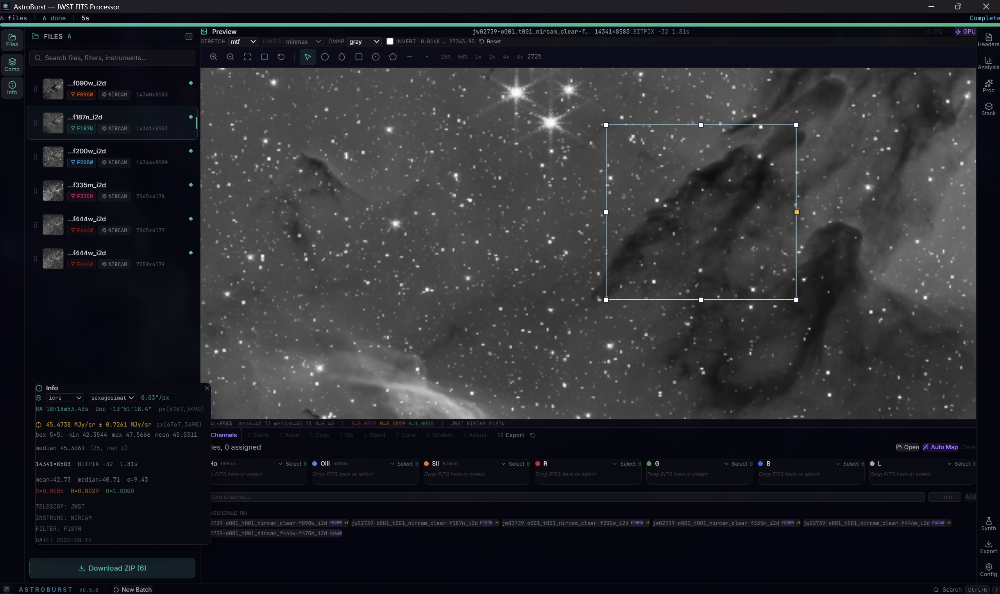
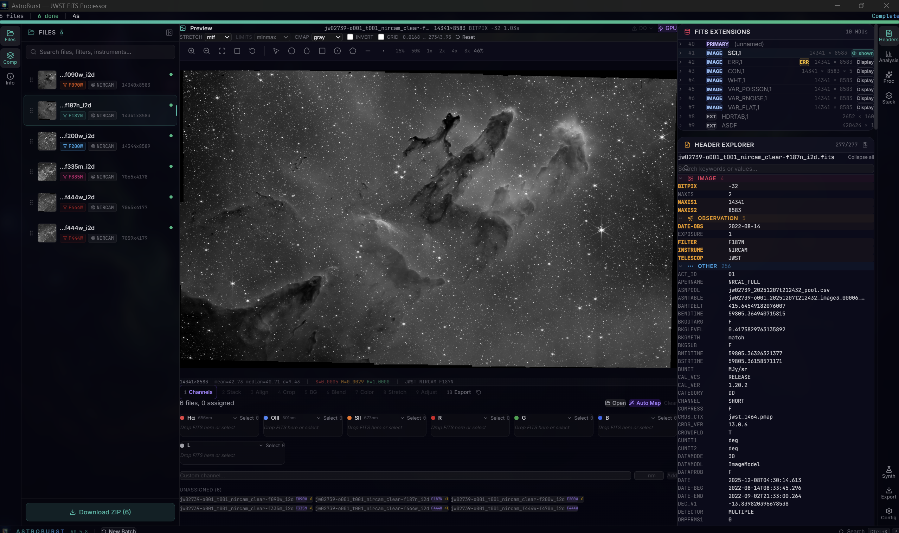
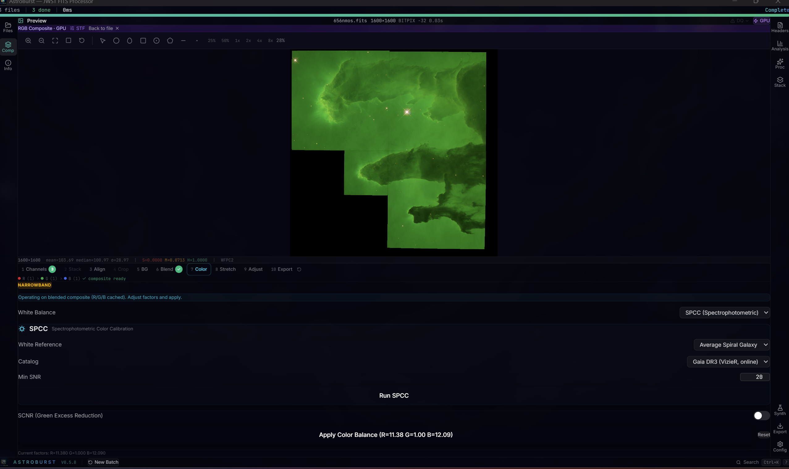
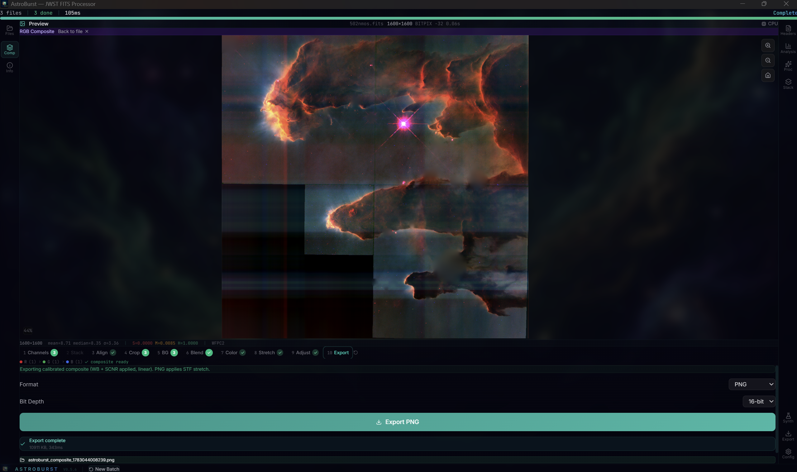
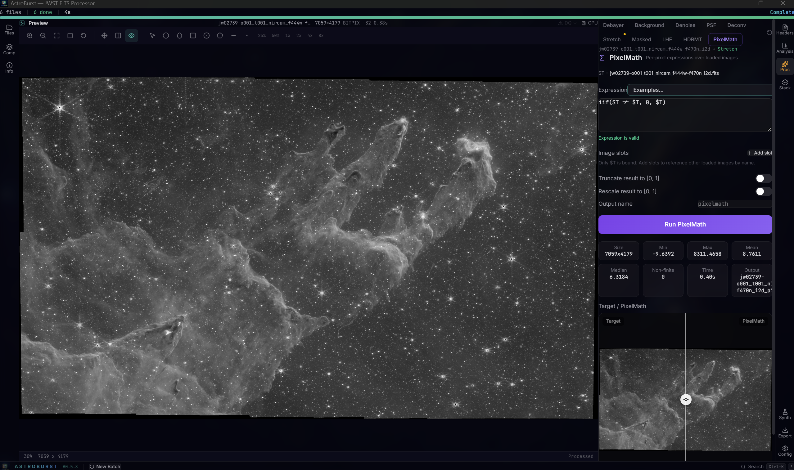
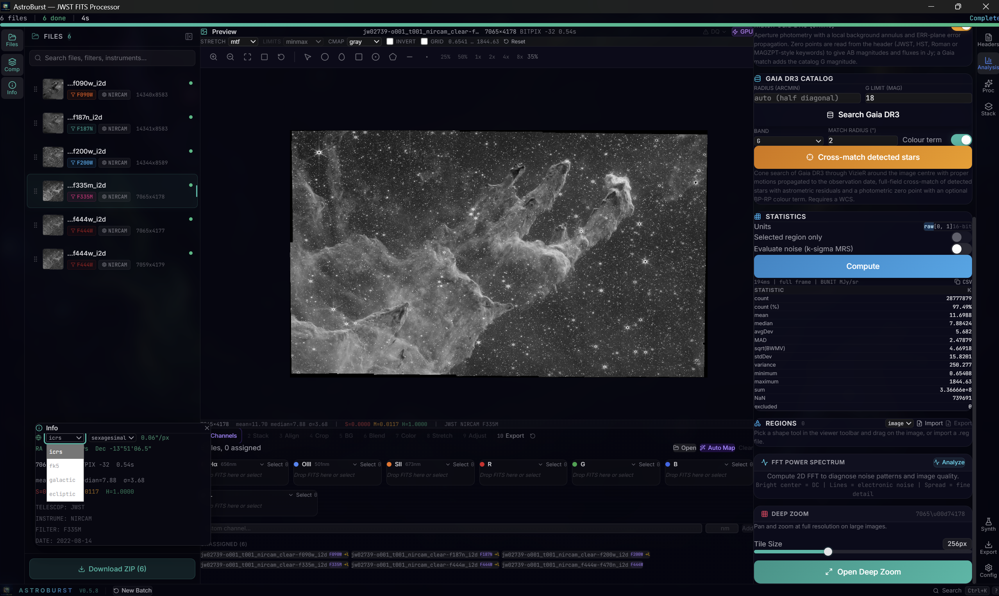
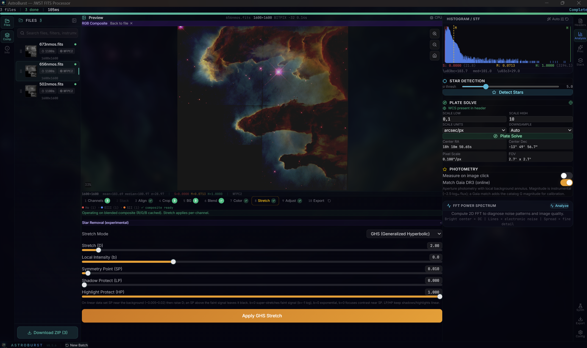

<p align="center">
  
</p>

<h1 align="center">AstroBurst</h1>

<p align="center">
  <strong>A desktop viewer and processing app for FITS and ASDF images, with an optional headless REST API.</strong>
</p>

<p align="center">
  <a href="https://github.com/samuelkriegerbonini-dev/AstroBurst/releases"></a>
  <a href="https://github.com/samuelkriegerbonini-dev/AstroBurst/actions"></a>
  
  <a href="LICENSE"></a>
  
  <a href="https://ko-fi.com/astroburst"></a>
</p>

<p align="center">
  <a href="#what-it-is">What it is</a> &middot;
  <a href="#feature-tour">Features</a> &middot;
  <a href="#install-and-build">Install</a> &middot;
  <a href="#quick-start">Quick start</a> &middot;
  <a href="#headless-server-and-python-client">Server</a> &middot;
  <a href="#supported-formats">Formats</a> &middot;
  <a href="#how-it-compares">Compare</a> &middot;
  <a href="#project-status">Status</a>
</p>

---

<p align="center">
  
</p>

**Latest:** 0.6.0-preview. Since 0.5.8: DS9-class display controls shared with the headless server, any-HDU / any-array image references, DQ decoding and overlays, interactive regions with DS9 `.reg` exchange, a PixInsight-class processing round (rejection families, frame normalization, cosmetic correction, DBE spline background, PixelMath, LHE, HDRMT, exact statistics) and a science round (header photometric calibration, spectral axes and velocities, cube moment maps, SCI+ERR+DQ cutouts, WCS grid, Gaia DR3 catalog). Full history in [CHANGELOG.md](CHANGELOG.md).

## What it is

AstroBurst opens FITS and ASDF images, displays them, measures them, and composes and exports them. The Rust backend does the processing, React draws the interface, Tauri packages it as a desktop app. A WebGPU shader applies the display stretch and colormap; that is the only place the GPU is used. Everything else, including stacking, alignment, drizzle, deconvolution and compose, runs on the CPU in Rust.

Three reader paths:

- **Quick-look.** Open any FITS HDU or ASDF array, pick a stretch, limits and colormap, read pixel values with their units and WCS position, overlay a coordinate grid, draw regions and measure them. Start at [Viewer, regions and pixel readout](#viewer-regions-and-pixel-readout).
- **JWST and Roman.** Native ASDF, per-HDU selection, DQ flag decoding and overlays, DQ-masked statistics, calibrated photometry in AB magnitudes and Jy, cube spectra and moment maps, science cutouts. Start at [Data quality and units](#data-quality-and-units) and [Science analysis](#science-analysis).
- **Astrophotography.** Calibration with cosmetic correction and dark optimization, integration with the PixInsight rejection family, a ten-step compose wizard, and a processing tab with DBE, PixelMath, wavelets, deconvolution, LHE and HDRMT. Start at [Compose wizard](#compose-wizard) and [Processing](#processing).

Image processing runs locally. Two optional features reach the network: plate solving uploads the frame to nova.astrometry.net, and spectrophotometric colour calibration queries Gaia DR3 through VizieR.

## Feature tour

### Viewer, regions and pixel readout

<p align="center">
  
</p>
<p align="center"><em>A box region selected over a JWST NIRCam F187N mosaic. Top: the display-controls bar, here on MTF stretch, min/max limits, gray colormap inverted. Right: the readout reporting the pixel as 45.4738 &plusmn; 0.7261 MJy/sr with its ICRS sexagesimal position.</em></p>

**Display controls.** Six stretch curves: MTF, linear, log, sqrt, asinh with an adjustable softening parameter, and power with an adjustable exponent. Four limit algorithms: min/max, zscale (IRAF-style, adjustable contrast), percentile (1 to 99.5 by default) and explicit user vmin/vmax. Nine colormaps (gray, viridis, inferno, magma, plasma, cividis, heat, cool, rainbow) with an invert toggle. The desktop app applies them through a LUT texture in a WebGPU shader and falls back to a CPU worker when WebGPU is unavailable or the device is lost; the headless server computes the same stretch and limits on the CPU and returns a PNG.

**Regions.** Draw circles, ellipses, boxes (both rotatable), annuli, polygons, lines and points, in pixel or sky coordinates. Measure a source by putting a circle on it and a background annulus around it: the annulus is fitted and subtracted from the region statistics, with optional sigma clipping and NaN-safe throughout. Check focus with a radial profile from a circle or annulus. Cut across a filament, a diffraction spike or a detector artefact with a line region and read the profile along it. Regions import and export as DS9 `.reg` files (format 4.1), keeping colour, width, label, dash and include/exclude, so shapes move between AstroBurst and DS9. Coordinate systems and shapes the reader does not handle (fk4, galactic, ecliptic, b1950, amplifier, detector, tile; text, vector, ruler, compass, projection, the panda family, composite) are reported as warnings instead of being dropped silently.

Region statistics, cutouts, histograms and rendering are available on the headless server too. Radial profiles, line cuts and `.reg` import/export are desktop-only.

**Readout.** Hovering reports the pixel value with its BUNIT unit (or the ASDF `unit` field), the matching value from an ERR companion array as `value ± err`, neighbourhood statistics over a box (min, max, mean, median, NaN count), and the decoded DQ flags. Cursor coordinates are shown in ICRS, FK5 (J2000), galactic or ecliptic (J2000), sexagesimal or decimal, with right ascension in hours for the equatorial frames and degrees for the others.

**Coordinate grid.** The display bar toggles a WCS grid in ICRS, FK5, galactic or ecliptic coordinates with a density choice. Lines are traced in world coordinates through the WCS, so they follow the image at every zoom; steps are sexagesimal-friendly, fields crossing RA 0h and fields containing a pole are handled, and edge labels never overlap. The same grid is served by `POST /v2/sessions/:sid/wcs/grid`.

**Statistics.** An exact PixInsight-style table per image or per selected region: count, mean, median, avgDev, MAD, sqrt(BWMV), stdDev, variance, min, max, sum, NaN and DQ-excluded counts, in raw, normalised or 16-bit units, per channel for composites, with k-sigma multiresolution noise evaluation and copy-as-CSV. Zeros and negatives are included and nothing is approximated by a histogram.

### Data quality and units

<p align="center">
  
</p>
<p align="center"><em>A JWST NIRCam i2d product on the GPU viewer: the extension list exposes SCI, ERR, CON, WHT and the variance planes for display, and the header explorer groups the 277 keywords.</em></p>

**Any HDU, any array.** An image reference of the form `path#hdu=3` or `path#array=roman.dq` makes any FITS extension or any ASDF array the displayed image, not only the auto-detected SCI plane. Every path-based command accepts the reference, so DQ and ERR planes can be displayed and measured like any other image. Pick one from the HDU panel in the desktop app, or over HTTP on the server.

**DQ flags.** Data-quality extensions are decoded against named bit tables, selected from the header: JWST (32 flags), HST, and the JWST convention for Roman. Files from other instruments fall back to the JWST bit names, labelled as such. Hovering a pixel names the flags set on it instead of showing a raw integer. Flagged pixels can be painted over the image as a mask overlay, and statistics, histograms, photometry, region statistics and profiles can all exclude them with one toggle. Integer extensions are read through a lossless integer plane, so individual flag bits survive exactly; the display and processing paths stay in f32/f64.

The DQ overlay and DQ exclusion are desktop-only. The server pixel endpoint returns decoded DQ, but its stats and histogram endpoints do not yet accept the exclusion flag.

### Colour calibration

<p align="center">
  
</p>
<p align="center"><em>Spectrophotometric colour calibration against Gaia DR3 with a selectable white reference and SCNR, on an RGB composite rendering through the GPU display path.</em></p>

Spectrophotometric colour calibration solves channel gains against a real Gaia DR3 cone search through VizieR (the `vizier` feature, on by default), falling back to a synthetic catalogue when the feature is off. Auto white balance picks the channel with the lowest noise (MAD over median) as the reference rather than always green. SCNR removes green excess and redistributes the lost luminance to red and blue with BT.709 weights.

### Compose wizard

<p align="center">
  
</p>
<p align="center"><em>The export step with a finished SHO narrowband composite. White balance and SCNR are baked in from the calibrated linear composite and the stretch is applied at write time.</em></p>

Ten steps: channels, stack, align, crop, background, blend, colour, stretch, adjust, export. Filters are detected from headers and mapped to channel bins by wavelength. Stacking uses the same rejection family as the Stack tab (sigma, Winsorized sigma, linear fit, percentile, min/max) with a subframe selector and optional drizzle. Alignment is sub-pixel phase correlation by default or star-based affine (triangle asterism with RANSAC, 2000 iterations) for rotation, with an automatic fallback chain of affine, rigid, phase correlation, identity. Background correction has four families: per-channel polynomial surface, linked shared gradient, neutralize (sky pedestal only) and de-band for 1/f striping (rows, columns, both or an auto-detected axis), offered as seven options in the selector. Blend presets (SHO, HOO, Dynamic HOO, Foraxx, Hubble Legacy, RGB, plus wavelength-spreading Auto and Balanced) resolve by spectral wavelength rather than bin order. Stretch offers star removal (starless image plus a separate stars layer), masked stretch with star protection, GHS, arcsinh and linked or per-channel STF. Adjust applies monotone Fritsch-Carlson spline tone curves. The composite is non-destructive: white balance and SCNR always reconstruct from an immutable original cache.

### Processing

<p align="center">
  
</p>
<p align="center"><em>PixelMath on a NIRCam mosaic: the expression is validated as you type, the result is written as a new FITS with provenance cards, and the panel compares target and result.</em></p>

**Calibration and integration.** Bias, dark and flat masters integrated with Winsorized sigma clipping instead of a plain median; EXPTIME-ratio dark scaling or dark-frame optimization by robust-noise minimisation; cosmetic correction from a master dark, from automatic cluster-aware detection or from a PixInsight-style defect list, CFA-aware, standalone or inside the pipeline. Integration offers the rejection family (sigma, Winsorized sigma, linear fit, percentile, min/max, none), mean/median/min/max combination, additive or multiplicative frame normalization with optional scaling, scale+offset rejection normalization, low/high rejection maps, subframe quality weights and 1/sigma² noise weights. Drizzle at 1 to 4x with square, Gaussian or Lanczos3 kernels applies the same pixel rejection before scattering. Everything is exposed on the desktop and on the headless server with the same parameter names.

**Background.** Polynomial surface (ABE-class) or a regularised thin-plate spline through box samples (DBE-class) with automatic grid placement, Point regions as manual samples, star and outlier rejection and adjustable smoothing; linked shared gradient, neutralize and de-band modes for the wizard.

**PixelMath.** A per-pixel expression language over the target image (`$T`) and named image slots bound to loaded files (`A`, `B`, ...): arithmetic, comparison and logical operators, `iif`, `~` inversion, per-pixel functions (abs, sqrt, exp, ln, log, log2, pow, min, max, floor, ceil, round, trunc, sign, clip, rescale) and image statistics (mean, med, mdev, sdev, adev, min, max) over finite pixels. NaN propagates, output goes to a new file with `ABPROC` and `PMEXPR` provenance cards, and slots for the symbols you type are bound to the loaded files automatically.

**Multiscale and local contrast.** A-trous wavelet denoise with per-scale thresholds and a PixInsight MLT-style per-scale detail bias; Local Histogram Equalization (CLAHE on lightness with kernel radius, contrast limit, 8/10/12-bit histograms and blend amount) and HDR Multiscale Transform (2 to 8 layers, overdrive, inverted mode, star-core deringing) for stretched images and the RGB composite. Richardson-Lucy deconvolution (FFT-based, Tikhonov regularization, deringing) with a synthetic or empirical PSF, and empirical PSF estimation with moment-based FWHM. OSC debayer (RGGB, BGGR, GRBG, GBRG, honouring XBAYROFF and YBAYROFF). Every processing step feeds the next one in the chain and the result is shown on the GPU viewer as well as on the CPU path.

### Science analysis

<p align="center">
  
</p>
<p align="center"><em>The Analysis tab on a NIRCam F335M mosaic: Gaia DR3 cone search and cross-match, the exact statistics table in MJy/sr with a noise evaluation toggle, regions, FFT and deep zoom, with the readout frame switched between ICRS, FK5, galactic and ecliptic.</em></p>

<p align="center">
  
</p>
<p align="center"><em>The analysis strip beside a GHS stretch in progress: a plate-solved field with labelled annotations, star detection with FWHM and SNR overlays, interactive photometry, an FFT power spectrum and the histogram readout.</em></p>

**Photometry.** Aperture photometry with fractional edge-pixel weights, a local background annulus, ERR-plane error propagation (or sky noise plus an optional Poisson term), the SATURATED DQ bit or a header saturation level, masked-pixel counts and a curve-of-growth aperture correction. The zero point is read from the header, JWST `MJy/sr` with `PIXAR_SR` or `DN/s` with `PHOTMJSR`, HST `PHOTFLAM`/`PHOTPLAM`/`PHOTZPT`, Roman `conversion_megajanskys`, or generic `MAGZERO`-style keywords, so the panel reports AB magnitude with error, flux in Jy and surface brightness, and warns when the image carries an `ABPROC` provenance card left by a processing step.

**Catalogs.** Gaia DR3 cone search through VizieR with proper motions propagated from J2016.0 to the observation date, an overlay layer with labels, full-field cross-match of detected stars with astrometric residuals (median dRA/dDec, rms) and a photometric zero point in G, BP or RP with an optional colour term, RFC-4180 CSV export of rows, sources and matches, and a one-click copy of rows into Point regions for `.reg` export.

**Spectra and cubes.** A full FITS spectral axis (WAVE, AWAV, FREQ and velocity kinds; `CDELT3`, `CD3_3` or `PC3_3`; lenient `CUNIT3`; `RESTWAV`/`RESTFRQ`; `SPECSYS`/`VELOSYS`) with air/vacuum conversion (Greisen et al. 2006) and optical, radio or relativistic velocity axes, plus a barycentric or heliocentric correction for ground-based headers from a low-precision analytic ephemeris (about 0.02 km/s), with spectra already in a rest frame recognised and spacecraft headers using `VELOSYS`. For IFU cubes: region (aperture) spectra with annulus sky subtraction in native units and Jy, channel-range collapse from a brush on the spectrum plot, and M0/M1/M2 moment maps with a per-pixel continuum fit and SNR masking, written as 2D FITS with the celestial WCS kept. Cubes open through a memory-mapped lazy reader.

**Cutouts.** Export > Cutout writes a multi-extension FITS (SCI, ERR, DQ) from a box region or a manual centre and size in pixels or arcseconds, with `CRPIX` shifted and `LTV1`/`LTV2`/`LTM` recorded, NaN padding outside the parent and padded DQ pixels flagged, sharing its core with the server cutout endpoint.

Star detection with flux, FWHM and SNR, a 64K-bin histogram with auto-STF and an FFT power spectrum complete the tab. Plate solving goes through astrometry.net and needs a free nova.astrometry.net API key entered in Settings; large images are auto-downsampled and the result is rescaled to full resolution. WCS is handled by the [wcs](https://github.com/cds-astro/wcs-rs) crate (about twenty FITS projections, CD/PC/CDELT conventions) with SIP distortion applied in the wrapper; see [ADR 0001](docs/adr/0001-wcs-rs-for-wcs-engine.md). A synthetic data generator produces star fields with configurable distributions, PSF models, a CCD noise model and a ground-truth catalogue CSV for validating photometry and alignment.

More screens are in [`docs/screenshots/`](docs/screenshots).

## Install and build

| Platform | Download |
|----------|----------|
| **macOS** (universal: Apple Silicon and Intel) | [`.dmg`](https://github.com/samuelkriegerbonini-dev/AstroBurst/releases/latest) |
| **Windows** | [`.msi`](https://github.com/samuelkriegerbonini-dev/AstroBurst/releases/latest) / [`.exe`](https://github.com/samuelkriegerbonini-dev/AstroBurst/releases/latest) |
| **Linux** | [`.deb`](https://github.com/samuelkriegerbonini-dev/AstroBurst/releases/latest) / [`.AppImage`](https://github.com/samuelkriegerbonini-dev/AstroBurst/releases/latest) / [`.rpm`](https://github.com/samuelkriegerbonini-dev/AstroBurst/releases/latest) |

Install scripts:

```bash
# macOS
curl -fsSL https://raw.githubusercontent.com/samuelkriegerbonini-dev/AstroBurst/main/scripts/install-macos.sh | bash

# Linux (Debian/Ubuntu)
curl -fsSL https://raw.githubusercontent.com/samuelkriegerbonini-dev/AstroBurst/main/scripts/install-linux.sh | bash
```

Build from source:

```bash
git clone https://github.com/samuelkriegerbonini-dev/AstroBurst.git
cd AstroBurst
pnpm install
pnpm tauri dev
```

`make dev`, `make build`, `make test` and `make lint` wrap the common dev, build, test and lint commands. CI builds and tests with current stable Rust, Node.js 22 and pnpm 10; the Tauri CLI tracks 2.10. Platform prerequisites are listed in [CONTRIBUTING.md](CONTRIBUTING.md#development-setup). WebGPU (Vulkan, Metal or DX12) is used for the preview when available; without it the app renders through a CPU worker.

## Quick start

1. **Drop** a file, a ZIP (nested ZIPs are followed up to a depth limit) or a folder into the window. `.fits`, `.fit`, `.fts`, `.asdf` and `.zip` are recognised.
2. **Look.** Click a file for its preview, histogram and headers. Set stretch, limits, colormap and the coordinate grid in the display bar, or hit Auto STF. Hover for value, unit, ERR, DQ and coordinates. Use the HDU panel to switch to another extension or array.
3. **Measure.** Draw a region, add a background annulus, read the statistics. Plot a radial profile or a line cut. Click a star for calibrated photometry, search Gaia DR3 for a catalog overlay and a zero point. Import or export DS9 `.reg` files.
4. **Compose.** Open the Compose tab and walk the ten steps.
5. **Process.** Debayer, background (polynomial or DBE spline), wavelet denoise, PSF estimation, deconvolution, the stretch tools, LHE, HDRMT and PixelMath sit in the Processing tab; calibration, cosmetic correction, subframe gating, stacking with the rejection family, the batch pipeline and drizzle in the Stacking tab.
6. **Export.** PNG at 8 or 16 bits, FITS with preserved WCS and metadata, a SCI+ERR+DQ cutout, or a ZIP bundle of all channels plus the composite.

Three HST/WFPC2 narrowband frames of the Eagle Nebula (M16) ship in [`exampleFits/sample-data/`](exampleFits/sample-data) for a first run: [OIII] 502 nm, H-alpha 656 nm and [SII] 673 nm, public domain (NASA/ESA). A ground-truth catalogue for photometry checks is in `exampleFits/sample-data/synthetic_catalog.csv`. For your own data, MAST and the ESA Hubble Science Archive publish JWST and HST `_cal.fits` and `_i2d.fits` products, and Roman `.asdf` products under instrument WFI.

## Headless server and Python client

The headless server and the v2 API were contributed by [Jae-Joon Lee](https://github.com/leejjoon).

`astroburst-server` is a separate Axum binary built behind the `server` feature. It shares the FITS and ASDF readers, the display controls and the region code with the desktop app. It renders on the CPU: there is no GPU dependency anywhere in the Rust crate. Run it on whatever machine holds the data and reach it over an SSH tunnel.

```bash
cd src-tauri
cargo run --bin astroburst-server \
  --no-default-features \
  --features server,astrometry-net,asdf-full,vizier
# Listening on 127.0.0.1:8080
```

Two API generations are served. **v1**: sessions, FITS open and header, render, auto-STF and viewport, stacking and drizzle with the rejection family and normalization, and pipeline runs with cosmetic correction and dark optimization, with async jobs you can poll, cancel or follow as a server-sent event stream. **v2**: session lifecycle with keepalive, image open and HDU switching, structure, header and WCS inspection, cutouts by pixel box or sky position or region shape with `LTV` reporting, block binning, pixel-to-sky and sky-to-pixel and angular separation, a WCS coordinate grid, pixel probe, exact statistics with noise evaluation, histogram, and a render endpoint taking the same display settings as the desktop bar.

The async Python client in [`agent/`](agent/README.md) wraps the v1 surface. The v2 endpoints are HTTP-only for now and have no Python method.

```python
import asyncio
from astroburst_client import AstroBurstClient

async def main():
    async with AstroBurstClient("http://localhost:8080") as client:
        session = await client.create_session()
        result = await session.open("/data/m16_ha.fits", slot="ha")
        print(f"{result.width}x{result.height}  median={result.stats.median:.1f}")
        png, stf = await session.stf("ha")
        open("preview.png", "wb").write(png)

asyncio.run(main())
```

Install with `pip install -e ./agent` (add `[image]` for the Pillow helper). Runnable examples: [`agent/examples/`](agent/examples). Full route list and configuration: [src-tauri/SERVER.md](src-tauri/SERVER.md). Client reference: [agent/README.md](agent/README.md).

## Supported formats

**FITS.** Memory-mapped reading. Multi-extension files with auto SCI selection, or any extension by `path#hdu=<n>`. Tile-compressed HDUs are decoded natively: ZCMPTYPE `RICE_1`, `GZIP_1`, `GZIP_2` and `NOCOMPRESS`, including quantized floats and plane-aligned compressed cubes (ZTILE3=1). Not supported: `PLIO_1`, `HCOMPRESS_1`, non-plane-aligned 3D tiling (ZTILE3>1), per-pixel null bitmaps and per-tile ZBLANK columns.

**ASDF.** A native reader written in Rust, so Roman and JWST pipeline products open without a Python environment: block index, YAML tree, science-array discovery, and gWCS extracted and approximated to a standard projection for readout. zlib decompression is always available; bzip2 and lz4 come with the `asdf-full` feature, which is on by default but must be listed explicitly in `--no-default-features` builds. Not supported: external (exploded) block files, arrays of rank other than 2 or 3, and dtypes outside the decoded set. Each failure reports a named error rather than passing silently.

**Containers.** ZIP archives, including nested ones up to a depth limit, and whole directories.

**Export.** PNG at 8 or 16 bits, FITS with BITPIX 16, float32 or float64 and optional Rice compression at a configurable quantize level, WCS and metadata preservation with `PROGRAM` and `HISTORY` provenance cards, RGB FITS cubes, and a ZIP bundle. Processing stays in f32/f64 with no quantization; quantization happens only where you ask for it, in 8/16-bit PNG export, integer-BITPIX or Rice FITS export, and the 8-bit deep-zoom tiles.

## How it compares

AstroBurst sits between a viewer and a processing suite, and is behind the established tools in both directions.

- **DS9** is the reference FITS viewer. AstroBurst matches most of its inspection surface: stretch and limit algorithms, colormaps, frames, a coordinate grid, region shapes with DS9 `.reg` exchange, per-region statistics and a Gaia catalog overlay. DS9 is ahead on frame management and blinking, image-server integration, contours, 3D rendering, and interoperability through SAMP and XPA, none of which AstroBurst has.
- **jdaviz** is the JWST and Roman quick-look toolset from STScI. AstroBurst overlaps on ASDF, DQ decoding, unit-aware readout, calibrated photometry, cube spectra and moment maps, and opens those files without Python. jdaviz is ahead on line and model fitting, Mosviz-style multi-object work, and lives inside a notebook where results are scriptable end to end.
- **Siril** is the closest free processing comparison. Calibration, registration, integration (rejection families, normalization, drizzle with rejection, cosmetic correction, dark optimization) and stretching are at a comparable level of algorithmic depth. Siril has a mature scripting language, RAW and XISF input, a much larger user base and years of field testing; AstroBurst has no scripting language yet.
- **PixInsight** is the commercial reference for processing depth. AstroBurst now covers the core of ImageIntegration, CosmeticCorrection, DynamicBackgroundExtraction, PixelMath, LocalHistogramEqualization, HDRMultiscaleTransform, Statistics and NoiseEvaluation, each as a single tool with the essential parameters. PixInsight keeps mosaic stitching, a process container and history model, masks and previews as first-class objects, modern deconvolution, and an enormous body of published workflows.

Where AstroBurst is genuinely different: a single desktop app that reads ASDF natively without Python, decodes DQ against named instrument bit tables, and exposes the same readers, display controls and region code through a headless REST API.

## Project status

Pre-1.0, developed by one maintainer with outside contributions. Formats, command names and the REST API may change before 1.0.

The current version is 0.6.0-preview (the Windows installer reports 0.6.0 because MSI versions cannot carry a pre-release identifier). The FITS and ASDF readers, display path, compose wizard and export are used daily; the processing and science rounds of September 2026 are covered by unit tests and adversarial code review but have had less time in the field. CI runs five jobs on every pull request and on pushes to main: typecheck plus a production build, eslint with zero warnings allowed, `cargo test --lib` on Windows, `cargo test --all-features` on Ubuntu and macOS (which covers the headless server), and the vitest suite. `cargo test --all-features` runs 1095 library tests and 131 server tests; vitest runs 315 frontend cases.

Known limits:

- There is no benchmark suite. No performance figure is published because none is reproducible from this repository.
- The GPU is used for display only. Every algorithm runs on the CPU in Rust.
- Plate solving needs a nova.astrometry.net account and network access; SPCC and the catalog panel need VizieR.
- Radial profiles, line cuts, `.reg` import and export, the DQ overlay, DQ-masked statistics, photometry, catalogs, cube science and the processing tools are desktop-only. The compose wizard has no server routes.
- The Python client covers the v1 API only.
- Integration holds every frame in memory; very large frame counts need a machine with matching RAM.
- The coordinate grid and regions are not drawn in the standalone deep-zoom tile viewer.
- No SAMP or XPA interoperability, no mosaic stitching, no plugin or scripting system, no RAW or XISF input.

Next up: MAST API access, a before/after preview per wizard step, levels and selective saturation, PixelMath RGB expressions and masks, row-banded integration for large frame counts. Longer term: GPU compute for stacking and alignment, plugin hooks.

## Contributing

Setup, code style, tests, the architecture overview and the current priority areas are in [CONTRIBUTING.md](CONTRIBUTING.md), so there is one list to keep current. Contributions require the [CLA](CLA.md). Please read the [Code of Conduct](CODE_OF_CONDUCT.md), and report security issues through [SECURITY.md](SECURITY.md).

The headless server, the v2 API, the Python client, the WCS engine migration, FITS tile compression, zscale and the colormaps were contributed by [Jae-Joon Lee](https://github.com/leejjoon).

AstroBurst is free and AGPLv3. If it helps your work, you can [support development on Ko-fi](https://ko-fi.com/astroburst).

<!-- SUPPORTERS:START -->
<!-- SUPPORTERS:END -->

## License

AGPLv3. See [LICENSE](LICENSE).

The network clause (section 13) covers the optional headless REST API: if you run a
modified AstroBurst as a network service, you must offer the modified source to its users.

---

<p align="center">
  <sub>Created by <a href="https://github.com/samuelkriegerbonini-dev">Samuel Krieger</a></sub>
</p>
