<p align="center">
  
</p>

<h1 align="center">AstroBurst</h1>

<p align="center">
  <strong>A desktop viewer and processing app for FITS and ASDF images, with an optional headless REST API.</strong>
</p>

<p align="center">
  <a href="https://github.com/samuelkriegerbonini-dev/AstroBurst/releases"></a>
  <a href="https://github.com/samuelkriegerbonini-dev/AstroBurst/actions"></a>
  
  <a href="LICENSE"></a>
  
  <a href="https://ko-fi.com/astroburst"></a>
</p>

<p align="center">
  <a href="#what-it-is">What it is</a> &middot;
  <a href="#feature-tour">Features</a> &middot;
  <a href="#install-and-build">Install</a> &middot;
  <a href="#quick-start">Quick start</a> &middot;
  <a href="#headless-server-and-python-client">Server</a> &middot;
  <a href="#supported-formats">Formats</a> &middot;
  <a href="#how-it-compares">Compare</a> &middot;
  <a href="#project-status">Status</a>
</p>

---

<p align="center">
  
</p>
<p align="center"><em>The Pillars of Creation composed from the three HST/WFPC2 narrowband frames that ship with the app, eight of the ten wizard steps done (Stack stays locked with one frame per channel) and the composite ready. Bottom: a monotone spline tone curve, applied in 39&nbsp;ms. Left: the readout for pixel (800, 799) &mdash; 134.35 with its 5&times;5 neighbourhood, the ICRS position at 0.10&Prime;/px, and the WFPC2 exposure it came from. Right: the header explorer reading <code>FILTNAM1: F656N</code> and offering to assign that frame to the green channel, which is how the wizard maps filters to channels without a manual step. The magenta corner is the gap between the WFPC2 chips, not a processing artefact.</em></p>

**Latest:** 0.6.3. Since 0.6.0: 0.6.1 kept the CPU and GPU previews on the same image after every processing step, and 0.6.2 added a measurement round (aperture and batch photometry, calibrated region fluxes, sky geometry, spectral line measurement, contours, surface-brightness profiles, time-series photometry, a pixel table). 0.6.3 adds a second science round (rest-frame line list, spectrum export and comparison, observation geometry with BJD_TDB, position-velocity diagrams, diverging colormaps with symmetric limits, a measurement log), fixes the Deep Zoom viewer and SPCC in the compose wizard, adds a Delete points button for Point regions, and closes an interface round of 30 fixes and 22 improvements. Full history in [CHANGELOG.md](CHANGELOG.md).

## What it is

AstroBurst opens FITS and ASDF images, displays them, measures them, and composes and exports them. The Rust backend does the processing, React draws the interface, Tauri packages it as a desktop app. A WebGPU shader applies the display stretch and colormap; that is the only place the GPU is used. Everything else, including stacking, alignment, drizzle, deconvolution and compose, runs on the CPU in Rust.

Three reader paths:

- **Quick-look.** Open any FITS HDU or ASDF array, pick a stretch, limits and colormap, read pixel values with their units and WCS position, overlay a coordinate grid, a compass and contours, draw regions and measure them. Start at [Viewer, regions and pixel readout](#viewer-regions-and-pixel-readout).
- **JWST and Roman.** Native ASDF, per-HDU selection, DQ flag decoding and overlays, DQ-masked statistics, calibrated photometry in AB magnitudes and Jy, cube spectra with line measurement, moment maps and position-velocity diagrams, science cutouts. Start at [Data quality and units](#data-quality-and-units) and [Science analysis](#science-analysis).
- **Astrophotography.** Calibration with cosmetic correction and dark optimization, integration with the PixInsight rejection family, a ten-step compose wizard, and a processing tab with DBE, PixelMath, wavelets, deconvolution, LHE and HDRMT. Start at [Compose wizard](#compose-wizard) and [Processing](#processing).

Image processing runs locally. Optional features reach the network: plate solving uploads the frame to nova.astrometry.net, and spectrophotometric colour calibration, the catalog panel and the opt-in Gaia match of click photometry query Gaia DR3 through VizieR.

## Feature tour

### Viewer, regions and pixel readout

<p align="center">
  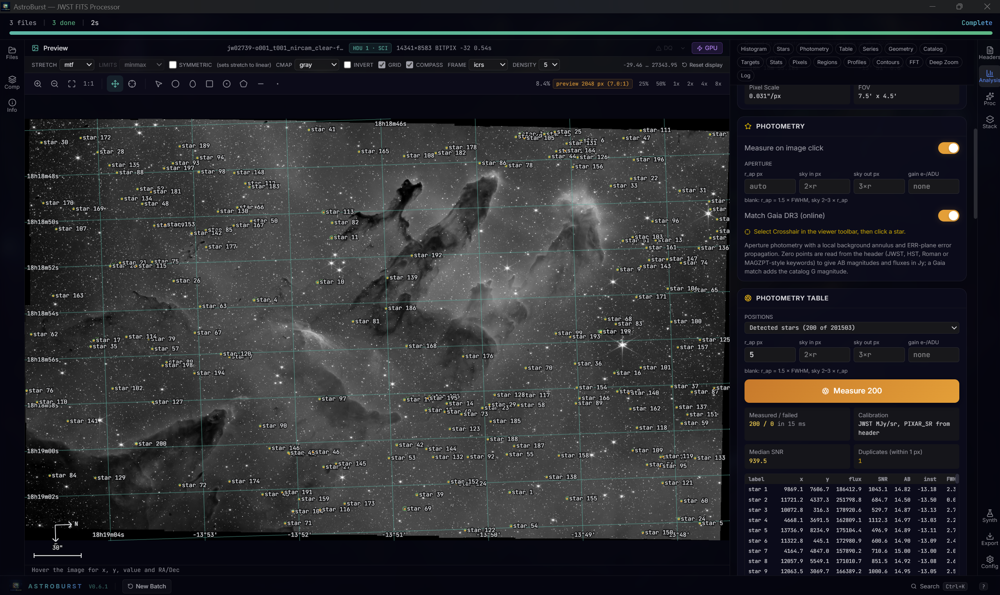
</p>
<p align="center"><em>The NIRCam mosaic of the Pillars of Creation (jw02739, 14341&times;8583) on the GPU viewer: the ICRS grid at density 5 with sexagesimal edge labels, the north/east compass and a 30&Prime; scale bar. The amber badge says the viewer is showing a 2048&nbsp;px preview texture (7.0:1); the 8.4% zoom beside it is measured in FITS pixels. Right: the Photometry table measured the 200 detected stars kept out of 201,503 in 15&nbsp;ms, none failed, with the zero point read from the header (JWST MJy/sr, <code>PIXAR_SR</code>); the apertures and their "star N" labels are drawn on the image. Above it, click photometry with the opt-in Gaia DR3 match switched on. Bottom: the status strip, waiting for the cursor.</em></p>

**Display controls.** Six stretch curves: MTF, linear, log, sqrt, asinh with an adjustable softening parameter, and power with an adjustable exponent. Four limit algorithms: min/max, zscale (IRAF-style, adjustable contrast), percentile (1 to 99.5 by default) and explicit user vmin/vmax. Thirteen colormaps, nine sequential (gray, viridis, inferno, magma, plasma, cividis, heat, cool, rainbow) and four diverging (RdBu, coolwarm, bwr, seismic, matplotlib knots), with an invert toggle; symmetric limits mirror vmin/vmax about a chosen centre (default 0) for residual, difference and moment-1 maps, and no-data pixels take a per-colormap neutral colour on the desktop and the server alike. The desktop app applies them through a LUT texture in a WebGPU shader, with a CPU worker taking over if the GPU device is lost; when WebGPU is unavailable the CPU viewer shows the auto-stretched preview, keeps the grid and compass, and disables the stretch, limit and colormap controls; the headless server computes the same stretch and limits on the CPU and returns a PNG. The zoom percentage, the zoom presets and 1:1 are measured in FITS pixels, and a "preview N px (r:1)" badge appears when the viewer shows a downsampled texture. Images wider or taller than 4096 pixels can also be opened in Deep Zoom, a full-screen tile viewer that keeps keyboard focus inside it and closes with Escape.

**Regions.** Draw circles, ellipses, boxes (both rotatable), annuli, polygons, lines and points, in pixel or sky coordinates. Measure a source by putting a circle on it and a background annulus around it: the annulus is fitted and subtracted from the region statistics, with optional sigma clipping and NaN-safe throughout. When the header carries a flux calibration and a WCS, every region also reports its flux in Jy, AB magnitude, surface brightness in mag/arcsec², area in arcsec², the RA/Dec of its centre and its sky position angle, and the region table exports as CSV. Check focus with a radial profile from a circle or annulus. Cut across a filament, a diffraction spike or a detector artefact with a line region and read the profile along it, together with the separation and position angle (east of north) between its ends. A Delete points button clears every Point region of the file at once, after a confirmation. Regions import and export as DS9 `.reg` files (format 4.1), keeping colour, width, label, dash and include/exclude, so shapes move between AstroBurst and DS9. Coordinate systems and shapes the reader does not handle (fk4, galactic, ecliptic, b1950, amplifier, detector, tile; text, vector, ruler, compass, projection, the panda family, composite) are reported as warnings instead of being dropped silently.

Region statistics, cutouts, histograms and rendering are available on the headless server too. Radial profiles, line cuts and `.reg` import/export are desktop-only.

**Readout.** Hovering reports the pixel value with its BUNIT unit (or the ASDF `unit` field), the matching value from an ERR companion array as `value ± err`, neighbourhood statistics over a box (min, max, mean, median, NaN count), and the decoded DQ flags. Cursor coordinates are shown in ICRS, FK5 (J2000), galactic or ecliptic (J2000), sexagesimal or decimal, with right ascension in hours for the equatorial frames and degrees for the others. A status strip under both viewers shows the cursor's pixel position, the value with its unit and the ICRS RA/Dec. Pixel coordinates are 0-based in the readouts and tables, which say so; DS9 and `.reg` files count from 1.

**Coordinate grid.** The display bar toggles a WCS grid in ICRS, FK5, galactic or ecliptic coordinates with a density choice. Lines are traced in world coordinates through the WCS, so they follow the image at every zoom; steps are sexagesimal-friendly, fields crossing RA 0h and fields containing a pole are handled, and edge labels never overlap. The same grid is served by `POST /v2/sessions/:sid/wcs/grid`.

**Compass, sky geometry and targets.** The display bar also draws a north/east compass with a scale bar; when the WCS cannot support the grid or the compass, an amber "(no WCS)" note gives the reason. The WCS orientation (projection, per-axis pixel scale, rotation, parity, SIP) is shown in the desktop WCS readout and returned, with the north and east vectors, by the server `wcs` route. The Targets panel places a pasted or CSV list of positions in ICRS, FK5, galactic or ecliptic coordinates on the image through its WCS, as labelled markers, and turns the ones that land on the image into Point regions.

**Statistics.** An exact PixInsight-style table per image or per selected region: count, mean, median, avgDev, MAD, sqrt(BWMV), stdDev, variance, min, max, sum, NaN and DQ-excluded counts, in raw, normalised or 16-bit units, per channel for composites, with k-sigma multiresolution noise evaluation and copy-as-CSV. Zeros and negatives are included and nothing is approximated by a histogram. When the region or the options change, the table dims and asks for a new Compute instead of showing stale numbers.

**Pixel table.** A 3&times;3 to 15&times;15 block of raw values around a clicked pixel or following the cursor, with the unit, the ERR value on request, the decoded DQ flag names, and the min, max, mean and median of the block, copyable as CSV.

<p align="center">
  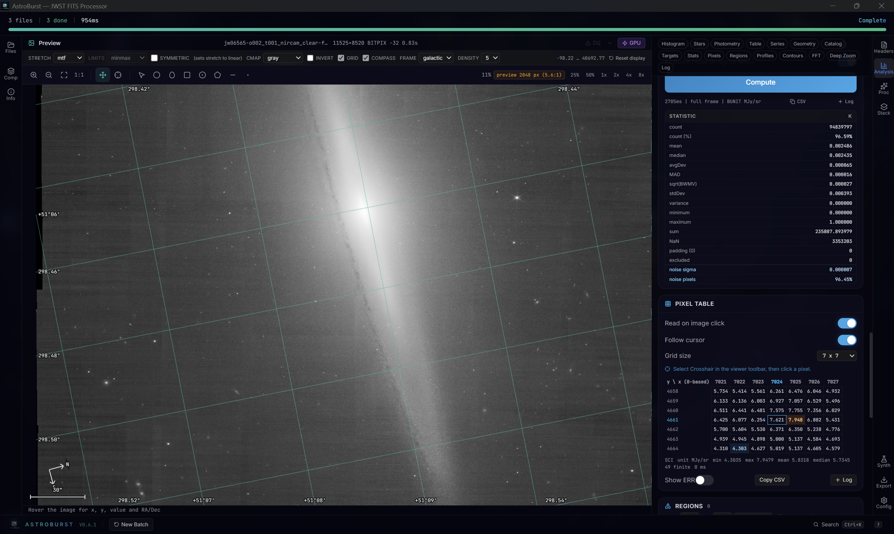
</p>
<p align="center"><em>A NIRCam galaxy mosaic (jw06565, 11525&times;8520) with the grid in galactic coordinates and the compass. Top right: the Statistics table over the full frame in 2705&nbsp;ms (BUNIT MJy/sr), 94,839,797 finite pixels (96.59%) and 3,353,203 NaN pixels counted rather than dropped; the last two rows are the k-sigma multiresolution noise evaluation, which classes 96.45% of the pixels as noise. Below it, the pixel table reading on click and following the cursor: a 7&times;7 block of MJy/sr values around pixel (7024, 4661), axes marked 0-based, with the min, max, mean and median of its 49 finite values.</em></p>

### Data quality and units

<p align="center">
  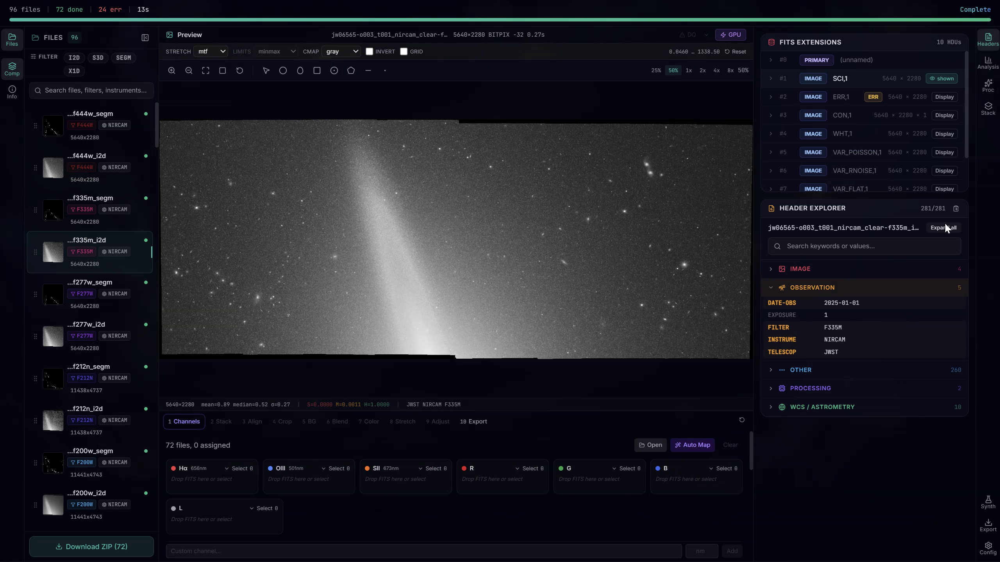
</p>
<p align="center"><em>A JWST NIRCam F335M i2d product on the GPU viewer. Top right: the extensions panel with its ten HDUs; SCI is shown, and ERR, CON, WHT, VAR_POISSON, VAR_RNOISE and VAR_FLAT each have a Display button, because they are images you can show and measure, not just metadata. Below it: the header explorer over all 281 keywords, grouped into IMAGE, OBSERVATION, OTHER, PROCESSING and WCS / ASTROMETRY, with OBSERVATION open. Bottom: the compose channel bins waiting for an assignment. Top: the batch of 96 files as it finished.</em></p>

**Any HDU, any array.** An image reference of the form `path#hdu=3` or `path#array=roman.dq` makes any FITS extension or any ASDF array the displayed image, not only the auto-detected SCI plane. Every path-based command accepts the reference, so DQ and ERR planes can be displayed and measured like any other image. Pick one from the HDU panel in the desktop app, or over HTTP on the server.

**DQ flags.** Data-quality extensions are decoded against named bit tables, selected from the header: JWST (32 flags), HST, and the JWST convention for Roman. Files from other instruments fall back to the JWST bit names, labelled as such. Hovering a pixel names the flags set on it instead of showing a raw integer. Flagged pixels can be painted over the image as a mask overlay, and statistics, histograms, photometry, region statistics and profiles can all exclude them with one toggle. Integer extensions are read through a lossless integer plane, so individual flag bits survive exactly; the display and processing paths stay in f32/f64.

The DQ overlay and DQ exclusion are desktop-only. The server pixel endpoint returns decoded DQ, but its stats and histogram endpoints do not yet accept the exclusion flag.

### Colour calibration

Spectrophotometric colour calibration solves channel gains against a real Gaia DR3 cone search through VizieR (the `vizier` feature, on by default), falling back to a synthetic catalogue when the feature is off or the query fails, and saying which one it used. In the compose wizard SPCC reads the WCS from each channel and refuses a channel without a celestial one, and it is offered for broadband RGB only: when an input is narrowband, the white-balance option reads "SPCC (broadband RGB only)", is disabled, and the reason is shown below it. Auto white balance picks the channel with the lowest noise (MAD over median) as the reference rather than always green. SCNR removes green excess and redistributes the lost luminance to red and blue with BT.709 weights.

### Compose wizard

<p align="center">
  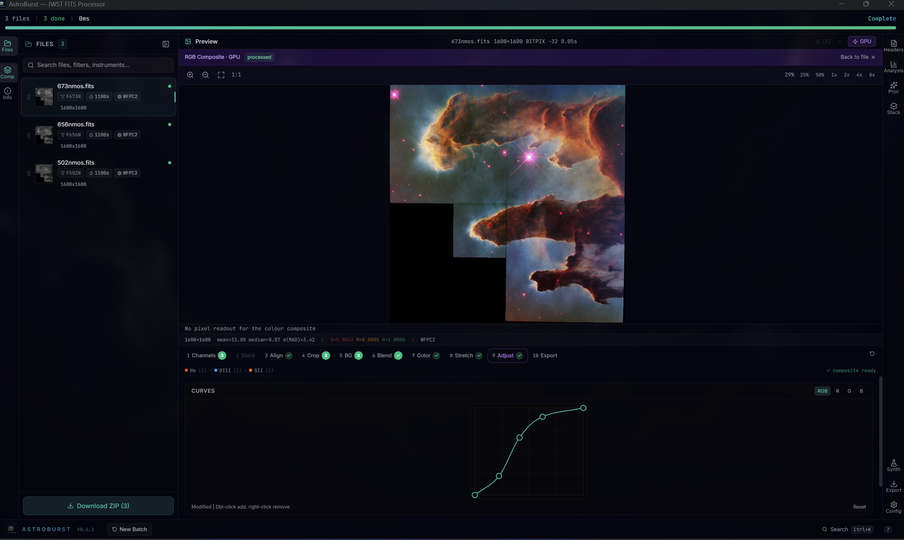
</p>
<p align="center"><em>The three HST/WFPC2 narrowband frames that ship with the app (502, 656 and 673&nbsp;nm, 1100&nbsp;s each) composed in the wizard. Channels, Crop and BG show a count of 3, one per frame, Align, Blend, Color, Stretch and Adjust carry checkmarks, Stack stays locked because Hα, OIII and SII hold one frame each, and the wizard reports "composite ready". Step 9, Adjust, holds a five-point spline curve on the RGB tab. Under the image, the status strip says there is no pixel readout for the colour composite, and the bar below it gives the composite's size and statistics.</em></p>

Ten steps: channels, stack, align, crop, background, blend, colour, stretch, adjust, export. Filters are detected from headers and mapped to channel bins by wavelength. Stacking uses the same rejection family as the Stack tab (sigma, Winsorized sigma, linear fit, percentile, min/max) with a subframe selector and optional drizzle. Alignment is sub-pixel phase correlation by default or star-based affine (triangle asterism with RANSAC, 2000 iterations) for rotation, with an automatic fallback chain of affine, rigid, phase correlation, identity. Background correction has four families: per-channel polynomial surface, linked shared gradient, neutralize (sky pedestal only) and de-band for 1/f striping (rows, columns, both or an auto-detected axis), offered as seven options in the selector. Blend presets (SHO, HOO, Dynamic HOO, Foraxx, Hubble Legacy, RGB, plus wavelength-spreading Auto and Balanced) resolve by spectral wavelength rather than bin order. Stretch offers star removal (starless image plus a separate stars layer), masked stretch with star protection, GHS, arcsinh and linked or per-channel STF.

Adjust applies monotone Fritsch-Carlson spline tone curves. The composite is non-destructive: white balance and SCNR always reconstruct from an immutable original cache.

<p align="center">
  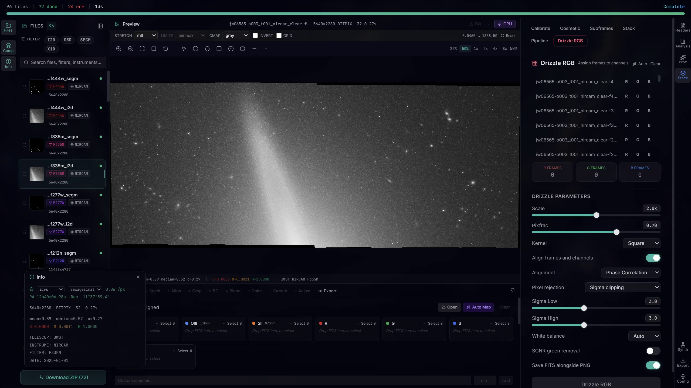
</p>
<p align="center"><em>Drizzle straight to RGB, from the Stacking tab: each loaded frame can be assigned to R, G or B (none are assigned yet here) and is then scattered at 2&times; with a 0.70 pixfrac and a square kernel. The same rejection family the Stack tab uses is applied <em>before</em> the scatter &mdash; sigma clipping at 3.0/3.0 here &mdash; rather than after, so rejected pixels never reach the output grid. Alignment across frames and across channels runs in the same pass.</em></p>

### Processing

<p align="center">
  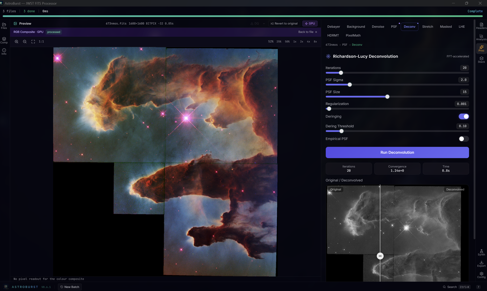
</p>
<p align="center"><em>Richardson-Lucy deconvolution of the [SII] 673&nbsp;nm WFPC2 frame, after the PSF step, as the breadcrumb 673nmos &rarr; PSF &rarr; Deconv records: 20 iterations with a synthetic PSF of sigma 2.0 and size 15, regularization 0.001 and deringing at 0.10, finished in 0.8&nbsp;s. Below the result cards, a draggable wipe compares the original frame against the deconvolved one. The viewer keeps the colour composite on screen, and the preview header offers Revert to original.</em></p>

**Calibration and integration.** Bias, dark and flat masters integrated with Winsorized sigma clipping instead of a plain median; EXPTIME-ratio dark scaling or dark-frame optimization by robust-noise minimisation; cosmetic correction from a master dark, from automatic cluster-aware detection or from a PixInsight-style defect list, CFA-aware, standalone or inside the pipeline. Integration offers the rejection family (sigma, Winsorized sigma, linear fit, percentile, min/max, none), mean/median/min/max combination, additive or multiplicative frame normalization with optional scaling, scale+offset rejection normalization, low/high rejection maps, subframe quality weights and 1/sigma² noise weights. Drizzle at 1 to 4x with square, Gaussian or Lanczos3 kernels applies the same pixel rejection before scattering. Everything is exposed on the desktop and on the headless server with the same parameter names.

**Background.** Polynomial surface (ABE-class) or a regularised thin-plate spline through box samples (DBE-class) with automatic grid placement, Point regions as manual samples, star and outlier rejection and adjustable smoothing; linked shared gradient, neutralize and de-band modes for the wizard.

**Multiscale and local contrast.** A-trous wavelet denoise with per-scale thresholds and a PixInsight MLT-style per-scale detail bias; Local Histogram Equalization (CLAHE on lightness with kernel radius, contrast limit, 8/10/12-bit histograms and blend amount) and HDR Multiscale Transform (2 to 8 layers, overdrive, inverted mode, star-core deringing) for stretched images and the RGB composite. Richardson-Lucy deconvolution (FFT-based, Tikhonov regularization, deringing) with a synthetic or empirical PSF, and empirical PSF estimation with moment-based FWHM. OSC debayer (RGGB, BGGR, GRBG, GBRG, honouring XBAYROFF and YBAYROFF). Every processing step feeds the next one in the chain and the result is shown on the GPU viewer as well as on the CPU path. On the colour composite, LHE and HDRMT work on the luminance of the stretched RGB image and keep its hue.

<p align="center">
  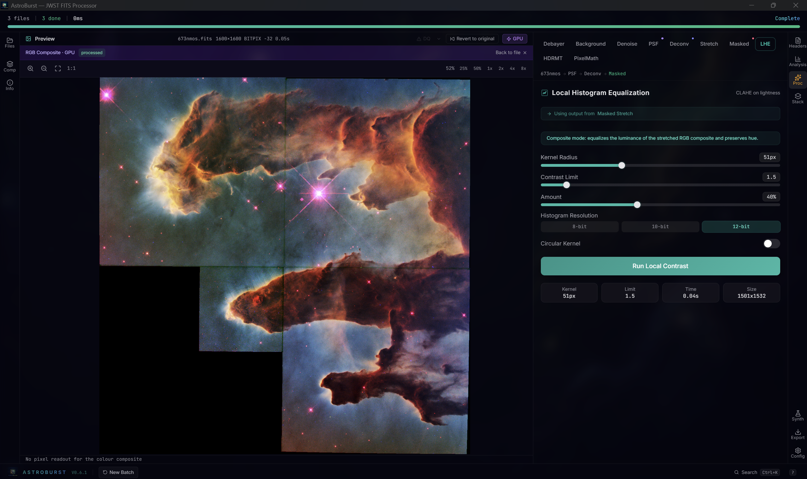
</p>
<p align="center"><em>Local histogram equalization in composite mode, which equalises the luminance of the stretched RGB composite and preserves hue. The banner reads <em>Using output from Masked Stretch</em>, and the breadcrumb 673nmos &rarr; PSF &rarr; Deconv &rarr; Masked names the chain it continues. 51&nbsp;px kernel, contrast limit 1.5, 40% amount, 12-bit histogram, 0.04&nbsp;s on the 1501&times;1532 composite.</em></p>

<p align="center">
  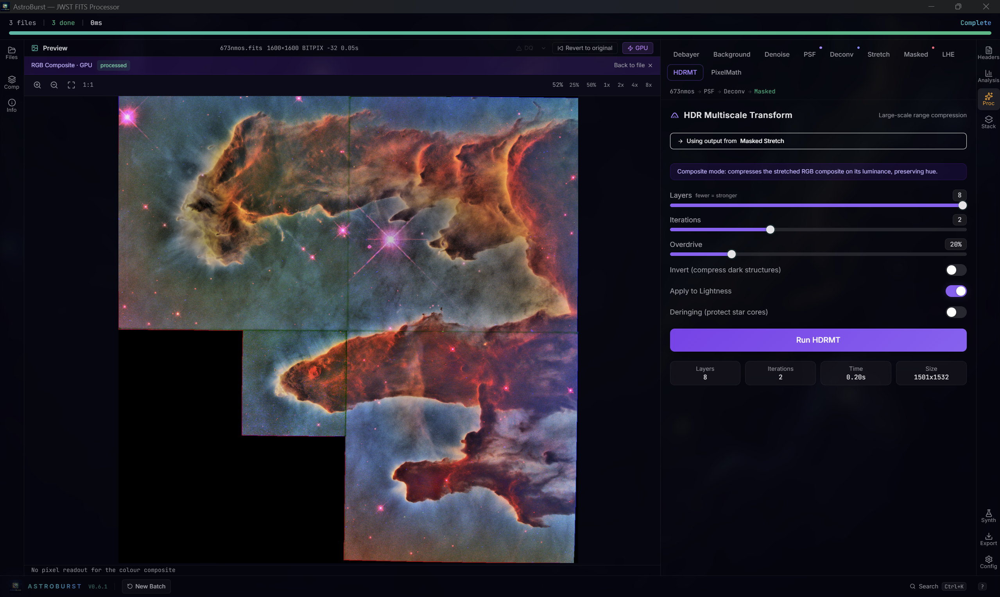
</p>
<p align="center"><em>The HDR multiscale transform on the same composite, also in composite mode and also fed by Masked Stretch: 8 layers, 2 iterations, 20% overdrive, applied to lightness, 0.20&nbsp;s. The Layers slider is marked "fewer = stronger".</em></p>

**PixelMath.** A per-pixel expression language over the target image (`$T`) and named image slots bound to loaded files (`A`, `B`, ...): arithmetic, comparison and logical operators, `iif`, `~` inversion, per-pixel functions (abs, sqrt, exp, ln, log, log2, pow, min, max, floor, ceil, round, trunc, sign, clip, rescale) and image statistics (mean, med, mdev, sdev, adev, min, max) over finite pixels. NaN propagates, output goes to a new file with `ABPROC` and `PMEXPR` provenance cards, and slots for the symbols you type are bound to the loaded files automatically.

<p align="center">
  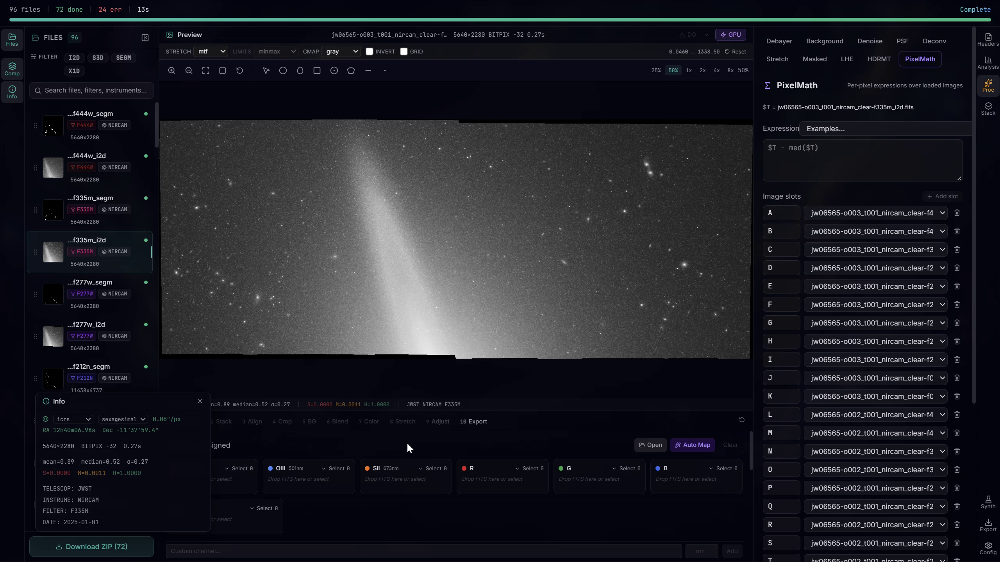
</p>
<p align="center"><em>The PixelMath panel on the F335M i2d mosaic (<code>$T</code>), its expression box showing the example <code>$T - med($T)</code>. The slots down the right, <code>A</code>, <code>B</code>, <code>C</code> and onward, are bound to the other loaded files, so any of them can enter an expression without wiring each one by hand.</em></p>

### Science analysis

<p align="center">
  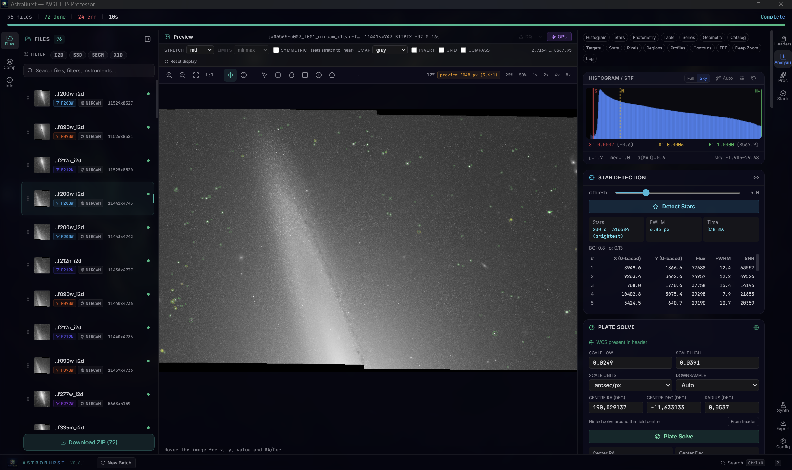
</p>
<p align="center"><em>96 NIRCam products loaded, with product-type filter chips (I2D, S3D, SEGM, X1D) and a filter badge on every file. Right: the histogram in Sky mode, which bins from the median &minus; 5&sigma; to the median + 50&sigma;, with the S, M and H markers of the screen transfer function. Star detection at 5&sigma; kept the brightest 200 of 316,584 sources (FWHM 6.85&nbsp;px, 838&nbsp;ms) and lists them with 0-based X and Y; the detections are circled on the image. Plate solve found a WCS in the header and pre-filled the scale range, 0.0249 to 0.0391&Prime;/px, and the field centre for a hinted solve.</em></p>

**Photometry.** Aperture photometry with fractional edge-pixel weights, a local background annulus, ERR-plane error propagation (or sky noise plus an optional Poisson term), the SATURATED DQ bit or a header saturation level, masked-pixel counts and a curve-of-growth aperture correction. The zero point is read from the header, JWST `MJy/sr` with `PIXAR_SR` or `DN/s` with `PHOTMJSR`, HST `PHOTFLAM`/`PHOTPLAM`/`PHOTZPT`, Roman `conversion_megajanskys`, or generic `MAGZERO`-style keywords, so the panel reports AB magnitude with error, flux in Jy and surface brightness, and warns when the image carries an `ABPROC` provenance card left by a processing step. The aperture radius, sky annulus and gain are adjustable (by default the aperture is 1.5 &times; FWHM and the sky annulus 2 to 3 &times; the aperture), and the curve of growth reports the EE50 and EE80 radii. Click photometry, switched on in the panel and used with the Crosshair tool, shows the local measurement at once and matches the star against Gaia DR3 only when that opt-in switch is on. The Photometry table measures a whole list in one run, from the detected stars, the Point regions or pasted positions, draws the apertures and labels on the image with a Show apertures toggle and a Clear button, and exports CSV.

**Catalogs.** Gaia DR3 cone search through VizieR with proper motions propagated from J2016.0 to the observation date, an overlay layer with labels, full-field cross-match of detected stars with astrometric residuals (median dRA/dDec, rms) and a photometric zero point in G, BP or RP with an optional colour term, RFC-4180 CSV export of rows, sources and matches, and a one-click copy of rows into Point regions for `.reg` export. The residuals and the zero-point fit are drawn as plots with a hover readout, wheel zoom, drag pan and CSV and PNG export, the same plot the tab uses for profiles, curves of growth, spectrum comparisons and light curves; when the header already carries a flux calibration, the zero point is labelled informational.

<p align="center">
  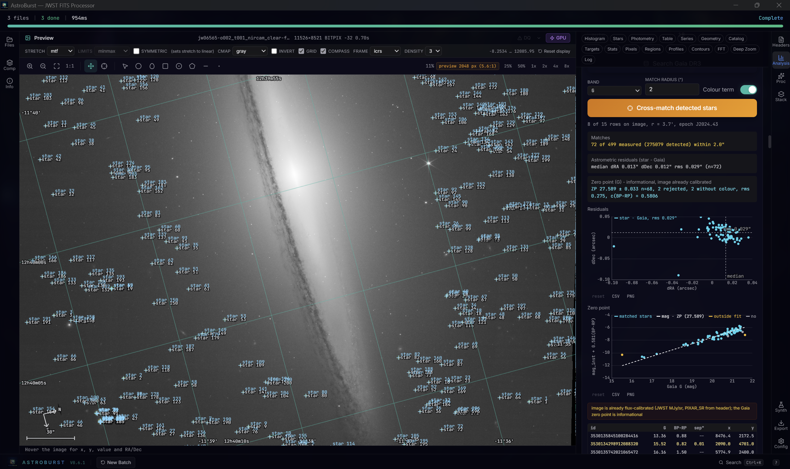
</p>
<p align="center"><em>The Gaia DR3 cross-match on the galaxy mosaic, with the ICRS grid and compass on the image and catalogue positions propagated to epoch J2024.43. 72 of 499 measured stars (275,079 detected) matched within 2.0&Prime;, with median residuals of 0.013&Prime; in RA and 0.012&Prime; in Dec and an rms of 0.029&Prime;, plotted above with the medians marked. The G-band zero point, 27.589 &plusmn; 0.033 from 68 stars with a colour term of 0.5806 in BP&minus;RP, is labelled informational because the image is already flux-calibrated (JWST MJy/sr, <code>PIXAR_SR</code> from the header); the lower plot shows the fit, with the points outside it in amber.</em></p>

**Spectra and cubes.** A full FITS spectral axis (WAVE, AWAV, FREQ and velocity kinds; `CDELT3`, `CD3_3` or `PC3_3`; lenient `CUNIT3`; `RESTWAV`/`RESTFRQ`; `SPECSYS`/`VELOSYS`) with air/vacuum conversion (Greisen et al. 2006) and optical, radio or relativistic velocity axes, plus a barycentric or heliocentric correction for ground-based headers from a low-precision analytic ephemeris (about 0.02 km/s), with spectra already in a rest frame recognised and spacecraft headers using `VELOSYS`. For IFU cubes: region (aperture) spectra with annulus sky subtraction in native units and Jy, channel-range collapse from a brush on the spectrum plot, and M0/M1/M2 moment maps with a per-pixel continuum fit and SNR masking, written as 2D FITS with the celestial WCS kept. Cubes open through a memory-mapped lazy reader. The displayed channel is marked on the spectrum and changes with a double-click, the arrow keys or looping playback; a committed channel is published as a FITS frame, so regions, statistics, photometry and contours work on it.

**Line measurement and line list.** Brushing a range of the spectrum measures the line in it: flux, equivalent width, centroid, sigma and FWHM, SNR and velocities, with an optional Gaussian fit that reports formal errors, and the continuum and model drawn on the spectrum. A built-in list of 23 rest-frame lines (hydrogen Balmer, Paschen and Brackett, [OII], [OIII], [NII], [SII], He I, H2, [FeII], CO, HCN, HCO+, [CII] and HI 21&nbsp;cm) is drawn on the spectrum at a typed redshift or systemic velocity, in the frame of the velocity axis, with family toggles; a click on a line sets the rest wavelength of the measurement.

**Spectrum export and comparison.** The displayed pixel or region spectrum copies or saves as CSV with provenance lines (file, source, ICRS centre, velocity frame and shift, flux unit) and columns for the channel, vacuum wavelength, the displayed axis, flux and, for MJy/sr cubes, flux in Jy. A comparison section overlays the spectra of the included area regions (the first 16) and the last clicked pixel, normalised to the peak, the median or the continuum windows, or offset, with a legend and one joined CSV on the common axis.

**Position-velocity diagrams.** A line region on a cube becomes a PV diagram: the cube is sampled along the slit with a chosen step and averaging width without loading it whole, offsets are centred on the slit in arcseconds when a WCS exists (pixels otherwise), and the panel plots the median-subtracted intensity-weighted ridge with the peak channel per offset. The result is a 2D FITS with an `OFFSET` axis and the cube's native spectral axis, shown in the viewer with the display controls and exported from the panel as CSV.

**Cutouts.** Export > Cutout writes a multi-extension FITS (SCI, ERR, DQ) from a box region or a manual centre and size in pixels or arcseconds, with `CRPIX` shifted and `LTV1`/`LTV2`/`LTM` recorded, NaN padding outside the parent and padded DQ pixels flagged, sharing its core with the server cutout endpoint.

**Contours.** Marching-squares contours with NaN-aware binning and smoothing, at listed, linear, log, sqrt or sigma-above-sky levels, drawn in a single colour or a blue-to-amber ramp with per-level visibility. They are traced on the image on screen, and closed contours export to Polygon regions.

<p align="center">
  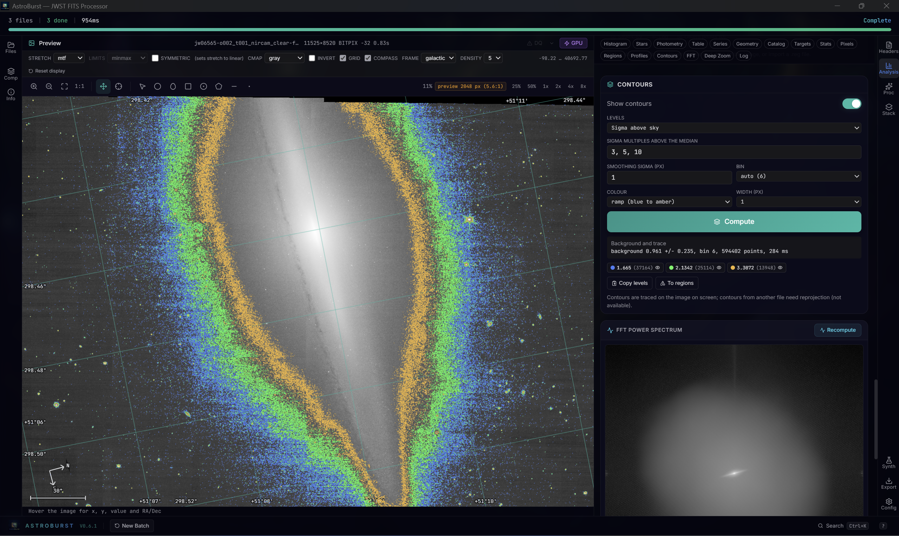
</p>
<p align="center"><em>Contours at 3, 5 and 10&sigma; above the sky on the galaxy mosaic, in the blue-to-amber ramp over the galactic grid. The panel reports the sky it measured, 0.961 &plusmn; 0.235 at bin 6, and a trace of 594,402 points in 284&nbsp;ms; each level has a chip with its value, its number of polylines and a visibility toggle, and To regions turns the contours into Polygon regions. Below: the FFT power spectrum of the same image.</em></p>

**Surface-brightness profiles.** Beside radial profiles and line cuts, the Profiles panel measures an elliptical surface-brightness profile: mag/arcsec² against the semi-major axis in arcseconds, with the R50, R80 and R90 radii, the Petrosian radius and the total AB magnitude.

**Time series and observation geometry.** Aperture photometry across the loaded frames tracks drift, builds a differential light curve against a comparison ensemble, and lists every frame in a table that exports as CSV. An observation geometry panel reports, for the loaded file and for every frame of a time series, BJD_TDB and HJD_UTC of mid-exposure (leap-second table, TT and TDB, light time to the barycentre within 1&nbsp;s of astropy), local sidereal time, hour angle, altitude, azimuth, Kasten-Young airmass, parallactic angle, and the altitude of the Sun and the Moon with the Moon's illumination and separation. Site and target are read from the header, with the source shown, or typed in the panel; a typed site is remembered across files and takes precedence over the header site. The light curve uses BJD_TDB as its time axis when every frame has one, headers already in BJD_TDB are not corrected twice, and the CSV carries the geometry columns.

**Measurement log.** The last panel of the tab records every photometry click, batch run, line measurement, time series, cross-match, spectrum export and PV run with its UTC timestamp, file, measured image, DQ handling, unit, parameters, values and region; region statistics, profiles, sky separations, the pixel table and the Statistics panel log on request. The log survives file switches, filters by kind or file, and copies or saves as CSV. It is kept for the current session only.

Star detection with flux, FWHM and SNR (it keeps the 200 brightest sources and says how many it found), a 64K-bin histogram with auto-STF over the full range or a Sky window from the median &minus; 5&sigma; to the median + 50&sigma;, and an FFT power spectrum complete the tab; a row of chips at its top jumps to each panel. Plate solving goes through astrometry.net and needs a free nova.astrometry.net API key entered in Settings; the scale range (0.8 to 1.25 times the header pixel scale) and the field centre are hinted from the header WCS when one exists, large images are auto-downsampled and the result is rescaled to full resolution. WCS is handled by the [wcs](https://github.com/cds-astro/wcs-rs) crate (about twenty FITS projections, CD/PC/CDELT conventions) with SIP distortion applied in the wrapper; see [ADR 0001](docs/adr/0001-wcs-rs-for-wcs-engine.md). A synthetic data generator produces star fields with configurable distributions, PSF models, a CCD noise model and a ground-truth catalogue CSV for validating photometry and alignment.

Every screenshot above is in [`docs/screenshots/`](docs/screenshots). The colour frames are the HST/WFPC2 narrowband set that ships with the app; the mono ones are JWST NIRCam mosaics of two fields, the Eagle Nebula (jw02739) and a galaxy (jw06565). The hero and the extensions, drizzle and PixelMath captures were taken on the 0.6.0 build, the other nine on the 0.6.3 build.

## Install and build

| Platform | Download |
|----------|----------|
| **macOS** (universal: Apple Silicon and Intel) | [`.dmg`](https://github.com/samuelkriegerbonini-dev/AstroBurst/releases/latest) |
| **Windows** | [`.msi`](https://github.com/samuelkriegerbonini-dev/AstroBurst/releases/latest) / [`.exe`](https://github.com/samuelkriegerbonini-dev/AstroBurst/releases/latest) |
| **Linux** | [`.deb`](https://github.com/samuelkriegerbonini-dev/AstroBurst/releases/latest) / [`.AppImage`](https://github.com/samuelkriegerbonini-dev/AstroBurst/releases/latest) / [`.rpm`](https://github.com/samuelkriegerbonini-dev/AstroBurst/releases/latest) |

Install scripts:

```bash
# macOS
curl -fsSL https://raw.githubusercontent.com/samuelkriegerbonini-dev/AstroBurst/main/scripts/install-macos.sh | bash

# Linux (Debian/Ubuntu)
curl -fsSL https://raw.githubusercontent.com/samuelkriegerbonini-dev/AstroBurst/main/scripts/install-linux.sh | bash
```

Build from source:

```bash
git clone https://github.com/samuelkriegerbonini-dev/AstroBurst.git
cd AstroBurst
pnpm install
pnpm tauri dev
```

`make dev`, `make build`, `make test` and `make lint` wrap the common dev, build, test and lint commands. CI builds and tests with current stable Rust, Node.js 22 and pnpm 10; the Tauri CLI tracks 2.10. Platform prerequisites are listed in [CONTRIBUTING.md](CONTRIBUTING.md#development-setup). WebGPU (Vulkan, Metal or DX12) is used for the preview when available; without it the app shows a CPU viewer with the grid and compass but without the stretch, limit and colormap controls.

## Quick start

1. **Drop** a file, a ZIP (nested ZIPs are followed up to a depth limit) or a folder into the window. `.fits`, `.fit`, `.fts`, `.asdf` and `.zip` are recognised.
2. **Look.** Click a file for its preview, histogram and headers. Set stretch, limits, colormap and the coordinate grid in the display bar, or hit Auto STF. Hover for value, unit, ERR, DQ and coordinates. Use the HDU panel to switch to another extension or array. `Ctrl+K` or a double `Shift` opens the command palette over files, tools and actions.
3. **Measure.** Draw a region, add a background annulus, read the statistics. Plot a radial profile or a line cut. Turn on Measure on image click in the Photometry panel, select Crosshair in the viewer toolbar and click a star for calibrated photometry; search Gaia DR3 for a catalog overlay and a zero point. Import or export DS9 `.reg` files.
4. **Compose.** Open the Compose tab and walk the ten steps.
5. **Process.** Debayer, background (polynomial or DBE spline), wavelet denoise, PSF estimation, deconvolution, the stretch tools, LHE, HDRMT and PixelMath sit in the Processing tab; calibration, cosmetic correction, subframe gating, stacking with the rejection family, the batch pipeline and drizzle in the Stacking tab.
6. **Export.** PNG at 8 or 16 bits, FITS with preserved WCS and metadata, a SCI+ERR+DQ cutout, or a ZIP bundle of all channels plus the composite.

Three HST/WFPC2 narrowband frames of the Eagle Nebula (M16) ship in [`exampleFits/sample-data/`](exampleFits/sample-data) for a first run: [OIII] 502 nm, H-alpha 656 nm and [SII] 673 nm, public domain (NASA/ESA). A ground-truth catalogue for photometry checks is in `exampleFits/sample-data/synthetic_catalog.csv`. For your own data, MAST and the ESA Hubble Science Archive publish JWST and HST `_cal.fits` and `_i2d.fits` products, and Roman `.asdf` products under instrument WFI.

## Headless server and Python client

The headless server and the v2 API were contributed by [Jae-Joon Lee](https://github.com/leejjoon).

`astroburst-server` is a separate Axum binary built behind the `server` feature. It shares the FITS and ASDF readers, the display controls and the region code with the desktop app. It renders on the CPU: there is no GPU dependency anywhere in the Rust crate. Run it on whatever machine holds the data and reach it over an SSH tunnel.

```bash
cd src-tauri
cargo run --bin astroburst-server \
  --no-default-features \
  --features server,astrometry-net,asdf-full,vizier
# Listening on 127.0.0.1:8080
```

Two API generations are served. **v1**: sessions, FITS open and header, render, auto-STF and viewport, stacking and drizzle with the rejection family and normalization, and pipeline runs with cosmetic correction and dark optimization, with async jobs you can poll, cancel or follow as a server-sent event stream. **v2**: session lifecycle with keepalive, image open and HDU switching, structure, header and WCS inspection, cutouts by pixel box or sky position or region shape with `LTV` reporting, block binning, pixel-to-sky and sky-to-pixel and angular separation, a WCS coordinate grid, pixel probe, exact statistics with noise evaluation, histogram, and a render endpoint taking the same display settings as the desktop bar.

The async Python client in [`agent/`](agent/README.md) wraps the v1 surface. The v2 endpoints are HTTP-only for now and have no Python method.

```python
import asyncio
from astroburst_client import AstroBurstClient

async def main():
    async with AstroBurstClient("http://localhost:8080") as client:
        session = await client.create_session()
        result = await session.open("/data/m16_ha.fits", slot="ha")
        print(f"{result.width}x{result.height}  median={result.stats.median:.1f}")
        png, stf = await session.stf("ha")
        open("preview.png", "wb").write(png)

asyncio.run(main())
```

Install with `pip install -e ./agent` (add `[image]` for the Pillow helper). Runnable examples: [`agent/examples/`](agent/examples). Full route list and configuration: [src-tauri/SERVER.md](src-tauri/SERVER.md). Client reference: [agent/README.md](agent/README.md).

## Supported formats

**FITS.** Memory-mapped reading. Multi-extension files with auto SCI selection, or any extension by `path#hdu=<n>`. Tile-compressed HDUs are decoded natively: ZCMPTYPE `RICE_1`, `GZIP_1`, `GZIP_2` and `NOCOMPRESS`, including quantized floats and plane-aligned compressed cubes (ZTILE3=1). Not supported: `PLIO_1`, `HCOMPRESS_1`, non-plane-aligned 3D tiling (ZTILE3>1), per-pixel null bitmaps and per-tile ZBLANK columns.

**ASDF.** A native reader written in Rust, so Roman and JWST pipeline products open without a Python environment: block index, YAML tree, science-array discovery, and gWCS extracted and approximated to a standard projection for readout. zlib decompression is always available; bzip2 and lz4 come with the `asdf-full` feature, which is on by default but must be listed explicitly in `--no-default-features` builds. Not supported: external (exploded) block files, arrays of rank other than 2 or 3, and dtypes outside the decoded set. Each failure reports a named error rather than passing silently.

**Containers.** ZIP archives, including nested ones up to a depth limit, and whole directories.

**Export.** PNG at 8 or 16 bits, FITS with BITPIX 16, float32 or float64 and optional Rice compression at a configurable quantize level, WCS and metadata preservation with `PROGRAM` and `HISTORY` provenance cards, RGB FITS cubes, and a ZIP bundle. Processing stays in f32/f64 with no quantization; quantization happens only where you ask for it, in 8/16-bit PNG export, integer-BITPIX or Rice FITS export, and the 8-bit deep-zoom tiles.

## How it compares

AstroBurst sits between a viewer and a processing suite, and is behind the established tools in both directions.

- **DS9** is the reference FITS viewer. AstroBurst matches most of its inspection surface: stretch and limit algorithms, colormaps, frames, a coordinate grid, a compass, contours, region shapes with DS9 `.reg` exchange, per-region statistics, a pixel table and a Gaia catalog overlay. DS9 is ahead on frame management and blinking, image-server integration, 3D rendering, and interoperability through SAMP and XPA, none of which AstroBurst has.
- **jdaviz** is the JWST and Roman quick-look toolset from STScI. AstroBurst overlaps on ASDF, DQ decoding, unit-aware readout, calibrated photometry, cube spectra with line lists and line measurement, and moment maps, and opens those files without Python. jdaviz is ahead on model fitting (AstroBurst fits one Gaussian per line), Mosviz-style multi-object work, and lives inside a notebook where results are scriptable end to end.
- **Siril** is the closest free processing comparison. Calibration, registration, integration (rejection families, normalization, drizzle with rejection, cosmetic correction, dark optimization) and stretching are at a comparable level of algorithmic depth. Siril has a mature scripting language, RAW and XISF input, a much larger user base and years of field testing; AstroBurst has no scripting language yet.
- **PixInsight** is the commercial reference for processing depth. AstroBurst now covers the core of ImageIntegration, CosmeticCorrection, DynamicBackgroundExtraction, PixelMath, LocalHistogramEqualization, HDRMultiscaleTransform, Statistics and NoiseEvaluation, each as a single tool with the essential parameters. PixInsight keeps mosaic stitching, a process container and history model, masks and previews as first-class objects, modern deconvolution, and an enormous body of published workflows.

Where AstroBurst is genuinely different: a single desktop app that reads ASDF natively without Python, decodes DQ against named instrument bit tables, and exposes the same readers, display controls and region code through a headless REST API.

## Project status

Pre-1.0, developed by one maintainer with outside contributions. Formats, command names and the REST API may change before 1.0.

The current version is 0.6.3. The FITS and ASDF readers, display path, compose wizard and export are used daily; the processing, science and measurement rounds of September 2026 are covered by unit tests and adversarial code review but have had less time in the field. CI runs five jobs on every pull request and on pushes to main: typecheck plus a production build, eslint with zero warnings allowed, `cargo test --lib` on Windows, `cargo test --all-features` on Ubuntu and macOS (which covers the headless server), and the vitest suite. `cargo test --all-features` runs 1759 library tests and 180 server tests; vitest runs 1510 frontend cases in 122 files.

Known limits:

- There is no benchmark suite. No performance figure is published because none is reproducible from this repository.
- The GPU is used for display only. Every algorithm runs on the CPU in Rust.
- Plate solving needs a nova.astrometry.net account and network access; the catalog panel and the optional Gaia match of click photometry need VizieR, and SPCC falls back to a synthetic catalogue without it.
- Radial and surface-brightness profiles, line cuts, `.reg` import and export, the DQ overlay, DQ-masked statistics, the compass overlay, the Targets panel, the pixel table, photometry, catalogs, contours, time series, observation geometry, cube science including line measurement and PV diagrams, the measurement log and the processing tools are desktop-only. The compose wizard has no server routes.
- The Python client covers the v1 API only.
- Integration holds every frame in memory; very large frame counts need a machine with matching RAM.
- The coordinate grid and regions are not drawn in the standalone deep-zoom tile viewer.
- No SAMP or XPA interoperability, no mosaic stitching, no plugin or scripting system, no RAW or XISF input.

Next up: MAST API access, a before/after preview per wizard step, levels and selective saturation, PixelMath RGB expressions and masks, row-banded integration for large frame counts. Longer term: GPU compute for stacking and alignment, plugin hooks.

## Contributing

Setup, code style, tests, the architecture overview and the current priority areas are in [CONTRIBUTING.md](CONTRIBUTING.md), so there is one list to keep current. Contributions require the [CLA](CLA.md). Please read the [Code of Conduct](CODE_OF_CONDUCT.md), and report security issues through [SECURITY.md](SECURITY.md).

The headless server, the v2 API, the Python client, the WCS engine migration, FITS tile compression, zscale and the first colormaps (gray and viridis) were contributed by [Jae-Joon Lee](https://github.com/leejjoon).

AstroBurst is free and AGPLv3. If it helps your work, you can [support development on Ko-fi](https://ko-fi.com/astroburst).

<!-- SUPPORTERS:START -->
<!-- SUPPORTERS:END -->

## License

AGPLv3. See [LICENSE](LICENSE).

The network clause (section 13) covers the optional headless REST API: if you run a
modified AstroBurst as a network service, you must offer the modified source to its users.

---

<p align="center">
  <sub>Created by <a href="https://github.com/samuelkriegerbonini-dev">Samuel Krieger</a></sub>
</p>
