<p align="center">
  
</p>

<h1 align="center">AstroBurst</h1>

<p align="center">
  <strong>A desktop viewer and processing app for FITS and ASDF images, with an optional headless REST API.</strong>
</p>

<p align="center">
  <a href="https://github.com/samuelkriegerbonini-dev/AstroBurst/releases"></a>
  <a href="https://github.com/samuelkriegerbonini-dev/AstroBurst/actions"></a>
  
  <a href="LICENSE"></a>
  
  <a href="https://ko-fi.com/astroburst"></a>
</p>

<p align="center">
  <a href="#what-it-is">What it is</a> &middot;
  <a href="#feature-tour">Features</a> &middot;
  <a href="#install-and-build">Install</a> &middot;
  <a href="#quick-start">Quick start</a> &middot;
  <a href="#headless-server-and-python-client">Server</a> &middot;
  <a href="#supported-formats">Formats</a> &middot;
  <a href="#how-it-compares">Compare</a> &middot;
  <a href="#project-status">Status</a>
</p>

---

<p align="center">
  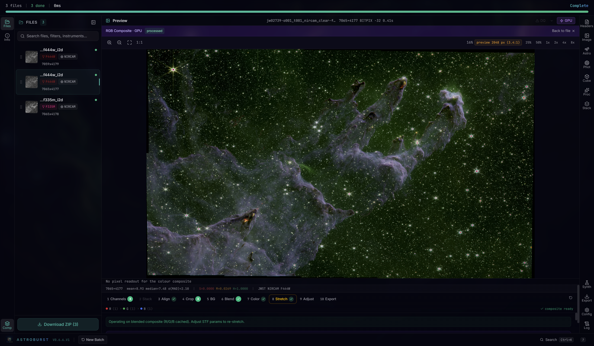
</p>
<p align="center"><em>The Pillars of Creation from three JWST NIRCam long-wave mosaics (jw02739): F470N (the F444W-F470N file) to red, F444W to green and F335M to blue. The wizard aligned them by phase correlation on the 7059&times;4179 grid (G +0.4/&minus;0.6&nbsp;px, B &minus;0.2/&minus;1.4&nbsp;px), cropped them to 7051&times;4170, blended them with Match levels, kept neutral 1/1/1 colour weights and stretched them with a linked Auto STF, then a shadow of 0.0017 and a midtone of 0.0032. The step row shows Channels, Align, Crop, Blend, Color and Stretch done. The viewer is at 16% with the "preview 2048&nbsp;px (3.4:1)" badge, and the status strip says there is no pixel readout for the colour composite.</em></p>

**Latest:** 0.6.7.0. Since 0.6.0: 0.6.1 kept the CPU and GPU previews on the same image after every processing step, and 0.6.2 added a measurement round (aperture and batch photometry, calibrated region fluxes, sky geometry, spectral line measurement, contours, surface-brightness profiles, time-series photometry, a pixel table). 0.6.3 added a second science round (rest-frame line list, spectrum export and comparison, observation geometry with BJD_TDB, position-velocity diagrams, diverging colormaps with symmetric limits, a measurement log), fixed the Deep Zoom viewer and SPCC in the compose wizard, added a Delete points button for Point regions, and closed an interface round of 30 fixes and 22 improvements. 0.6.4 let the Processing tab work on the colour composite built in Compose, with its own processing chain and a revert to the original, and fixed the dark discs Masked Stretch left around stars. 0.6.5.0 added dockable tool windows, an Align overlay and a Crop editor in the compose wizard, Match levels for narrowband blends, the JWST pipeline x1d in the spectrum comparison, a wavelength readout for NIRSpec `_cal` frames, exclude regions, a colorbar and Write WCS after a plate solve. 0.6.6 added per-spaxel line-fit kinematic maps for IFU cubes with a spaxel inspect plot, JWST `_uncal` ramps with a quick-look slope compared against the official `_rate`, Brα, Brβ, Pfβ and He I 2.0587&nbsp;µm in the rest-frame line list, and synthetic stacks that vary from frame to frame and list each frame in a manifest; 0.6.6.3 split Analysis into five dock tools and closed a round of fixes. 0.6.7.0 evaluates the gWCS of JWST `_cal` and Roman `_cal.asdf` images, requires a celestial `CTYPE` pair before reading sky coordinates, checks calibration frames before any master is built (with flat-dark masters, darks grouped by sensor temperature and stack provenance cards), reprojects compose channels through their WCS, matches channel levels by median and MAD, evaluates SPCC's blackbody approximation at the channel filter wavelengths, adds Curves and Geometry to the Processing tab, a photometry gain model, a disk cache for Gaia DR3 cones and `-TAB` spectral axes. Full history in [CHANGELOG.md](CHANGELOG.md).

## What it is

AstroBurst opens FITS and ASDF images, displays them, measures them, and composes and exports them. The Rust backend does the processing, React draws the interface, Tauri packages it as a desktop app. A WebGPU shader applies the display stretch and colormap; that is the only place the GPU is used. Everything else, including stacking, alignment, drizzle, deconvolution and compose, runs on the CPU in Rust.

Three reader paths:

- **Quick-look.** Open any FITS HDU or ASDF array, pick a stretch, limits and colormap, read pixel values with their units and WCS position, overlay a coordinate grid, a compass and contours, draw regions and measure them. Start at [Viewer, regions and pixel readout](#viewer-regions-and-pixel-readout).
- **JWST and Roman.** Native ASDF, gWCS evaluation for `_cal` images, per-HDU selection, DQ flag decoding and overlays, DQ-masked statistics, calibrated photometry in AB magnitudes and Jy, cube spectra with line measurement, moment maps, per-spaxel line-fit maps and position-velocity diagrams, science cutouts. Start at [Data quality and units](#data-quality-and-units) and [Science analysis](#science-analysis).
- **Astrophotography.** Calibration with cosmetic correction and dark optimization, integration with the PixInsight rejection family, a ten-step compose wizard, and a processing tab with DBE, PixelMath, wavelets, deconvolution, LHE, HDRMT and curves. Start at [Compose wizard](#compose-wizard) and [Processing](#processing).

Image processing runs locally. Optional features reach the network: plate solving uploads the frame to nova.astrometry.net, and colour calibration (SPCC), the catalog panel and the opt-in Gaia match of click photometry query Gaia DR3 through VizieR, keeping every cone in a disk cache so a field fetched once loads again without the network.

## Feature tour

### Viewer, regions and pixel readout

<p align="center">
  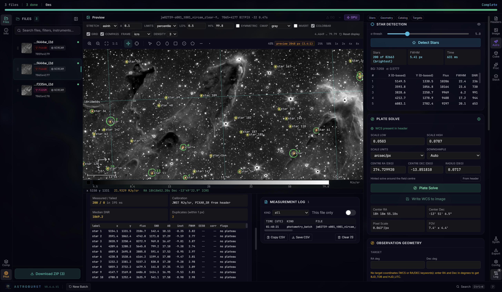
</p>
<p align="center"><em>The NIRCam F444W mosaic of the Pillars of Creation (jw02739) at 40% on the GPU viewer, with the ICRS grid, the north/east compass and scale bar, and the colorbar in MJy/sr. Right, the Astrometry tool: star detection kept the brightest 200 of 82,663 sources (FWHM 5.41&nbsp;px, 631&nbsp;ms), and Plate Solve found a WCS in the header. Bottom left, the Photometry tool docked under the viewer: its table measured the 200 detected stars in 195&nbsp;ms, none failed, median SNR 1069.2, with the calibration read from the header (JWST MJy/sr, <code>PIXAR_SR</code>), and the apertures and their labels are drawn on the image. Bottom right, the Log tool with the batch photometry entry. The status strip reads 21.9329&nbsp;MJy/sr at pixel (5150, 1331) with its ICRS position.</em></p>

**Display controls.** Six stretch curves: MTF, linear, log, sqrt, asinh with an adjustable softening parameter, and power with an adjustable exponent. Four limit algorithms: min/max, zscale (IRAF-style, adjustable contrast), percentile (1 to 99.5 by default) and explicit user vmin/vmax. Thirteen colormaps, nine sequential (gray, viridis, inferno, magma, plasma, cividis, heat, cool, rainbow) and four diverging (RdBu, coolwarm, bwr, seismic, matplotlib knots), with an invert toggle; symmetric limits mirror vmin/vmax about a chosen centre (default 0) for residual, difference and moment-1 maps, and no-data pixels take a per-colormap neutral colour on the desktop and the server alike. The desktop app applies them through a LUT texture in a WebGPU shader, with a CPU worker taking over if the GPU device is lost; when WebGPU is unavailable the CPU viewer shows the auto-stretched preview, keeps the grid and compass, and disables the stretch, limit and colormap controls; the headless server computes the same stretch and limits on the CPU and returns a PNG. A colorbar under the GPU viewer shows the colormap with value ticks placed through the current stretch and limits, the unit and the no-data colour; a display-bar checkbox hides it. The zoom percentage, the zoom presets and 1:1 are measured in FITS pixels, and a "preview N px (r:1)" badge appears when the viewer shows a downsampled texture. Images wider or taller than 4096 pixels can also be opened in Deep Zoom, a full-screen tile viewer that keeps keyboard focus inside it and closes with Escape.

**Regions.** Draw circles, ellipses, boxes (both rotatable), annuli, polygons, lines and points, in pixel or sky coordinates. Measure a source by putting a circle on it and a background annulus around it: the annulus is fitted and subtracted from the region statistics, with optional sigma clipping and NaN-safe throughout. Switch an area region to exclude (`excl`, the DS9 `-` prefix) and the pixels inside it, a neighbouring star for instance, are left out of every other region's statistics, background annulus and profiles, together with the DQ-flagged pixels when DQ exclusion is on; the `n` cell says how many were left out. When the header carries a flux calibration and a WCS, every region also reports its flux in Jy, AB magnitude, surface brightness in mag/arcsec², area in arcsec², the RA/Dec of its centre and its sky position angle, and the region table exports as CSV. Check focus with a radial profile from a circle or annulus. Cut across a filament, a diffraction spike or a detector artefact with a line region and read the profile along it, together with the separation and position angle (east of north) between its ends. A Delete points button clears every Point region of the file at once, after a confirmation. Regions import and export as DS9 `.reg` files (format 4.1), keeping colour, width, label, dash and include/exclude, so shapes move between AstroBurst and DS9. Coordinate systems and shapes the reader does not handle (fk4, galactic, ecliptic, b1950, amplifier, detector, tile; text, vector, ruler, compass, projection, the panda family, composite) are reported as warnings instead of being dropped silently.

Region statistics, cutouts, histograms and rendering are available on the headless server too. Radial profiles, line cuts, exclude regions and `.reg` import/export are desktop-only.

<p align="center">
  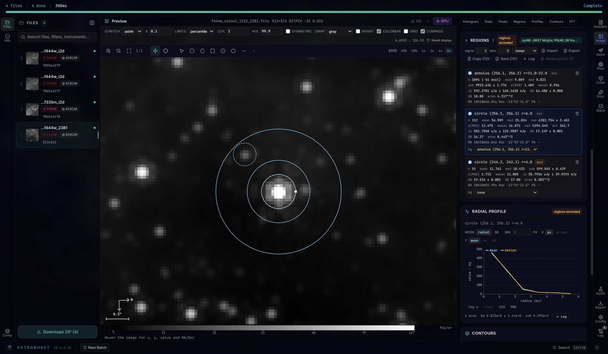
</p>
<p align="center"><em>A 513&times;513 cutout of the F444W mosaic, written by Export &gt; Cutout, at 800%: a source circle (r&nbsp;=&nbsp;6&nbsp;px) at (256.1, 256.2), a background annulus from 11 to 22&nbsp;px, and a dashed exclude circle (r&nbsp;=&nbsp;4&nbsp;px) on a neighbouring star inside the annulus. The annulus row reads <code>n 1091 (-51 excl)</code>, and the Regions header carries the "regions excluded" badge. With the annulus subtracted, the circle measures a net 5394.545, SNR 361.7, 501.76&nbsp;µJy and AB 17.149. Below, the radial profile of the circle, also marked "regions excluded": 6 bins over a background of 8.823 &plusmn; 1.41.</em></p>

**Readout.** Hovering reports the pixel value with its BUNIT unit (or the ASDF `unit` field), the matching value from an ERR companion array as `value ± err`, neighbourhood statistics over a box (min, max, mean, median, NaN count), and the decoded DQ flags. Cursor coordinates are shown in ICRS, FK5 (J2000), galactic or ecliptic (J2000), sexagesimal or decimal, with right ascension in hours for the equatorial frames and degrees for the others; they come from the WCS of the image on screen and are hidden when it has no celestial WCS, on a PV diagram for instance. A status strip under both viewers shows the cursor's pixel position, the value with its unit and the ICRS RA/Dec; on a NIRSpec `_cal` frame, or any FITS image with a same-size `WAVELENGTH` extension, it also shows the wavelength at the cursor. Pixel coordinates are 0-based in the readouts and tables, which say so; DS9 and `.reg` files count from 1.

**Coordinate grid.** The display bar toggles a WCS grid in ICRS, FK5, galactic or ecliptic coordinates with a density choice. Lines are traced in world coordinates through the WCS, so they follow the image at every zoom; steps are sexagesimal-friendly, fields crossing RA 0h and fields containing a pole are handled, and edge labels never overlap. The same grid is served by `POST /v2/sessions/:sid/wcs/grid`.

**Compass, sky geometry and targets.** The display bar also draws a north/east compass with a scale bar; when the WCS cannot support the grid or the compass, an amber "(no WCS)" note gives the reason. The WCS orientation (projection, per-axis pixel scale, rotation, parity, SIP) is shown in the desktop WCS readout and returned, with the north and east vectors, by the server `wcs` route. The Targets panel places a pasted or CSV list of positions in ICRS, FK5, galactic or ecliptic coordinates on the image through its WCS, as labelled markers, and turns the ones that land on the image into Point regions.

**Statistics.** An exact PixInsight-style table per image or per selected region: count, mean, median, avgDev, MAD, sqrt(BWMV), stdDev, variance, min, max, sum, NaN and DQ-excluded counts, in raw, normalised or 16-bit units, per channel for composites, with k-sigma multiresolution noise evaluation and copy-as-CSV. Zeros and negatives are included and nothing is approximated by a histogram. When the region or the options change, the table dims and asks for a new Compute instead of showing stale numbers.

**Pixel table.** A 3&times;3 to 15&times;15 block of raw SCI, ERR or WAVELENGTH values around a clicked pixel or following the cursor, with the unit, the ERR value and wavelength of each cell in its tooltip, the decoded DQ flag names, and the min, max, mean and median of the block, copyable as CSV.

<p align="center">
  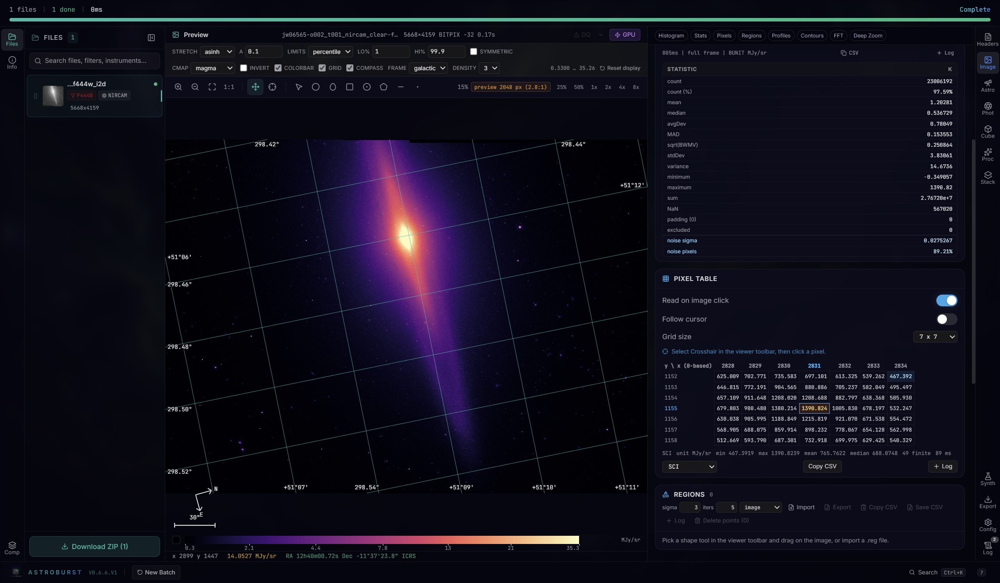
</p>
<p align="center"><em>The Sombrero galaxy, M104, in NIRCam F444W (jw06565, 5668&times;4159), in magma with the grid in galactic coordinates and the compass. Top right: the Statistics table in raw units over the full frame in 805&nbsp;ms (BUNIT MJy/sr): 23,006,192 finite pixels (97.59%), median 0.536729, MAD 0.153553, maximum 1390.82, and 567,020 NaN pixels counted rather than dropped; the last two rows are the k-sigma multiresolution noise evaluation, a noise sigma of 0.0275267 with 89.21% of the pixels classed as noise. Below it, the pixel table on the SCI plane: a 7&times;7 block of MJy/sr values around the nucleus at (2831, 1155), axes marked 0-based, peak 1390.824 and median 688.0748. The status strip reads 14.0527&nbsp;MJy/sr at pixel (2899, 1447) with its ICRS position.</em></p>

**Tool windows.** The tools dock in four groups, Left Top and Bottom Left on the left strip, Right Top and Bottom Right on the right one, and two tools can share the bottom area side by side. Drag an icon to another group or position and a preview shows where its panel will open; right-click it, or press Shift+F10 on a focused icon, for Move to, Move up, Move down and Reset layout. The layout, the open panels and their sizes are kept across sessions. On first launch a tips card at the top right of the viewer (`Arrange your tool windows`) animates the two moves: an icon dropped on the top half of a strip opens as a full-height column, one dropped on the bottom half opens under the viewer. It does not take the focus, stays still under reduced motion and does not come back once closed or once a tool has been moved to another group; Show layout tips in the right-click menu and Show tool window tips in the command palette open it again.

### Data quality and units

<p align="center">
  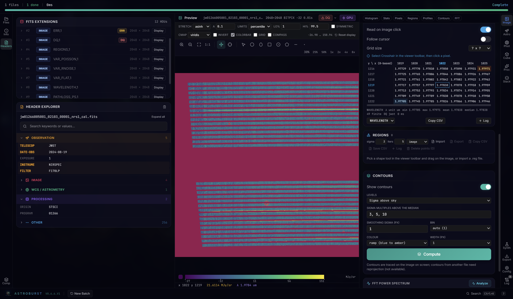
</p>
<p align="center"><em>A NIRSpec IFU <code>_cal</code> frame (jw01266005001_02103_00001_nrs1, 12 HDUs) with the Headers tool moved to Left Top. Top left: the FITS extensions ERR, DQ, REGIONS, VAR_POISSON, VAR_RNOISE, VAR_FLAT, WAVELENGTH and PATHLOSS_PS, each with a Display button, because they are images you can show and measure, not just metadata. Below it, the header explorer with its Observation and Processing groups open. The viewer, in viridis, has the DQ overlay on, decoded with the JWST flag table: the crimson area is the <code>DO_NOT_USE</code> pixels between the IFU slices. The status strip gives 21.6114&nbsp;MJy/sr at pixel (1022, 1219) and the wavelength there, &lambda; 1.9784&nbsp;µm, and the pixel table on the right reads the WAVELENGTH plane, a 7&times;7 block centred on 1.97838&nbsp;µm.</em></p>

**Any HDU, any array.** An image reference of the form `path#hdu=3` or `path#array=roman.dq` makes any FITS extension or any ASDF array the displayed image, not only the auto-detected SCI plane. Every path-based command accepts the reference, so DQ and ERR planes can be displayed and measured like any other image. Pick one from the HDU panel in the desktop app, or over HTTP on the server.

**DQ flags.** Data-quality extensions are decoded against named bit tables, selected from the header: JWST (32 flags), HST, and the JWST convention for Roman. Files from other instruments fall back to the JWST bit names, labelled as such. Hovering a pixel names the flags set on it instead of showing a raw integer. Flagged pixels can be painted over the image as a mask overlay, and statistics, histograms, photometry, region statistics and profiles can all exclude them with one toggle. Integer extensions are read through a lossless integer plane, so individual flag bits survive exactly; the display and processing paths stay in f32/f64.

The DQ overlay and DQ exclusion are desktop-only. The server pixel endpoint returns decoded DQ, but its stats and histogram endpoints do not yet accept the exclusion flag.

**WCS.** Header WCS is handled by the [wcs](https://github.com/cds-astro/wcs-rs) crate (about twenty FITS projections, CD/PC/CDELT conventions) with SIP distortion applied in the wrapper; see [ADR 0001](docs/adr/0001-wcs-rs-for-wcs-engine.md). A celestial WCS needs a longitude/latitude `CTYPE1`/`CTYPE2` pair (RA/DEC, GLON/GLAT or ELON/ELAT, longitude first) with one projection; a header without one, such as a 2-D spectrum with only `CRPIX`, `CRVAL` and `CDELT`, gets no sky coordinates, and the no-WCS note names the reason. The generalized WCS that the JWST and Roman pipelines store in ASDF (the `ASDF` extension of a JWST `_cal` or `_crf` FITS, `roman.meta.wcs` of a Roman `_cal.asdf`) is evaluated transform by transform in f64 (polynomial distortion, mappings, affine and 3-D rotations, the gnomonic projection, the arithmetic operators of the tweakreg correction), with stored inverses where present, an exact inverse refined by Newton iteration otherwise, and the pipeline's bounding box; the readouts, grid, compass, Targets, catalogs, photometry, regions, cutouts, SPCC, Compose Align and the server routes all use it. A JWST `_cal` keeps its header TAN-SIP as the fallback and the Info line reports the gap between the two (`header SIP within 0.009 px (0.27 mas)` on a NIRCam `_cal`); a Roman image gets a TAN-SIP header fitted to its gWCS to 0.01&nbsp;px, so cutouts and other derived FITS keep a WCS. `_i2d` mosaics, `_rate` frames and cubes keep their header WCS, and a gWCS with a transform the evaluator does not handle (`tabular`, `fix_inputs`, JWST pipeline models) falls back to the header with the reason on the Info line. The evaluator is compared in the test suite with gwcs 1.0.3 on NIRCam, MIRI, FGS and NIRISS fixtures committed under `src-tauri/tests/fixtures/gwcs`. `SIPMXERR` and `SIPIVERR`, the residual the JWST pipeline writes for its TAN-SIP fit, are shown at the end of the Info orientation line and rescaled by drizzle and resample. The server `wcs` route reports which WCS is in use (`wcs_kind`, the gWCS steps and frames, the gap to the header SIP, a refusal reason).

### Colour calibration

Colour calibration, labelled SPCC (blackbody approximation), matches the detected stars against a Gaia DR3 cone search through VizieR (the `vizier` feature, on by default), turns each star's BP&minus;RP colour into an effective temperature and solves the channel gains against a blackbody evaluated at the wavelengths of the filters feeding R, G and B, relative to the chosen white reference. A line above the white reference names the wavelengths (`Blackbody approximation at R/G/B 814/555/435 nm (from the channel filters)`); 640/530/460&nbsp;nm are used only when a filter is unknown, with a note, and wavelengths outside 300-1200&nbsp;nm are refused. It does not use Gaia XP spectra or filter transmission curves. The cone goes through the catalog disk cache, and SPCC falls back to a synthetic catalogue when the feature is off or the query fails, saying which one it used. In the compose wizard SPCC reads the WCS from each channel and refuses a channel without a celestial one, and it is offered for broadband visible RGB only: when an input is narrowband, medium-band or outside 380-830&nbsp;nm (the JWST infrared filters, for example), the white-balance option reads "SPCC (broadband RGB only)", is disabled, the reason below it names the filter, and SCNR is not switched on by itself. Auto white balance picks the channel with the lowest noise (MAD over median) as the reference rather than always green. SCNR removes green excess and redistributes the lost luminance to red and blue with BT.709 weights.

### Compose wizard

<p align="center">
  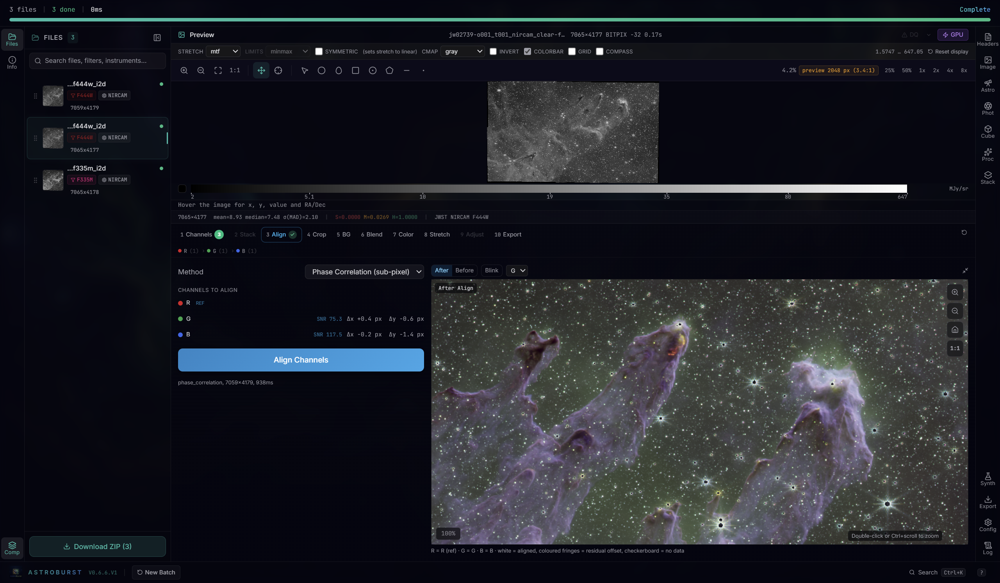
</p>
<p align="center"><em>The Align step of the hero composite. Phase correlation (sub-pixel) shifted G by +0.4/&minus;0.6&nbsp;px (SNR 75.3) and B by &minus;0.2/&minus;1.4&nbsp;px (SNR 117.5) against R, on the 7059&times;4179 grid in 938&nbsp;ms. The After overlay, at 1:1 on the 2048&nbsp;px preview and panned to the pillar tips, draws the aligned channels in colour: white where they line up, coloured fringes where an offset remains, checkerboard where there is no data. After, Before, Blink and the channel choice sit above it.</em></p>

Ten steps: channels, stack, align, crop, background, blend, colour, stretch, adjust, export. Filters are detected from headers and mapped to channel bins by wavelength. Stacking uses the same rejection family as the Stack tab (sigma, Winsorized sigma, linear fit, percentile, min/max) with a subframe selector and optional drizzle. Align registers every channel to a reference, by default the channel with the finest WCS pixel scale; a REF select (Auto (finest pixel scale) or any channel) overrides it. When a channel and the reference both carry a celestial WCS, the channel is reprojected onto the reference pixel grid through it (bicubic, NaN outside its footprint, a finer channel box-reduced first when the reference is 1.5 times coarser or more), and the residual is measured on point sources matched across the field and applied only above 1&nbsp;px, because phase correlation on extended emission differs between filters; each row says how the channel was registered, and a residual above 5&nbsp;px or a channel outside the reference footprint is warned. Channels without a WCS pair are resampled by array size, with an amber note, and registered by sub-pixel phase correlation or star-based affine (triangle asterism with RANSAC, 2000 iterations) for rotation, with an automatic fallback chain of affine, rigid, phase correlation, identity; an unknown method name is refused. After Align, a colour overlay of the aligned channels against the reference (aligned stars come out white, residual offsets as coloured fringes), with After/Before, a blink, zoom and 1:1, shows how well they line up, and Crop draws a draggable, resizable box over the aligned channels, pre-set to the auto-detected borders; with a single filled channel, Crop opens without an Align run and crops that channel. Background correction has four families: per-channel polynomial surface, linked shared gradient, neutralize (sky pedestal only) and de-band for 1/f striping (rows, columns, both or an auto-detected axis), offered as seven options in the selector; de-band is refused on dispersed JWST exposures, whose rows and columns are spectra, and on undebayered Bayer mosaics. Blend presets (SHO, HOO, Dynamic HOO, Foraxx, Hubble Legacy, RGB, plus wavelength-spreading Auto and Balanced) resolve by spectral wavelength rather than bin order. Match levels, on by default when a narrowband filter is loaded, gives each channel the median and the MAD of the channel with the largest MAD (a scale and a pedestal per channel) before blending, so the planes start from equal backgrounds and equal diffuse-signal spreads and one bright filter does not swamp the others; the summary and the FITS history record each channel's factors (`Level match: r F200W x9.574 -8.953, g F187N x1.000 +0.000, b F090W x20.89 -13.39`), and with SPCC selected a note says the background stays neutral after SPCC only if its factors are equal. The Blend preview unlinks its STF when the blended channel medians differ by more than 3&sigma; or by a ratio above 1.5, and a note says that Preview, Adjust and the PNG export use an unlinked auto-STF while the composite FITS data are unchanged. Stretch offers star removal (starless image plus a separate stars layer; it clears Stretch, Adjust and Export so they are rerun on the starless image), masked stretch with star protection, GHS, arcsinh and linked or per-channel STF.

Adjust applies monotone Fritsch-Carlson spline tone curves. The composite is non-destructive: white balance and SCNR always reconstruct from an immutable original cache. Export before Blend writes the channels with the fixed R/G/B mapping of their bins and without the Blend weights, and a banner and the FITS header say so (`No composite yet: exporting the fixed mapping R=SII G=Hα B=OIII. Your Blend weights are not applied; run Blend to export the composite.`).

<p align="center">
  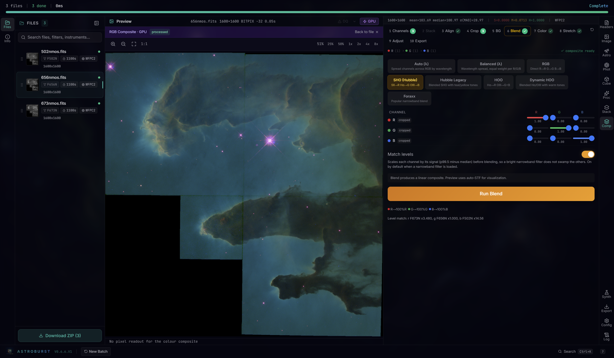
</p>
<p align="center"><em>The Blend step on the three HST/WFPC2 narrowband frames that ship with the app (502, 656 and 673&nbsp;nm), with the SHO (Hubble) preset and Match levels on. The scales are printed under Run Blend: <code>Level match: r F673N x3.480, g F656N x1.000, b F502N x14.56</code>, so [SII] and [OIII] are raised to the level of H&alpha; instead of being swamped by it. Compose has been moved to the right column; the composite is shown at 51%.</em></p>

### Processing

<p align="center">
  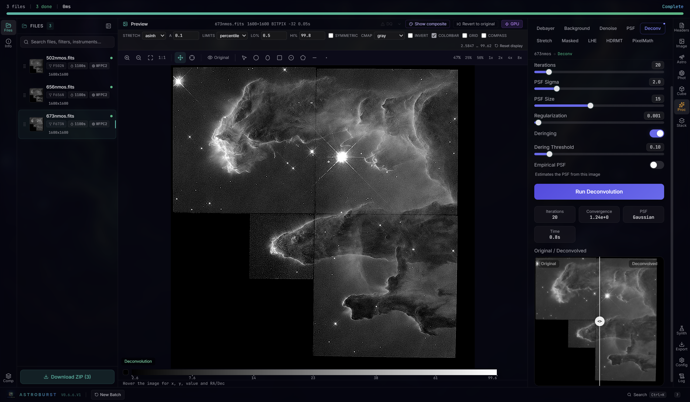
</p>
<p align="center"><em>Richardson-Lucy deconvolution of the [SII] 673&nbsp;nm WFPC2 frame (673nmos.fits): 20 iterations with a synthetic Gaussian PSF of sigma 2.0 and size 15, regularization 0.001 and deringing at a threshold of 0.10, finished in 0.8&nbsp;s with a convergence of 1.24e+0. Below the result cards, a draggable wipe compares the original frame against the deconvolved one, and the preview header offers Revert to original.</em></p>

**Calibration and integration.** Bias, dark, flat and flat-dark masters integrated with Winsorized sigma clipping instead of a plain median; with flat-darks, flats are calibrated as flat minus master flat-dark, and without flat-darks or a bias a warning quantifies the thermal signal the unscaled light dark leaves in or removes from the flats. The frames are checked before any master is built, in the Calibration tab, the Pipeline and the server pipeline route: darks whose exposures differ by more than 1&nbsp;%, flats of different filters, mixed binning, mixed `GAIN` or `OFFSET` in a master set, lights binned unlike the masters and a light or flat frame in a bias, dark or flat-dark row (`IMAGETYP`) are refused, and an unscaled dark, lights flat-fielded with another filter or taken at another `GAIN` or `OFFSET` than the darks, flats whose exposures spread by more than 20&nbsp;% and long bias frames are warned. Darks are grouped by sensor temperature (`CCD-TEMP`, else `SET-TEMP`, split at gaps above 3&nbsp;°C) and each light uses the nearest group, with a warning when it is more than 2&nbsp;°C away. The dark is scaled by the light/dark exposure ratio when a master bias is present and left unscaled without one, or optimized by robust-noise minimisation; exposure times come from the merged primary and image header (`EXPTIME`, `XPOSURE` or `EFFEXPTM`). Cosmetic correction from a master dark, from automatic cluster-aware detection or from a PixInsight-style defect list, CFA-aware (the switch follows the header `BAYERPAT` or `COLORTYP`), standalone or inside the pipeline. Integration offers the rejection family (sigma, Winsorized sigma, linear fit, percentile, min/max, none), mean/median/min/max combination, additive or multiplicative frame normalization with optional scaling, scale+offset rejection normalization, low/high rejection maps, subframe quality weights and 1/sigma² noise weights divided by the square of the normalization scale. Stack, the Pipeline masters and drizzle write `NCOMBINE`, `EXPTIME`, `TOTEXP`, `ABCOMB`, `ABREJECT` and `ABNORM` (drizzle `ABDRZSCL`) with a `HISTORY` line, counting only the frames actually stacked. Drizzle at 1 to 4x with square, Gaussian or Lanczos3 kernels applies the same pixel rejection before scattering. Aligning or drizzling one-shot-colour (Bayer) lights before debayering is refused, with the route that works instead; so is stacking frames of different sizes with alignment off, and the Pipeline with alignment on leaves out a light it cannot register and names it in its warnings. Everything is exposed on the desktop and on the headless server with the same parameter names. In the desktop app, the Pipeline and Drizzle RGB leave out the frames rejected in the Subframe Selector and list them, with a Use all frames action.

**Background.** Polynomial surface (ABE-class) or a regularised thin-plate spline through box samples (DBE-class) with automatic grid placement, Point regions as manual samples, star and outlier rejection and adjustable smoothing; linked shared gradient, neutralize and de-band modes for the wizard. The Processing tab's Mode select also de-bands a single file with the polynomial model (auto-detected axis, rows, columns or both), shows the removed band pattern in the model preview and writes `ABDEBAND` and a `HISTORY` line, with the same refusals as the wizard.

**Multiscale and local contrast.** A-trous wavelet denoise with per-scale thresholds and a PixInsight MLT-style per-scale detail bias; Local Histogram Equalization (CLAHE on lightness with kernel radius, contrast limit, 8/10/12-bit histograms and blend amount) and HDR Multiscale Transform (2 to 8 layers, overdrive, inverted mode, star-core deringing) for stretched images and the RGB composite. Richardson-Lucy deconvolution (FFT-based, Tikhonov regularization, deringing) with a synthetic or empirical PSF, and empirical PSF estimation with moment-based FWHM. OSC debayer (RGGB, BGGR, GRBG, GBRG, honouring XBAYROFF and YBAYROFF). Every processing step feeds the next one in the chain and the result is shown on the GPU viewer as well as on the CPU path. On the colour composite, LHE and HDRMT work on the luminance of the stretched RGB image and keep its hue.

<p align="center">
  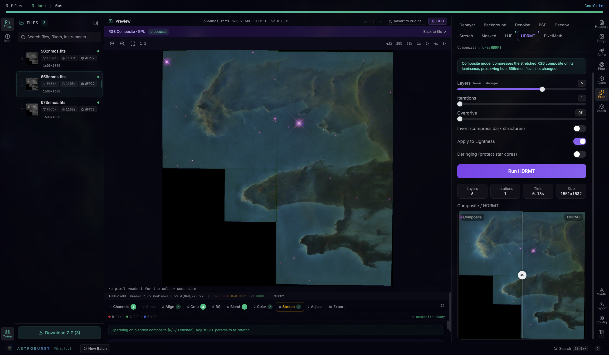
</p>
<p align="center"><em>The HDR multiscale transform in composite mode on the WFPC2 colour composite: as the banner says, it compresses the stretched RGB composite on its luminance and preserves hue, and 656nmos.fits is not changed. 6 layers, 1 iteration, 0% overdrive, applied to lightness, 0.18&nbsp;s on the 1501&times;1532 composite. The Composite/HDRMT wipe below the result cards shows what it changed.</em></p>

**Curves and geometry.** Curves applies levels (black point, gamma, white point) and a monotone tone curve to a mono or RGB FITS, as a chain step after LHE and HDRMT and before PixelMath. A linear image is first brought to display with its own auto-STF (one linked STF for RGB), the output `<stem>_tone.fits` is marked display-referred (`ABDISP=T`) with the STF, levels and curve in its `HISTORY`, NaN padding stays NaN, and an identity setting and cubes are refused; on the colour composite the panel points to Compose › Adjust. Geometry rotates by 90° clockwise, 180° or 90° counter-clockwise, or flips horizontally or vertically, and writes `<stem>_<op>.fits` to the Files list with `CRPIX`, the CD matrix, the SIP coefficients, `LTV`/`LTM` and the Bayer pattern remapped exactly and stale orientation cards removed. RGB FITS are transformed per plane, ERR and DQ are not carried, cubes are refused, and there is no arbitrary angle.

**PixelMath.** A per-pixel expression language over the target image (`$T`) and named image slots bound to loaded files (`A`, `B`, ...): arithmetic, comparison and logical operators, `iif`, `~` inversion, per-pixel functions (abs, sqrt, exp, ln, log, log2, pow, min, max, floor, ceil, round, trunc, sign, clip, rescale) and image statistics (mean, med, mdev, sdev, adev, min, max) over finite pixels. NaN propagates, output goes to a new file with `ABPROC` and `PMEXPR` provenance cards, and slots for the symbols you type are bound to the loaded files automatically.

<p align="center">
  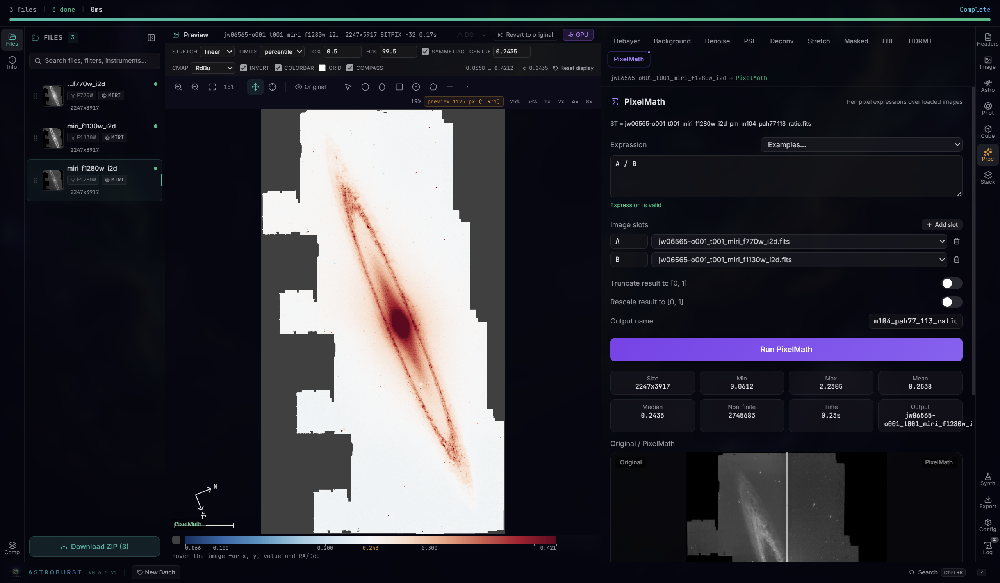
</p>
<p align="center"><em>PixelMath on the MIRI imaging of M104 (jw06565, 2247&times;3917): <code>A / B</code> with slot <code>A</code> bound to F770W and <code>B</code> to F1130W (<code>$T</code> is F1280W), a 7.7/11.3&nbsp;µm band ratio of two PAH bands, not a calibrated PAH map. The result, computed in 0.23&nbsp;s (min 0.0612, max 2.2305, median 0.2435) and written to <code>..._pm_m104_pah77_113_ratio.fits</code>, is shown in RdBu inverted with limits symmetric about the median (0.066 to 0.421), and the dust ring stands out. The Original/PixelMath wipe sits below the result cards.</em></p>

### Science analysis

**Photometry.** Aperture photometry with fractional edge-pixel weights, a local background annulus, ERR-plane error propagation (or sky noise plus an optional Poisson term), the SATURATED DQ bit or a header saturation level, masked-pixel counts and a curve-of-growth aperture correction. The zero point is read from the header, JWST `MJy/sr` with `PIXAR_SR` or `DN/s` with `PHOTMJSR`, HST `PHOTFLAM`/`PHOTPLAM`/`PHOTZPT`, Roman `conversion_megajanskys`, or generic `MAGZERO`-style keywords, so the panel reports AB magnitude with error, flux in Jy and surface brightness, and warns when the image carries an `ABPROC` provenance card left by a processing step. The aperture radius, sky annulus and gain are adjustable (by default the aperture is 1.5 &times; FWHM and the sky annulus 2 to 3 &times; the aperture), and the curve of growth reports the EE50 and EE80 radii. The gain field is prefilled from the measured image's header, with a caption naming the source: `EGAIN`, `ATODGAIN`, `CCDGAIN` or `ADCGAIN` for count units, 1 for `ELECTRONS`, `EXPTIME` for `ELECTRONS/S` and the header gain &times; `EXPTIME` for count rates. An AstroBurst stack scales it by its `NCOMBINE` and combine method (mean N&middot;g, median 2N&middot;g/&pi;, drizzle N&middot;g/scale&sup2; with a correlated-noise note), a file with an ERR plane takes the Poisson noise from it, calibrated units such as MJy/sr get no gain, and a camera `GAIN` card (the gain setting of ZWO, QHY and ASCOM cameras) is reported and never applied. A value typed by hand survives a file change, and click, batch and time-series photometry without a gain or an ERR plane warn that the flux errors leave out source photon noise. Click photometry, switched on in the panel and used with the Crosshair tool, shows the local measurement at once and matches the star against Gaia DR3 only when that opt-in switch is on, against one field cone fetched through the catalog cache. The Photometry table measures a whole list in one run, from the detected stars, the Point regions or pasted positions, draws the apertures and labels on the image with a Show apertures toggle and a Clear button, and exports CSV.

**Catalogs.** Gaia DR3 cone search through VizieR with proper motions propagated from J2016.0 to the observation date, an overlay layer with labels, full-field cross-match of detected stars with astrometric residuals (median dRA/dDec, rms) and a photometric zero point in G, BP or RP with an optional colour term, RFC-4180 CSV export of rows, sources and matches, and a one-click copy of rows into Point regions for `.reg` export. The residuals and the zero-point fit are drawn as plots with a hover readout, wheel zoom, drag pan and CSV and PNG export, the same plot the analysis tools use for profiles, curves of growth, spectrum comparisons and light curves; when the header already carries a flux calibration, the zero point is labelled informational. Every cone result is kept on disk (`astroburst/catalog-cache` under the OS cache folder, 64&nbsp;MB, oldest files evicted first, no expiry since DR3 does not change), and the Catalog panel, SPCC and the photometry Gaia match look in memory, then on disk, then query VizieR, reporting which one answered; `ASTROBURST_CATALOG_CACHE_DIR` and `ASTROBURST_VIZIER_URL` move the folder and the endpoint.

<p align="center">
  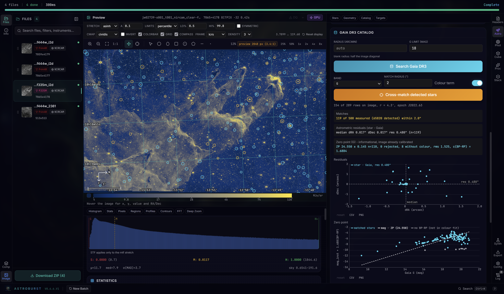
</p>
<p align="center"><em>A live Gaia DR3 query through VizieR on the Pillars F335M mosaic, in cividis with the ICRS grid: 154 of 289 rows land on the image (r&nbsp;=&nbsp;4.3&prime;, positions propagated to epoch J2022.63). The cross-match found 119 of 500 measured stars (500 is the measurement cap; 65,820 were detected) within 2.0&Prime;, with median residuals of 0.017&Prime; in RA and in Dec and an rms of 0.480&Prime; (n&nbsp;=&nbsp;119). The G-band zero point, 24.550 &plusmn; 0.145 from 110 stars with a colour term c(BP&minus;RP)&nbsp;=&nbsp;1.6884, is labelled informational because the image is already calibrated; the residual and zero-point plots are below the summary. Bottom left, the Image tool shows the histogram in Sky mode.</em></p>

**Spectra and cubes.** A full FITS spectral axis (WAVE, AWAV, FREQ and velocity kinds; `CDELT3`, `CD3_3` or `PC3_3`; lenient `CUNIT3`; `RESTWAV`/`RESTFRQ`; `SPECSYS`/`VELOSYS`) with air/vacuum conversion (Greisen et al. 2006) and optical, radio or relativistic velocity axes, plus a barycentric or heliocentric correction for ground-based headers from a low-precision analytic ephemeris (about 0.02 km/s), with spectra already in a rest frame recognised and spacecraft headers using `VELOSYS`. A `-TAB` spectral axis (`WAVE-TAB` with `PS3_0`/`PS3_1`, FITS WCS Paper III) is read from its `WCS-TABLE` extension with wcslib's interpolation rules, so spectra, line measurement, line-fit maps, moments and the x1d comparison use the tabulated wavelengths, with a note naming the table and column; a PV diagram of such a cube is written only when the table is linear to 1&nbsp;% of its step. For IFU cubes: region (aperture) spectra with annulus sky subtraction in native units and Jy, channel-range collapse from a brush on the spectrum plot, and M0/M1/M2 moment maps with a per-pixel continuum fit and SNR masking, written as 2D FITS with the celestial WCS kept. Cubes open through a memory-mapped lazy reader. The displayed channel is marked on the spectrum and changes with a double-click, the arrow keys or looping playback; a committed channel is published as a FITS frame, so regions, statistics, photometry and contours work on it. A click extracts a spectrum only on an image with the cube's spatial grid (the cube and its moment, collapse and line-fit maps) or on a ramp, never on a PV diagram.

**Line measurement and line list.** Brushing a range of the spectrum measures the line in it: flux, equivalent width, centroid, sigma and FWHM, SNR and velocities, with an optional Gaussian fit that reports formal errors, and the continuum and model drawn on the spectrum. A built-in list of 27 rest-frame lines (hydrogen Balmer, Paschen, Brackett and Pfund, [OII], [OIII], [NII], [SII], He I, H2, [FeII], CO, HCN, HCO+, [CII] and HI 21&nbsp;cm) is drawn on the spectrum at a typed redshift or systemic velocity, in the frame of the velocity axis, with family toggles; a click on a line sets the rest wavelength of the measurement.

<p align="center">
  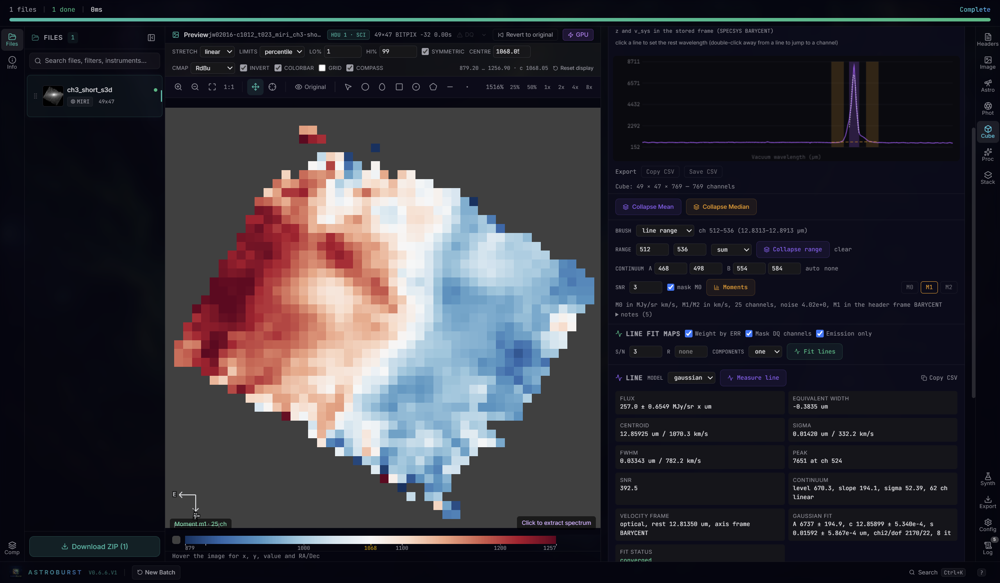
</p>
<p align="center"><em>[NeII] at the nucleus of M104 in a MIRI MRS cube (jw02016, channel 3 short, 49&times;47&times;769). The viewer shows the moment-1 map over channels 512-536 (12.831-12.891&nbsp;µm), with continuum windows at channels 468-498 and 554-584, in RdBu inverted centred on 1068.05&nbsp;km/s (limits 879 to 1257&nbsp;km/s), showing the rotation. Right: the line measured at spaxel (26, 20) against a typed rest wavelength of 12.8135&nbsp;µm: flux 257.0 &plusmn; 0.65&nbsp;MJy/sr&middot;µm, centroid 12.85925&nbsp;µm or 1070.3&nbsp;km/s, FWHM 782.2&nbsp;km/s (observed) and SNR 392.5.</em></p>

**Line-fit kinematic maps.** Fit lines, in the Line fit maps section of the Cube tool, fits the brushed line in every spaxel of an IFU cube, in a fraction of a second on a NIRSpec IFU cube, with ERR-propagated errors and DQ masking, inside the viewer. Each spaxel gets a Gaussian over a continuum fixed from the two side windows (a constant where one window is too short), weighted by 1/ERR² from the cube's `ERR` extension, with the channels flagged `DO_NOT_USE` in its `DQ` extension left out; the errors are absolute where the model fits, inflated by √χ²_red where it does not, and include the continuum uncertainty. The result is a set of 2D maps, flux, velocity, observed sigma (and a corrected sigma, instrumental width removed, when you give a resolving power), their errors, χ²_red, S/N, a bit mask and the number of components, each written as a FITS with the celestial WCS and `LF*` provenance cards and shown in the viewer, velocity planes in RdBu with limits symmetric about 0 until you leave them. Two-component mode splits a line into a bluer and a redder component where the pair passes width, flux-share and separation guards and, in `auto`, a ΔBIC test normalised by the single fit's χ²_red; with Emission only off, absorption lines are mapped too. Clicking a spaxel of a displayed map refits it and draws its spectrum, the windows, the continuum, each component and the total model in a mini plot with a parameter table. Every run goes to the measurement log.

<p align="center">
  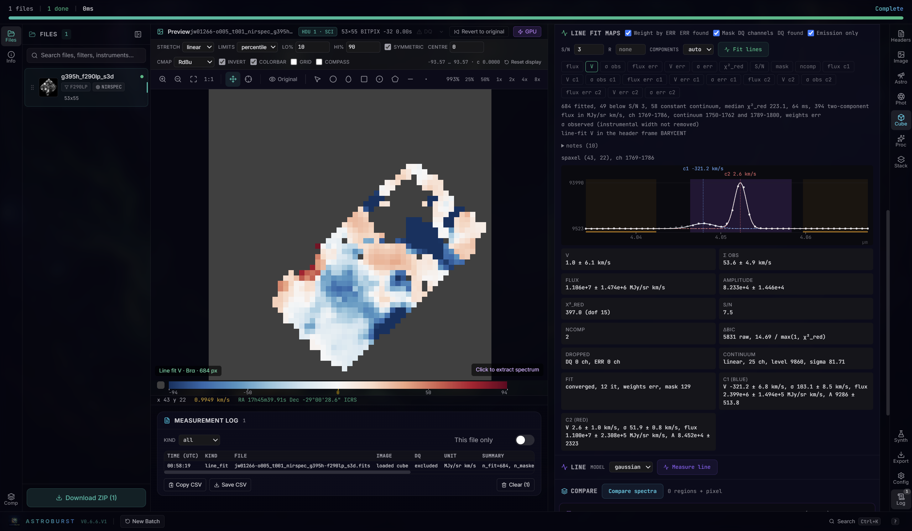
</p>
<p align="center"><em>Brα in the Galactic Centre minispiral, from a JWST NIRSpec G395H IFU cube (program 1266, 53&times;55 spaxels), in the Cube tool. The viewer shows the single-component velocity map in RdBu inverted with limits symmetric about 0 (&plusmn;93.57&nbsp;km/s). Right: the Fit lines run, 684 spaxels fitted, 49 below S/N 3, 58 with a constant continuum, median &chi;&sup2;_red 223.1 and 394 split into two components, in 64&nbsp;ms. Below it, spaxel (43, 22) refitted and split into c1 at &minus;321.2 &plusmn; 6.8&nbsp;km/s (&sigma; 103.1) and c2 at +2.6 &plusmn; 1.0&nbsp;km/s (&sigma; 51.9), with &Delta;BIC 5831 raw and 14.69 after dividing by max(1, &chi;&sup2;_red); the mini plot draws the samples, the line and continuum windows, both components and the total model. Bottom: the Log tool with the <code>line_fit</code> entry.</em></p>

**Spectrum export and comparison.** The displayed pixel or region spectrum copies or saves as CSV with provenance lines (file, source, ICRS centre, velocity frame and shift, flux unit) and columns for the channel, vacuum wavelength, the displayed axis, flux and, for MJy/sr cubes, flux in Jy. A comparison section overlays the spectra of the included area regions (the first 16) and the last clicked pixel, normalised to the peak, the median or the continuum windows, or offset, with a legend and one joined CSV on the common axis. A JWST pipeline x1d (`EXTRACT1D` table) can join the comparison: Compare with pipeline x1d loads the `_x1d.fits` next to the cube, Pick x1d&hellip; any other, and the table is resampled onto the cube's channels, never across DQ-flagged rows, plotted in Jy or surface brightness and written to the joined CSV.

<p align="center">
  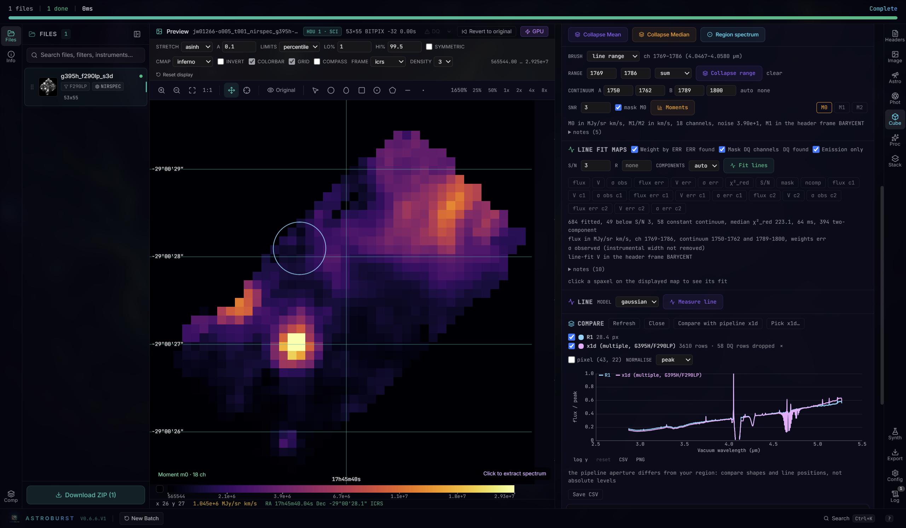
</p>
<p align="center"><em>The moment-0 map of Brα (channels 1769-1786) from the same G395H cube, in inferno with an asinh stretch and the ICRS grid, and a circular region R1 at spaxel (26, 27). Right, the Compare section: the R1 spectrum (28.4&nbsp;px) and the JWST pipeline x1d (multiple, G395H/F290LP; 3610 rows, 58 DQ-flagged rows dropped), both normalised to the peak. The two spectra overlap, and the note under the plot says the pipeline aperture differs from the region, so shapes and line positions compare, not absolute levels.</em></p>

**Position-velocity diagrams.** A line region on a cube becomes a PV diagram: the cube is sampled along the slit with a chosen step and averaging width without loading it whole, offsets are centred on the slit in arcseconds when a WCS exists (pixels otherwise), and the panel plots the median-subtracted intensity-weighted ridge with the peak channel per offset. The result is a 2D FITS with an `OFFSET` axis and the cube's native spectral axis, shown in the viewer with the display controls and exported from the panel as CSV.

**Ramps.** JWST `_uncal` ramps (and Roman L1 resultant stacks) open as ramps with group and integration navigation and a per-pixel ramp plot. The Cube tool's Ramp section runs a quick-look slope (IRS2 reference-offset correction, saturation and jump flags) into `<stem>_qslope.fits`, a decision aid and not a rate, and compares it with the official `_rate.fits` (ratio image, residual histogram, `JUMP_DET` recall and precision). Details and the validation table are in [docs/quick-slope.md](docs/quick-slope.md).

<p align="center">
  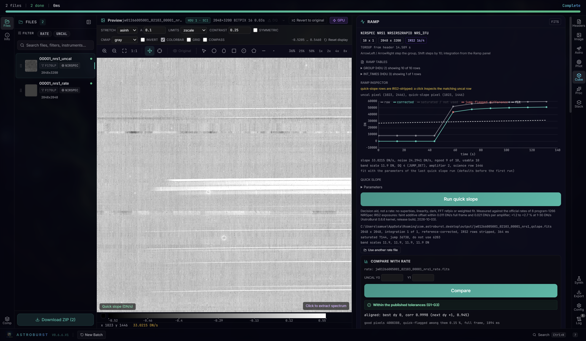
</p>
<p align="center"><em>A NIRSpec <code>_uncal</code> ramp (jw01266005001_02103_00001_nrs1: NRSIRS2RAPID, 10 groups &times; 1 integration, 2048&times;3200 with the IRS2 16/4 layout, TGROUP 14.589&nbsp;s) loaded with its <code>_rate</code>. The viewer shows the quick-slope product in DN/s, 33.0215&nbsp;DN/s at pixel (1023, 1446). Right, the Ramp inspector at the matching uncal pixel (1023, 2446): the raw, corrected and fitted ramp with group 5 flagged as a jump, slope 33.0215&nbsp;DN/s, noise 24.2941&nbsp;DN/s, 9 of 10 groups good. The quick slope is 2048&times;2048, integration 1 of 1, reference-corrected with the IRS2 rows stripped, with 7144 saturated, 36,730 jump and 6203 do-not-use pixels; Compare with rate finds it within the published tolerances (G1-G3), aligned at dy&nbsp;0 with a correlation of 0.9998 over 4,000,308 good pixels, 0.15% of them quick-flagged.</em></p>

**Cutouts.** Export > Cutout writes a multi-extension FITS (SCI, ERR, DQ) from a box region or a manual centre and size in pixels or arcseconds, with `CRPIX` shifted and `LTV1`/`LTV2`/`LTM` recorded, NaN padding outside the parent and padded DQ pixels flagged, sharing its core with the server cutout endpoint.

**Contours.** Marching-squares contours with NaN-aware binning and smoothing, at listed, linear, log, sqrt or sigma-above-sky levels, drawn in a single colour or a blue-to-amber ramp with per-level visibility. They are traced on the image on screen, and closed contours export to Polygon regions.

<p align="center">
  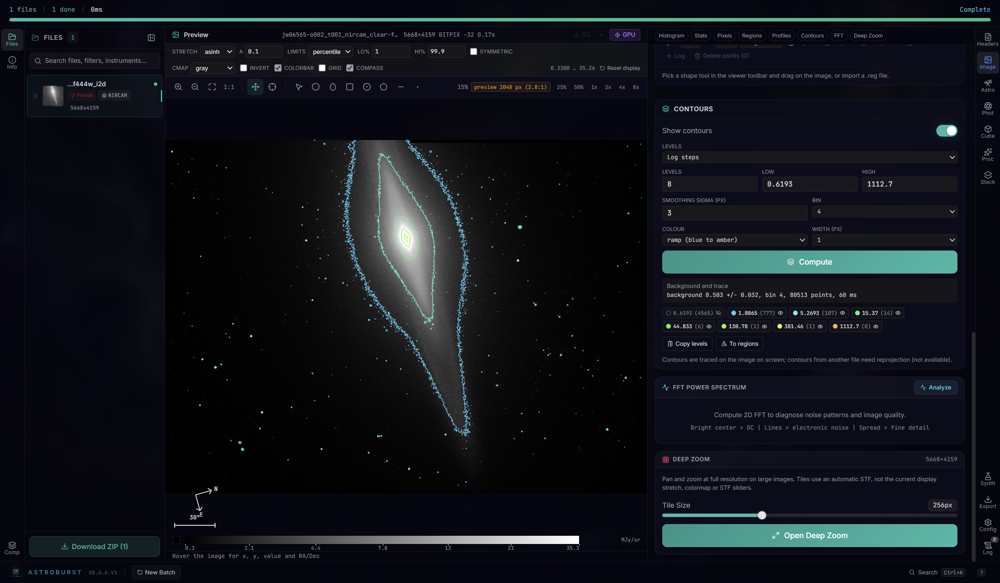
</p>
<p align="center"><em>The Sombrero in NIRCam F444W with 8 contour levels in log steps from 0.6193 (the median plus 3&sigma; of the noise) to 1112.7&nbsp;MJy/sr, smoothing 3 and bin 4, in the blue-to-amber ramp. The lowest level, the noisiest, is hidden with the visibility toggle on its chip; the panel measured a background of 0.503 &plusmn; 0.032. To regions turns the contours into Polygon regions. The FFT and Deep Zoom panels follow below.</em></p>

**Surface-brightness profiles.** Beside radial profiles and line cuts, the Profiles panel measures an elliptical surface-brightness profile: mag/arcsec² against the semi-major axis in arcseconds, with the R50, R80 and R90 radii, the Petrosian radius and the total AB magnitude.

**Time series and observation geometry.** Aperture photometry across the loaded frames tracks drift, builds a differential light curve against a comparison ensemble, and lists every frame in a table that exports as CSV; a frame whose filter differs from the reference frame's (read with the Compose rule, where a `PUPIL` filter code wins over `FILTER`) is skipped with a note. An observation geometry panel reports, for the loaded file and for every frame of a time series, BJD_TDB and HJD_UTC of mid-exposure (leap-second table, TT and TDB, light time to the barycentre within 1&nbsp;s of astropy), local sidereal time, hour angle, altitude, azimuth, Kasten-Young airmass, parallactic angle, and the altitude of the Sun and the Moon with the Moon's illumination and separation. Site and target are read from the header, with the source shown, or typed in the panel; a typed site is remembered across files and takes precedence over the header site. The light curve uses BJD_TDB as its time axis when every frame has one, headers already in BJD_TDB are not corrected twice, and the CSV carries the geometry columns.

**Measurement log.** The Log tool (its icon in the strip shows the entry count) records every photometry click, batch run, line measurement, line-fit run, time series, cross-match, spectrum export and PV run with its UTC timestamp, file, measured image, DQ handling, unit, parameters, values and region; region statistics, profiles, sky separations, the pixel table and the Statistics panel log on request. The log survives file switches, filters by kind or file, and copies or saves as CSV. It is kept for the current session only.

Star detection with flux, FWHM and SNR (it keeps the 200 brightest sources and says how many it found), a 64K-bin histogram with auto-STF over the full range or a Sky window from the median &minus; 5&sigma; to the median + 50&sigma;, and an FFT power spectrum complete the analysis tools. Analysis is five dock tools, each with its own icon in the strip: Image (histogram, statistics, pixels, regions, profiles, contours, FFT, deep zoom), Astrometry (star detection, plate solve, catalog, targets, observation geometry), Photometry (aperture photometry, the photometry table, time series), Cube (spectrum with moments and line fits, PV diagrams, ramps) and Log (the measurement log, with the entry count on its icon). Each one docks anywhere like the other tools, so Photometry can sit under the viewer while Astrometry stays in the side column, and the stars detected in Astrometry feed the Photometry table. When the selected file changes, an open Image or Cube switches to the one that fits the file (cubes and ramps on Cube) and remembers the one you picked per file; Image and Astrometry have a row of chips that jumps to their panels. Plate solving goes through astrometry.net and needs a free nova.astrometry.net API key entered in Settings; the scale range (0.8 to 1.25 times the header pixel scale) and the field centre are hinted from the header WCS when one exists, large images are auto-downsampled and the result is rescaled to full resolution. Plate Solve works on the image on screen, a stack or a processed result included, and its status, calibration and WCS requests are retried up to 3 times on transport errors and HTTP 5xx. Write WCS to image then saves a copy of that image with the astrometry.net TAN-SIP solution (`<name>_wcs.fits` in the output folder, which is emptied at every start, so export it to keep it) and shows it, so the grid, compass, Targets, photometry and the Gaia catalog use the new WCS; the button is disabled once the image on screen carries the solution. WCS handling is described under [WCS](#data-quality-and-units). A synthetic data generator produces star fields with configurable distributions, PSF models, a CCD noise model with an optional vignetting flat over stars and sky, a ground-truth catalogue CSV and a noise-free ground-truth image for validating photometry and alignment; stacks vary from frame to frame by default (dither, seeing, sky and transparency jitter, cosmic rays) and list each frame's offsets and factors in a `{prefix}_frames.csv` manifest, and every frame records its seed, field and PSF in the header, stack frames also their offsets, with `EGAIN` next to `GAIN` so the Photometry gain field prefills.

<p align="center">
  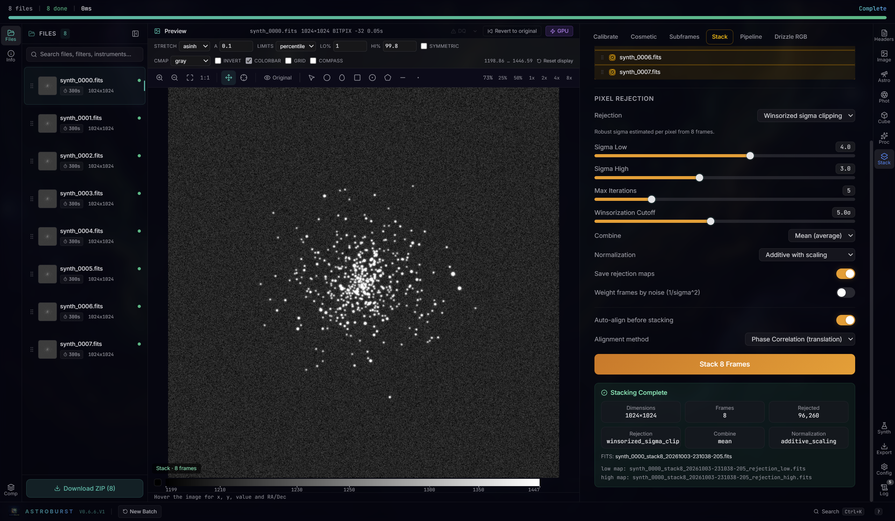
</p>
<p align="center"><em>Generated data: the synthetic generator wrote 8 frames of 1024&times;1024 (a King cluster with a Moffat PSF, frames varied with a 3&nbsp;px dither, 10% seeing jitter and cosmic rays, seed 2026), and the Stack tab integrated them with Winsorized sigma clipping (sigma low 4, high 3, 5 iterations), mean combination and additive scaling, saving the low and high rejection maps: 96,260 pixels rejected.</em></p>

Every screenshot above is in [`docs/screenshots/`](docs/screenshots) and was captured on the 0.6.6 build with the five analysis tools, before 0.6.7.0: the hero, Align and Blend captions show the 0.6.6 registration by phase correlation and the scale-only Match levels. The data are the HST/WFPC2 narrowband frames of the Pillars of Creation that ship with the app; the JWST NIRCam mosaics of the Pillars (jw02739); JWST NIRCam and MIRI imaging of M104 (jw06565); a JWST MIRI MRS cube of M104 (jw02016); JWST NIRSpec IFU data of the Galactic Centre (jw01266), both the G395H cube with its pipeline x1d and the detector-level <code>_uncal</code>, <code>_rate</code> and <code>_cal</code> frames; and synthetic frames from the built-in generator.

## Install and build

| Platform | Download |
|----------|----------|
| **macOS** (universal: Apple Silicon and Intel) | [`.dmg`](https://github.com/samuelkriegerbonini-dev/AstroBurst/releases/latest) |
| **Windows** | [`.msi`](https://github.com/samuelkriegerbonini-dev/AstroBurst/releases/latest) / [`.exe`](https://github.com/samuelkriegerbonini-dev/AstroBurst/releases/latest) |
| **Linux** | [`.deb`](https://github.com/samuelkriegerbonini-dev/AstroBurst/releases/latest) / [`.AppImage`](https://github.com/samuelkriegerbonini-dev/AstroBurst/releases/latest) / [`.rpm`](https://github.com/samuelkriegerbonini-dev/AstroBurst/releases/latest) |

Install scripts:

```bash
# macOS
curl -fsSL https://raw.githubusercontent.com/samuelkriegerbonini-dev/AstroBurst/main/scripts/install-macos.sh | bash

# Linux (Debian/Ubuntu)
curl -fsSL https://raw.githubusercontent.com/samuelkriegerbonini-dev/AstroBurst/main/scripts/install-linux.sh | bash
```

Flatpak (community-maintained, via [FlatPark](https://github.com/flatpark/flatpark)):

```bash
flatpak remote-add --if-not-exists flatpark https://dl.flatpark.org/flatpark.flatpakrepo
flatpak install flatpark io.github.samuelkriegerbonini_dev.AstroBurst
```

This package is maintained by [jing2uo](https://github.com/jing2uo), not by the AstroBurst project. It downloads the official `.deb` from the GitHub releases unmodified at install time and follows new releases automatically. Permissions and details are on the [FlatPark app page](https://flatpark.org/apps/io.github.samuelkriegerbonini_dev.AstroBurst), and packaging issues go to the [FlatPark tracker](https://github.com/flatpark/flatpark/issues).

Build from source:

```bash
git clone https://github.com/samuelkriegerbonini-dev/AstroBurst.git
cd AstroBurst
pnpm install
pnpm tauri dev
```

`make dev`, `make build`, `make test` and `make lint` wrap the common dev, build, test and lint commands. CI builds and tests with current stable Rust, Node.js 22 and pnpm 10; the Tauri CLI tracks 2.10. Platform prerequisites are listed in [CONTRIBUTING.md](CONTRIBUTING.md#development-setup). WebGPU (Vulkan, Metal or DX12) is used for the preview when available; without it the app shows a CPU viewer with the grid and compass but without the stretch, limit and colormap controls.

## Quick start

1. **Drop** a file, a ZIP (nested ZIPs are followed up to a depth limit) or a folder into the window. `.fits`, `.fit`, `.fts`, `.asdf` and `.zip` are recognised.
2. **Look.** Click a file for its preview, histogram and headers. Set stretch, limits, colormap and the coordinate grid in the display bar, or hit Auto STF. Hover for value, unit, ERR, DQ and coordinates. Use the HDU panel to switch to another extension or array. `Ctrl+K` or a double `Shift` opens the command palette over files, tools and actions.
3. **Measure.** Draw a region, add a background annulus, read the statistics. Plot a radial profile or a line cut. Turn on Measure on image click in the Photometry panel, select Crosshair in the viewer toolbar and click a star for calibrated photometry; search Gaia DR3 for a catalog overlay and a zero point. Import or export DS9 `.reg` files.
4. **Compose.** Open the Compose tab and walk the ten steps.
5. **Process.** Debayer, background (polynomial or DBE spline) and de-band, wavelet denoise, PSF estimation, deconvolution, the stretch tools, LHE, HDRMT, Curves, PixelMath and Geometry (rotate and flip) sit in the Processing tab; calibration with flat-darks, cosmetic correction, subframe gating, stacking with the rejection family, the batch pipeline and drizzle in the Stacking tab.
6. **Export.** PNG at 8 or 16 bits, FITS with preserved WCS and metadata, a SCI+ERR+DQ cutout, or a ZIP bundle of all channels plus the composite.

Three HST/WFPC2 narrowband frames of the Eagle Nebula (M16) ship in [`exampleFits/sample-data/`](exampleFits/sample-data) for a first run: [OIII] 502 nm, H-alpha 656 nm and [SII] 673 nm, public domain (NASA/ESA). A ground-truth catalogue for photometry checks is in `exampleFits/sample-data/synthetic_catalog.csv`. For your own data, MAST and the ESA Hubble Science Archive publish JWST and HST `_cal.fits` and `_i2d.fits` products, and Roman `.asdf` products under instrument WFI.

## Headless server and Python client

The headless server and the v2 API were contributed by [Jae-Joon Lee](https://github.com/leejjoon).

`astroburst-server` is a separate Axum binary built behind the `server` feature. It shares the FITS and ASDF readers, the display controls and the region code with the desktop app. It renders on the CPU: there is no GPU dependency anywhere in the Rust crate. Run it on whatever machine holds the data and reach it over an SSH tunnel.

```bash
cd src-tauri
cargo run --bin astroburst-server \
  --no-default-features \
  --features server,astrometry-net,asdf-full,vizier
# Listening on 127.0.0.1:8080
```

Two API generations are served. **v1**: sessions, FITS open and header, render, auto-STF and viewport, stacking and drizzle with the rejection family and normalization, and pipeline runs with cosmetic correction and dark optimization, with async jobs you can poll, cancel or follow as a server-sent event stream. **v2**: session lifecycle with keepalive, image open and HDU switching, structure, header and WCS inspection, cutouts by pixel box or sky position or region shape with `LTV` reporting, block binning, pixel-to-sky and sky-to-pixel and angular separation, a WCS coordinate grid, pixel probe, exact statistics with noise evaluation, histogram, and a render endpoint taking the same display settings as the desktop bar.

The async Python client in [`agent/`](agent/README.md) wraps the v1 surface. The v2 endpoints are HTTP-only for now and have no Python method.

```python
import asyncio
from astroburst_client import AstroBurstClient

async def main():
    async with AstroBurstClient("http://localhost:8080") as client:
        session = await client.create_session()
        result = await session.open("/data/m16_ha.fits", slot="ha")
        print(f"{result.width}x{result.height}  median={result.stats.median:.1f}")
        png, stf = await session.stf("ha")
        open("preview.png", "wb").write(png)

asyncio.run(main())
```

Install with `pip install -e ./agent` (add `[image]` for the Pillow helper). Runnable examples: [`agent/examples/`](agent/examples). Full route list and configuration: [src-tauri/SERVER.md](src-tauri/SERVER.md). Client reference: [agent/README.md](agent/README.md).

## Supported formats

**FITS.** Memory-mapped reading. Multi-extension files with auto SCI selection, or any extension by `path#hdu=<n>`. Tile-compressed HDUs are decoded natively: ZCMPTYPE `RICE_1`, `GZIP_1`, `GZIP_2` and `NOCOMPRESS`, including quantized floats and plane-aligned compressed cubes (ZTILE3=1). Not supported: `PLIO_1`, `HCOMPRESS_1`, non-plane-aligned 3D tiling (ZTILE3>1), per-pixel null bitmaps and per-tile ZBLANK columns. JWST Level-1b `_uncal` files open as 4-D ramps, NIRSpec IRS2 included. Binary tables are not opened as images: a JWST x1d `EXTRACT1D` table is read in the Cube tool, next to the spectrum of a cube, and its row in the file list says so and offers Open in Spectroscopy. Binary-table columns with a fixed repeat count (`1400E`, with or without `TDIM`) are read as arrays, which is how a `-TAB` spectral axis is read from its `WCS-TABLE` extension; variable-length (`P`/`Q`) columns are refused with a message. The `ASDF` extension of a JWST `_cal` or `_crf` file is read for its gWCS.

**ASDF.** A native reader written in Rust, so Roman and JWST pipeline products open without a Python environment: block index, YAML tree, science-array discovery, and an imaging gWCS evaluated transform by transform (see [WCS](#data-quality-and-units)); the synthesised header carries a TAN projection when the chain reduces to one and a TAN-SIP fitted to the gWCS otherwise, and a chain with a transform outside the evaluated set opens without a WCS, with the reason reported. Roman L1 ASDF ramps open for inspection. zlib decompression is always available; bzip2 and lz4 come with the `asdf-full` feature, which is on by default but must be listed explicitly in `--no-default-features` builds. Not supported: external (exploded) block files, arrays of rank other than 2 or 3, and dtypes outside the decoded set. Each failure reports a named error rather than passing silently.

**Containers.** ZIP archives, including nested ones up to a depth limit, and whole directories.

**Export.** PNG at 8 or 16 bits, FITS with BITPIX 16, float32 or float64 and optional Rice compression at a configurable quantize level, WCS and metadata preservation with `PROGRAM` and `HISTORY` provenance cards, RGB FITS cubes, and a ZIP bundle. Processing stays in f32/f64 with no quantization; quantization happens only where you ask for it, in 8/16-bit PNG export, integer-BITPIX or Rice FITS export, and the 8-bit deep-zoom tiles.

## How it compares

AstroBurst sits between a viewer and a processing suite, and is behind the established tools in both directions.

- **DS9** is the reference FITS viewer. AstroBurst matches most of its inspection surface: stretch and limit algorithms, colormaps, frames, a coordinate grid, a compass, contours, region shapes with DS9 `.reg` exchange, per-region statistics, a pixel table and a Gaia catalog overlay. DS9 is ahead on frame management and blinking, image-server integration, 3D rendering, and interoperability through SAMP and XPA, none of which AstroBurst has.
- **jdaviz** is the JWST and Roman quick-look toolset from STScI. AstroBurst overlaps on ASDF, DQ decoding, unit-aware readout, calibrated photometry, cube spectra with line lists and line measurement, and moment maps, and opens those files without Python. jdaviz is ahead on model fitting (AstroBurst fits one Gaussian per line, or at most two per spaxel in its line-fit maps), Mosviz-style multi-object work, and lives inside a notebook where results are scriptable end to end.
- **Siril** is the closest free processing comparison. Calibration, registration, integration (rejection families, normalization, drizzle with rejection, cosmetic correction, dark optimization) and stretching are at a comparable level of algorithmic depth. Siril has a mature scripting language, RAW and XISF input, a much larger user base and years of field testing; AstroBurst has no scripting language yet.
- **PixInsight** is the commercial reference for processing depth. AstroBurst now covers the core of ImageIntegration, CosmeticCorrection, DynamicBackgroundExtraction, PixelMath, LocalHistogramEqualization, HDRMultiscaleTransform, Statistics and NoiseEvaluation, each as a single tool with the essential parameters. PixInsight keeps mosaic stitching, a process container and history model, masks and previews as first-class objects, modern deconvolution, and an enormous body of published workflows.

Where AstroBurst is genuinely different: a single desktop app that reads ASDF natively without Python, decodes DQ against named instrument bit tables, and exposes the same readers, display controls and region code through a headless REST API.

## Project status

Pre-1.0, developed by one maintainer with outside contributions. Formats, command names and the REST API may change before 1.0.

The current version is 0.6.7.0. The FITS and ASDF readers, display path, compose wizard and export are used daily; the processing, science and measurement rounds of September 2026 and the October 2026 releases are covered by unit tests and adversarial code review but have had less time in the field. The [technical document](docs/astroburst_technical_document.pdf) (release 0.6.7.0) describes the algorithms and the rules behind each step. CI runs five jobs on every pull request and on pushes to main: typecheck plus a production build, eslint with zero warnings allowed, `cargo test --lib` on Windows, `cargo test --all-features` on Ubuntu and macOS (which covers the headless server), and the vitest suite. `cargo test --lib` runs 2389 library tests (29 more, on real data or timing, are marked ignored) and the headless server build adds 190 server tests; vitest runs 2962 frontend cases in 199 files. The desktop backend exposes 140 commands.

Known limits:

- There is no benchmark suite. No performance figure is published because none is reproducible from this repository.
- The GPU is used for display only. Every algorithm runs on the CPU in Rust.
- Plate solving needs a nova.astrometry.net account and network access; the catalog panel and the optional Gaia match of click photometry need VizieR for a field not yet in the disk cache, and SPCC falls back to a synthetic catalogue without it.
- SPCC is a blackbody approximation at the channel wavelengths, not a fit to Gaia XP spectra through filter transmission curves.
- Only imaging gWCS is evaluated. Spectroscopic gWCS and chains with `tabular`, `fix_inputs` or JWST pipeline model transforms fall back to the header WCS, or leave a Roman ASDF image without one.
- Radial and surface-brightness profiles, line cuts, `.reg` import and export, the DQ overlay, DQ-masked statistics, the compass overlay, the Targets panel, the pixel table, photometry, catalogs, contours, time series, observation geometry, cube science including line measurement, line-fit maps and PV diagrams, the measurement log and the processing tools are desktop-only. The compose wizard has no server routes.
- The Python client covers the v1 API only.
- Integration holds every frame in memory; very large frame counts need a machine with matching RAM.
- The coordinate grid and regions are not drawn in the standalone deep-zoom tile viewer.
- No SAMP or XPA interoperability, no mosaic stitching, no plugin or scripting system, no RAW or XISF input.

Next up: MAST API access, a before/after preview per wizard step, selective saturation, PixelMath RGB expressions and masks, row-banded integration for large frame counts. Longer term: GPU compute for stacking and alignment, plugin hooks.

## Contributing

Setup, code style, tests, the architecture overview and the current priority areas are in [CONTRIBUTING.md](CONTRIBUTING.md), so there is one list to keep current. Contributions require the [CLA](CLA.md). Please read the [Code of Conduct](CODE_OF_CONDUCT.md), and report security issues through [SECURITY.md](SECURITY.md).

The headless server, the v2 API, the Python client, the WCS engine migration, FITS tile compression, zscale and the first colormaps (gray and viridis) were contributed by [Jae-Joon Lee](https://github.com/leejjoon).

AstroBurst is free and AGPLv3. If it helps your work, you can [support development on Ko-fi](https://ko-fi.com/astroburst).

<!-- SUPPORTERS:START -->
<!-- SUPPORTERS:END -->

## License

AGPLv3. See [LICENSE](LICENSE).

The network clause (section 13) covers the optional headless REST API: if you run a
modified AstroBurst as a network service, you must offer the modified source to its users.

---

<p align="center">
  <sub>Created by <a href="https://github.com/samuelkriegerbonini-dev">Samuel Krieger</a></sub>
</p>
